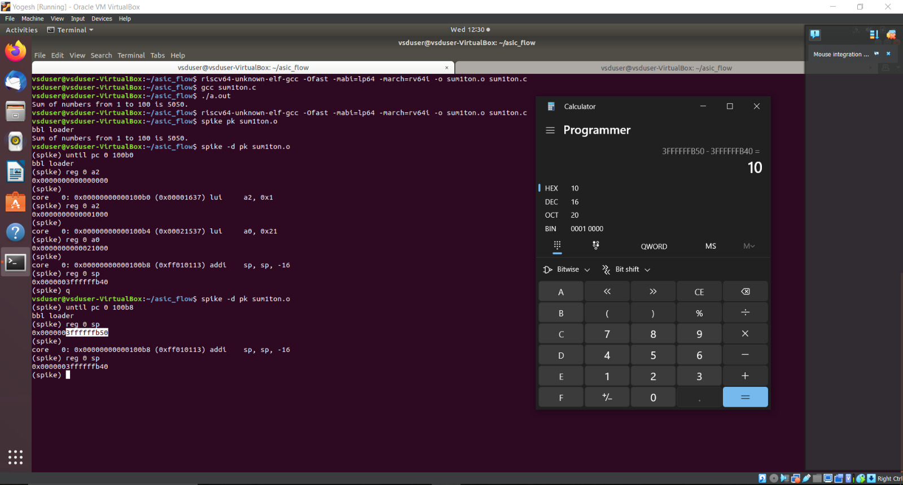
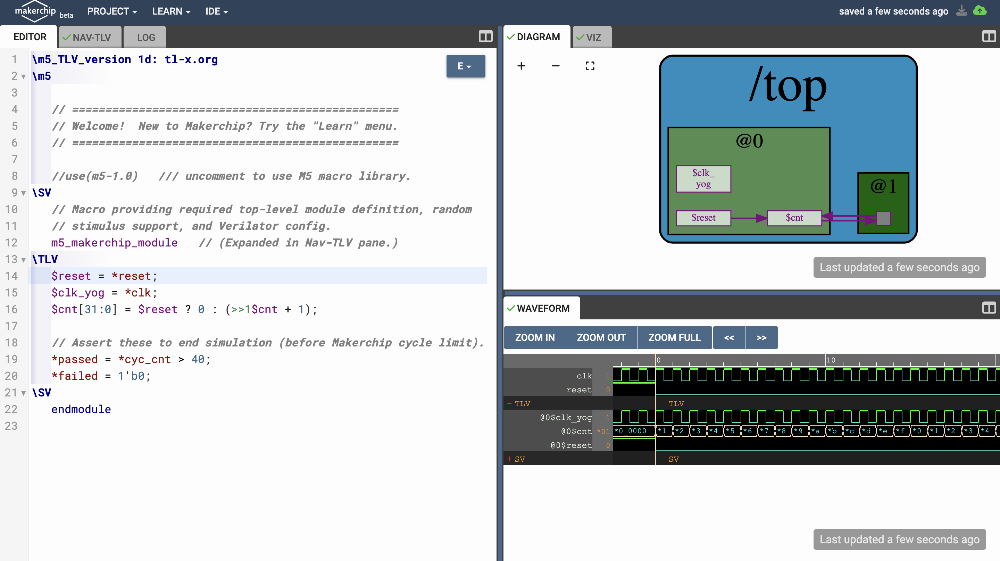
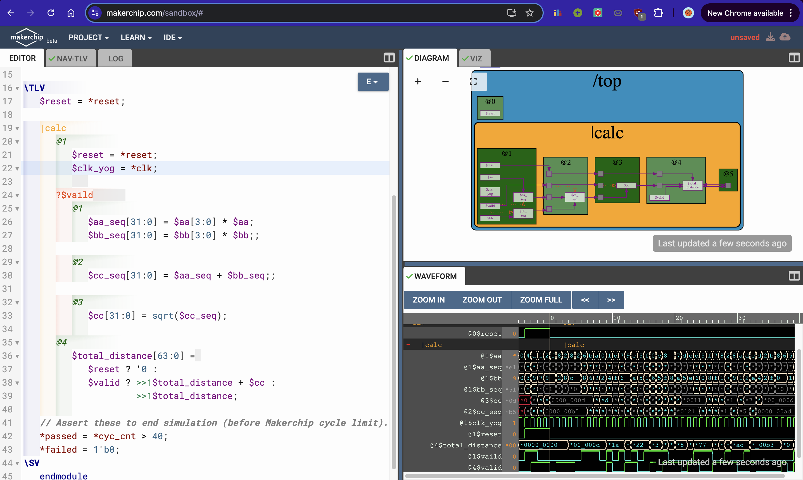
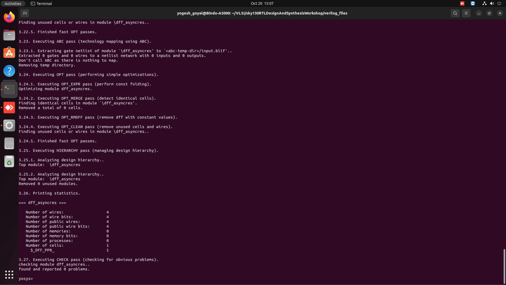
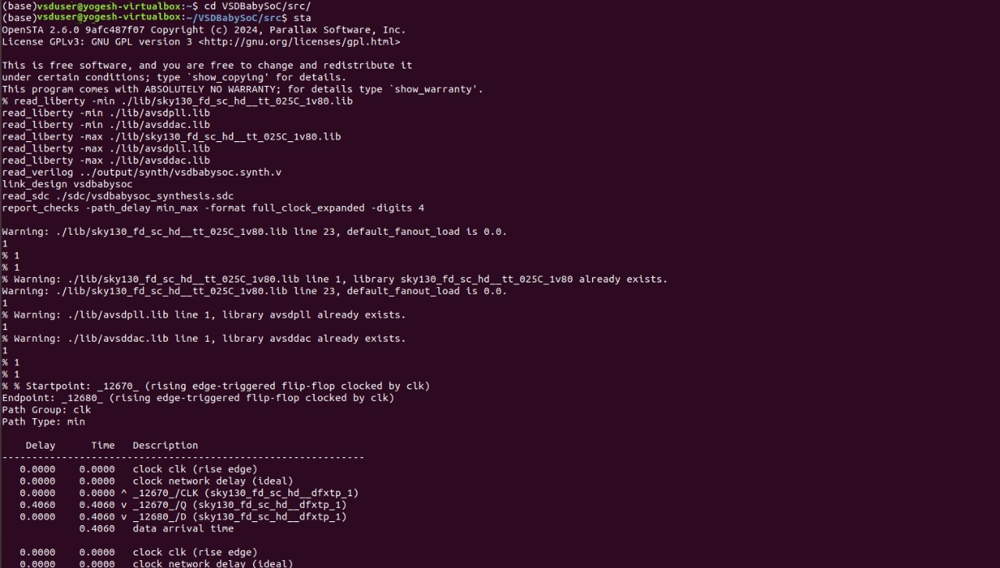

# ASIC Design Class Repository

## GitHub Repository: Yogesh Goyal, IMT2021542

This repository contains all the documentation and snapshots related to the experiments conducted during the lab sessions for the ASIC Design Class

---

## Contents of the Repository

- **Documentation:** Detailed explanations and observations for each experiment.
- **Snapshots:** Visual aids showing the procedures and steps involved in the experiments.

---

## Labs
<details>
<summary><strong>Laboratory 1:</strong> Create a C program to find the sum of `n` natural numbers, compile it using the GCC compiler, and verify the output after execution.</summary>

### Step-by-Step Procedure:

**Step 1:** Create a new `sum1ton.c` file in the specified directory (asic_flow) in a Linux environment using gedit editor.


- Save your C program


**Step 2:** Compile the source code `sum1ton.c` using gcc compiler (`gcc sum1ton.c`) which will generate an executable a.out file. Run the executable file(`./a.out`) in terminal window to view the output.


**Observation** 
- Sum of first 100 natural numbers come out to be 5050

</details>

<details>
<summary><strong>Laboratory 2:</strong> Compile the C program written in Laboratory 1 using the RISCV compiler.</summary>

### Step-by-Step Procedure:

# **Compilation using O1 flag**

**Step 1:** Compile `sum1ton.c` using RISCV Compiler using the command given below
```bash
riscv64-unknown-elf-gcc -O1 -mabi=lp64-march=rv64i -o sum1ton.o  sum1ton.c
```

- `riscv64-unknown-elf-gcc`: The compiler for RISC-V 64-bit target.
- `O1`: Applies moderate optimizations for a good balance between performance and compilation time.
- `mabi=lp64`: Specifies the ABI (Application Binary Interface) as LP64, meaning "Long and Pointer are 64-bit."
- `march=rv64i`: Sets the architecture to RISC-V 64-bit with the RV64I instruction set.
- `o sum1ton.o`: Outputs the compiled code to a file named sum1ton.o.
- `sum1ton.c`: The source file to be compiled.


- Also to check whether sum1ton.o has been created or not type the following command
```bash
ls -ltr sum1ton.o
```


**Step 2:** To generate the assembly code of the c program written type the following command in a new terminal window
```bash
riscv64-unknown-elf-objdump -d sum1ton.o
```


- It will give a bunch of assembly language code

**Step 3:** Use pipe less command with the command used in step 2 as shown below which allows us to scroll through the output interactively.

```bash
riscv64-unknown-elf-objdump -d sum1ton.o | less
```
- The assembly version of the C program is displayed. Type /main to navigate to the section of the code related to the main function (int main()).


- To determine the number of instructions in the "main" section, you can either count each instruction individually or use an alternative method: subtract the address of the first instruction in the subsequent section from the address of the first instruction in the "main" section. Then, divide the result by 4, as each instruction occupies 4 bytes in a byte-addressable memory system.


- No of instructions in the main function comes out to be (0x101C0 - 0x10184)/4 = 0x3C/4 = 0xF = 15 instructions

# **Compilation using Ofast flag**

**Step 4:** Repeat Step1 and instead of O1 flag use Ofast Flag and follow all the steps after that in the similar manner
```bash
riscv64-unknown-elf-gcc -Ofast -mabi=lp64-march=rv64i -o sum1ton.o  sum1ton.c
```


- Generate the assembly code for the file and observe that the number of bytes utilized decreases from 15 to 12.

**Observation** 
- **O1**: Provides moderate optimizations, balancing performance and compilation time, and adheres strictly to standards.
- **Ofast**: Applies aggressive optimizations for maximum performance, but might break some programs as it may not follow all standards.
</details>

<details>
<summary><strong>Laboratory 3:</strong> Determine the output of the C program using the RISC-V Compiler using Spike simulator, and then debug the code</summary>

### Step-by-Step Procedure:

# **Compilation**

**Step 1:** Compile `sum1ton.c` using RISCV Compiler using the command given below
```bash
riscv64-unknown-elf-gcc -O1 -mabi=lp64-march=rv64i -o sum1ton.o  sum1ton.c
```
**Step 2:** Now we have compiled our program using RISCV compiler and we need to run in order to get the output 
similar to the ./a.out we do using gcc compiler. To do that use Spike Simulator and type the following command 
given below

```bash
spike pk sum1ton.o
```


**Observation** 
- We have verified that output is same using the gcc and the riscv compiler

# **Debugging**

## Debugging the Assembly Code


To debug the assembly code of your compiled C program using the Spike simulator, follow these steps:

**Step 1:** Run the following command given below
```bash
spike -d pk sum1ton.o
```

- `spike`: The Spike RISC-V simulator.
- `d`: Starts the simulator in debug mode.
- `pk`: Proxy kernel, a small environment that provides minimal OS services.
- `sum1ton.o`: The compiled object file of your C program.

We will let the Spike debugger run until it reaches the 100b0 instruction within the main function by running the command given below. From there, we will proceed with manual debugging, checking the a2 register before and after execution.To move on to next instruction press Enter

```bash
until pc 0 100b0
```
To check a registers Value type the following command 
```bash
reg 0 a2
```


**Observation**
- Notably, the lui a2, 0x1 instruction changes the a2 register's value from `0x0000000000000000` to `0x0000000000001000`.

Next, we will manually debug the instruction addi sp, sp, -16, which reduces the stack pointer (sp) by 16. To do this run all the instructions till 100b8 by using the following command
```bash
until pc 0 100b8
```
To check stack pointer's Value type the following command 
```bash
reg 0 sp
```


 


**Observation**
- In the assembly code, it's evident that the stack pointer's value is being decreased by `0x10` in hexadecimal notation. This hexadecimal value translates to a reduction of 16 in decimal notation. Thus, the stack pointer is effectively being reduced by `16` units in decimal form.

</details>

<details>
<summary><strong>Laboratory 4:</strong> Identifying Different RISC-V Instructions.</summary>


# RISC-V Instruction Formats


**RISC-V architecture employs a variety of instruction formats to accommodate different types of operations. The six main formats are R-Type, I-Type, S-Type, B-Type, U-Type, and J-Type, each tailored for specific purposes like arithmetic, logical operations, immediate values, branching, memory access, and jumps. Below is a brief description of each format and its usage**

## R Type
- 'R' stands for register which means that operations are carried on the Registers and not on memory location
- This format encompasses arithmetic and logical operations.
- Suitable for operations involving three registers.
- The R-type format includes fields for two source registers, one destination register, a function code, and an opcode.
  - **Examples:** ADD, SUB, OR, XOR, AND etc.
  - **Format:**
    ```
    funct7 (7 bits): Function code for more instruction details.
    rs2 (5 bits): Second source register.
    rs1 (5 bits): First source register.
    funct3 (3 bits): Function code for basic instruction details.
    rd (5 bits): Destination register.
    opcode (7 bits): Base operation code for R-type instructions.
    ```

## I Type
- I stand for immediate which means that operations use Registers and Immediate value for their execution and are not related with memory location
- Commonly used for arithmetic with immediate values, load operations, and certain branch instructions.
- The I-type format includes fields for a source register, destination register, an immediate value, a function code, and an opcode.
  - **Format:**
    ```
    immediate (12 bits): Immediate value for operations.
    rs1 (5 bits): Source register.
    funct3 (3 bits): Function code for instruction details.
    rd (5 bits): Destination register.
    opcode (7 bits): Base operation code for I-type instructions.
    ```

## S Type
- S stands for Store, meaning it stores register values into memory.
- The S-type format includes fields for two source registers, an immediate value for the memory offset, a function code, and an opcode.
  - **Format:**
    ```
    imm[11:5] (7 bits): Upper 7 bits of the immediate value.
    rs2 (5 bits): Second source register (data to be stored).
    rs1 (5 bits): First source register (base address register).
    funct3 (3 bits): Function code for instruction details.
    imm[4:0] (5 bits): Lower 5 bits of the immediate value.
    opcode (7 bits): Base operation code for S-type instructions.
    ```

## B Type
- B-type instructions manage conditional branch operations, altering the flow of execution based on comparisons between two registers.
- The B-type format includes fields for two source registers, an immediate value for the branch offset, a function code, and an opcode.
  - **Format:**
    ```
    imm[12] (1 bit): The 12th bit of the immediate value.
    imm[10:5] (6 bits): The 10th to 5th bits of the immediate value.
    rs2 (5 bits): Second source register.
    rs1 (5 bits): First source register.
    funct3 (3 bits): Function code for instruction details.
    imm[4:1] (4 bits): The 4th to 1st bits of the immediate value.
    imm[11] (1 bit): The 11th bit of the immediate value.
    opcode (7 bits): Base operation code for B-type instructions.
    ```

## U Type
- U-type instructions deal with large immediate values, typically for loading upper immediate values or computing addresses.
- The U-type format includes fields for a destination register, a large immediate value, and an opcode.
  - **Format:**
    ```
    immediate[31:12] (20 bits): The upper 20 bits of the immediate value.
    rd (5 bits): Destination register.
    opcode (7 bits): Base operation code for U-type instructions.
    ```

## J Type
- J-type instructions handle jump operations, allowing for altering the program control flow by jumping to a specific address.
- These are used for unconditional jumps, such as calling functions or implementing loops.
  - **Format:**
    ```
    imm[20] (1 bit): The 20th bit of the immediate value.
    imm[10:1] (10 bits): The 10th to 1st bits of the immediate value.
    imm[11] (1 bit): The 11th bit of the immediate value.
    imm[19:12] (8 bits): The 19th to 12th bits of the immediate value.
    rd (5 bits): Destination register where the return address is stored.
    opcode (7 bits): Operation code for J-type instructions.
    ```

## Analyzing and Decoding each Instruction given to us
```
ADD r0, r1, r2
SUB r2, r0, r1
AND r1, r0, r2
OR r8, r1, r5
XOR r8, r0, r4
SLT r0, r1, r4
ADDI r2, r2, 5
SW r2, r0, 4
SRL r6, r1, r1
BNE r0, r0, 20
BEQ 10, r0, 15
LW r3, r1, 2
SLL r5, r1, r1
```
```
1. ADD r0, r1, r2
```
- Opcode for ADD = 0110011
- rd = r0 = 00000
- rs1 = r1 = 00001
- rs2 = r2 = 00010
- func3 = 000
- func7 = 0000000
- Instruction Type- R Type
- **32-bit Instruction:** `0000000_00010_00001_000_00000_0110011`
```
2. SUB r2, r0, r1
```
- Opcode for SUB = 0110011
- rd = r2 = 00010
- rs1 = r0 = 00000
- rs2 = r1 = 00001
- func3 = 000
- func7 = 0100000
- Instruction Type- R Type
- **32-bit Instruction:** `0100000_00001_00000_000_00010_0110011`
```
3. AND r1, r0, r2
```
- Opcode for AND = 0110011
- rd = r1 = 00001
- rs1 = r0 = 00000
- rs2 = r2 = 00010
- func3 = 111
- func7 = 0000000
- Instruction Type- R Type
- **32-bit Instruction:** `0000000_00010_00000_111_00001_0110011`
```
4. OR r8, r1, r5
```
- Opcode for OR = 0110011
- rd = r8 = 01000
- rs1 = r1 = 00001
- rs2 = r5 = 00101
- func3 = 110
- func7 = 0000000
- Instruction Type- R Type
- **R Type 32-bit Instruction:** `0000000_00101_00001_110_01000_0110011`
```
5. XOR r8, r0, r4
```
- Opcode for XOR = 0110011
- rd = r8 = 01000
- rs1 = r0 = 00000
- rs2 = r4 = 00100
- func3 = 100
- func7 = 0000000
- Instruction Type- R Type
- **32-bit Instruction:** `0000000_00100_00000_100_01000_0110011`
```
6. SLT r0, r1, r4
```
- Opcode for SLT = 0110011
- rd = r0 = 00000
- rs1 = r1 = 00001
- rs2 = r4 = 00100
- func3 = 010
- func7 = 0000000
- Instruction Type- R Type
- **32-bit Instruction:** `0000000_00100_00001_010_00000_0110011`
```
7. ADDI r2, r2, 5
```
- Opcode for ADDI = 0010011
- rd = r2 = 00010
- rs1 = r2 = 00010
- imm = 000000000101
- func3 = 000
- Instruction Type- I Type
- **I Type 32-bit Instruction:** `000000000101_00010_000_00010_0010011`
```
8. SW r2, r0, 4
```
- Opcode for SW = 0100011
- rs1 = r0 = 00000
- rs2 = r2 = 00010
- imm = 0000000 0100
- func3 = 010
- Instruction Type- S Type
- **32-bit Instruction:** `0000000_00010_00000_010_00100_0100011`
```
9. SRL r6, r1, r1
```
- Opcode for SRL = 0110011
- rd = r6 = 00110
- rs1 = r1 = 00001
- rs2 = r1 = 00001
- func3 = 101
- func7 = 0000000
- Instruction Type- R Type
- **32-bit Instruction:** `0000000_00001_00001_101_00110_0110011`
```
10. BNE r0, r0, 20
```
- Opcode for BNE = 1100011
- rs1 = r0 = 00000
- rs2 = r0 = 00000
- imm[12:1] = 20 = 000000010100
- func3 = 001
- Instruction Type- B Type
- **32-bit Instruction:** `0_000001_00000_00000_001_0100_0_1100011`
```
11. BEQ r0, r0, 15
```
- Opcode for BEQ = 1100011
- rs1 = r0 = 00000
- rs2 = r0 = 00000
- Imm[12:1] = 15 = 000000001111
- func3 = 000
- Instruction Type- B Type
- **32-bit Instruction:** `0_000000_00000_00000_000_1111_0_1100011`
```
12. LW r3, r1, 2
```
- Opcode for LW = 0000011
- rd = r3 = 00011
- rs1 = r1 = 00001
- imm = 000000000010
- func3 = 010
- Instruction Type- I Type
- **32-bit Instruction:** `000000000010_00001_010_00011_0000011`
```
13. SLL r5, r1, r1
```
- Opcode for SLL = 0110011
- rd = r5 = 00101
- rs1 = r1 = 00001
- rs2 = r1 = 00001
- func3 = 001
- func7 = 0000000
- Instruction Type- R Type
- **32-bit Instruction:** `0000000_00001_00001_001_00101_0110011`

| Instruction | Type | 32-bit Representation                      | Hexadecimal Notation  |
|-------------|------|-------------------------------------------|-----------------------|
| ADD r0, r1, r2 | R    | 0000000_00010_00001_000_00000_0110011     | 0x00208033            |
| SUB r2, r0, r1 | R    | 0100000_00001_00000_000_00010_0110011     | 0x40100133            |
| AND r1, r0, r2 | R    | 0000000_00010_00000_111_00001_0110011     | 0x002070B3            |
| OR r8, r1, r5  | R    | 0000000_00101_00001_110_01000_0110011     | 0x0050E433            |
| XOR r8, r0, r4 | R    | 0000000_00100_00000_100_01000_0110011     | 0x00404433            |
| SLT r0, r1, r4 | R    | 0000000_00100_00001_010_00000_0110011     | 0x0040A033            |
| ADDI r2, r2, 5 | I    | 000000000101_00010_000_00010_0010011      | 0x00510113            |
| SW r2, r0, 4   | S    | 0000000_00010_00000_010_00100_0100011     | 0x00202223            |
| SRL r6, r1, r1 | R    | 0000000_00001_00001_101_00110_0110011     | 0x0010D333            |
| BNE r0, r0, 20 | B    | 0_000001_00000_00000_001_0100_0_1100011   | 0x02001463            |
| BEQ r0, r0, 15 | B    | 0_000000_00000_00000_000_1111_0_1100011   | 0x00000F63            |
| LW r3, r1, 2   | I    | 000000000010_00001_010_00011_0000011      | 0x0020A183            |
| SLL r5, r1, r1 | R    | 0000000_00001_00001_001_00101_0110011     | 0x001092B3            |

</details>

<details>
<summary><strong>Laboratory 5:</strong> Execute the RISC-V ISA in the Reference Verilog Code and Get the Output Waveform.</summary>

---
##### As illustrated in the figure below, all the instructions in the provided Verilog file are hardcoded. This means that, instead of adhering to the standard RISC-V bit patterns, the designer has implemented custom bit patterns for each instruction.


### Differences between Standard RISC-V ISA and Hardcoded ISA

| Operation           | Standard RISC-V ISA | Hardcoded ISA   |
|---------------------|---------------------|-----------------|
| ADD R6, R2, R1      | 32'h00110333         | 32'h02208300    |
| SUB R7, R1, R2      | 32'h402083b3         | 32'h02209380    |
| AND R8, R1, R3      | 32'h0030f433         | 32'h0230a400    |
| OR R9, R2, R5       | 32'h005164b3         | 32'h02513480    |
| XOR R10, R1, R4     | 32'h0040c533         | 32'h0240c500    |
| SLT R1, R2, R4      | 32'h0045a0b3         | 32'h02415580    |
| ADDI R12, R4, 5     | 32'h004120b3         | 32'h00520600    |
| BEQ R0, R0, 15      | 32'h00000f63         | 32'h00f00002    |
| SW R3, R1, 2        | 32'h0030a123         | 32'h00209181    |
| LW R13, R1, 2       | 32'h0020a683         | 32'h00208681    |
| SRL R16, R14, R2    | 32'h0030a123         | 32'h00271803    |
| SLL R15, R1, R2     | 32'h002097b3         | 32'h00208783    |

### Custom Instructions provided in previous task

| Instruction    | Type | 32-bit Representation                | Hexadecimal Notation |
|----------------|------|--------------------------------------|----------------------|
| ADD r0, r1, r2 | R    | 0000000_00010_00001_000_00000_0110011 | 0x00208033           |
| SUB r2, r0, r1 | R    | 0100000_00001_00000_000_00010_0110011 | 0x40100133           |
| AND r1, r0, r2 | R    | 0000000_00010_00000_111_00001_0110011 | 0x002070B3           |
| OR r8, r1, r5  | R    | 0000000_00101_00001_110_01000_0110011 | 0x0050E433           |
| XOR r8, r0, r4 | R    | 0000000_00100_00000_100_01000_0110011 | 0x00404433           |
| SLT r0, r1, r4 | R    | 0000000_00100_00001_010_00000_0110011 | 0x0040A033           |
| ADDI r2, r2, 5 | I    | 000000000101_00010_000_00010_0010011  | 0x00510113           |
| SW r2, r0, 4   | S    | 0000000_00010_00000_010_00100_0100011 | 0x00202223           |
| SRL r6, r1, r1 | R    | 0000000_00001_00001_101_00110_0110011 | 0x0010D333           |
| BNE r0, r0, 20 | B    | 0_000001_00000_00000_001_0100_0_1100011 | 0x02001463           |
| BEQ r0, r0, 15 | B    | 0_000000_00000_00000_000_1111_0_1100011 | 0x00000F63           |
| LW r3, r1, 2   | I    | 000000000010_00001_010_00011_0000011  | 0x0020A183           |
| SLL r5, r1, r1 | R    | 0000000_00001_00001_001_00101_0110011 | 0x001092B3           |


## **Functional Simulation**

*NOTE:* Here we have used Verilog code and the testbench of RISC-V from the GitHub repository [iiitb_rv32i](https://github.com/vinayrayapati/rv32i/tree/main).

1. Clone the Repository and change the directory as follows
    ```bash
   git clone https://github.com/vinayrayapati/iiitb_rv32i
    cd rv32i  
   ```


2. To compile the Verilog code, use the following command:
   ```bash
   iverilog -o iiitb_rv32i iiitb_rv32i.v iiitb_rv32i_tb.v
   ```

3. Run this command to execute the test bench and generate a .vcd file:
     ```bash
    vvp iiitb_rv32i
   ```
4. View the Test Bench in GTKWave:

    ```bash
    gtkwave iiitb_rv32i.vcd
    ```


### Output Waveform
The output waveform illustrates the execution of instructions within a 5-stage pipelined architecture.


Outputs
```
1. ADD R6, R2, R1
```


```
2. SUB R7, R1, R2
```


```
3. AND R8, R1, R3
```


```
4. OR R9, R2, R5
```


```
5. XOR R10, R1, R4
```


```
6. SLT R1, R2, R4
```


```
7. ADDI R12, R4, 5
```


```
8. BEQ R0, R0, 15
```


```
9. SW R3, R1, 2
```

```

10. LW R13, R1, 2
```


**Observation**:- We observe a variation between bit pattern of RISCV code and hardcoded ISA.
</details>

<details>
<summary><strong>Laboratory 6:</strong> Finding Two's Complement of a 4 bit Number</summary>

# Twosify: Two's Compliment of a number
### Understanding Two's Complement

Two's complement is a mathematical operation on binary numbers, often used to represent signed integers in computing. To find the two's complement of a binary number:

1. **Invert all the bits** (change 0 to 1 and 1 to 0).
2. **Add 1** to the least significant bit (LSB) of the inverted number.

### Step-by-Step Procedure:

# **Calculation of Two's Complement**

## Compilation using gcc

**Step 1:** Create a new `twosify.c` file in the specified directory (asic_flow) in a Linux environment using gedit editor and save your c program. You can find the c program here `Lab6/twosify.c`


**Step 2:** Compile the c program using the gcc compiler using the command below
```bash
gcc twosify.c
```
**Step 3:** Now the run the executable file (a.out) using the following command
```bash
./a.out
```


## Compliation using RISCV Compiler

**Step 1:** Compile `twosify.c` using the RISCV Compiler with the command below:
```bash
riscv64-unknown-elf-gcc -Ofast -mabi=lp64 -march=rv64i -o twosify.o twosify.c
```

**Step 2:** After compiling the program using the RISCV compiler, run it to obtain the output. Similar to how you would use ./a.out with the GCC compiler, use the Spike Simulator with the following command:

```bash
spike pk twosify.o
```


**Observation**:- We can observe the output that is the two's compliment of number `3` is verified and coming the same using gcc and the riscv compiler.
</details>

<details>
<summary><strong>Laboratory 7:</strong> Digital Logic with TL-Verilog using Makerchip </summary>

## Combinational Circuits in TL-Verilog

**Introduction to TL-Verilog and Makerchip:**
Makerchip supports the Transaction-Level Verilog (TL-Verilog) standard, which represents a significant advancement by removing the need for the legacy features of traditional Verilog and introducing a more streamlined syntax. TL-Verilog enhances design efficiency by adding powerful constructs for pipelines and transactions, making it easier to develop complex digital circuits.


### 1. Inverter
Code is given below
```tl-verilog
$out = ! $in;
```
The generated block diagram and waveforms are as shown


### 2. 2-Input And Gate(&&)
Code is given below
```tl-verilog
$out = $in1 && $in2;
```
The generated block diagram and waveforms are as shown


### 3. 2-Input OR Gate
Code is given below
```tl-verilog
$out = $in1 || $in2;
```
The generated block diagram and waveforms are as shown


### 4. 2-Input XOR Gate
Code is given below
```tl-verilog
$out = $in1 ^ $in2;
```
The generated block diagram and waveforms are as shown


### 5. Arithmetic Operation on Vectors
Code is given below
```tl-verilog
$out[4:0] = $in1[3:0] + $in2[3:0];
```
The generated block diagram and waveforms are as shown


### 6. 2:1 MUX
Code is given below
```tl-verilog
$out = $sel ? $in1 : $in0;
```
The generated block diagram and waveforms are as shown


### 7. 2:1 MUX Using Vectors
Code is given below
```tl-verilog
$out[7:0] = $sel ? $in1[7:0] : $in0[7:0];
```
The generated block diagram and waveforms are as shown


### 8. Combinational Calculator Implementation in TL-Verilog

**Calculator Overview:**
In this section, we demonstrate a basic combinational calculator implemented using TL-Verilog on the Makerchip platform. The calculator performs four fundamental arithmetic operations: addition, subtraction, multiplication, and division.

```tl-verilog
$val1[31:0] = $rand1[3:0];
$val2[31:0] = $rand2[3:0];

$sum[31:0]  = $val1[31:0] + $val2[31:0];
$diff[31:0] = $val1[31:0] - $val2[31:0];
$prod[31:0] = $val1[31:0] * $val2[31:0];
$quot[31:0] = $val1[31:0] / $val2[31:0];

$out[31:0]  = $sel[1] ? ($sel[0] ? $quot[31:0] : $prod[31:0])
                      : ($sel[0] ? $diff[31:0] : $sum[31:0]);
```
Description: 
In this code snippet, two random 4-bit values, `$rand1[3:0]` and `$rand2[3:0]`, are assigned to the 32-bit variables `$val1[31:0]` and `$val2[31:0]`, respectively. The calculator then performs four arithmetic operations on these values:

The result of one of these operations is selected by a multiplexer (MUX), controlled by the selection bits `$sel[1:0]`. The MUX determines which operation's output is assigned to `$out[31:0]`.

The generated block diagram and waveforms are as shown


#### **Observation**:- The following screenshot shows the implementation of the combinational circuit using the code above on the Makerchip platform. It also displays the generated block diagram and the simulation waveform, providing insight into the circuit's operation.

## Sequential Circuits in TL-Verilog

A sequential circuit is a type of digital circuit that uses memory components to retain data, enabling it to generate outputs based on both the current inputs and the circuit's prior state. This distinguishes it from combinational circuits, where the output is solely determined by the present inputs without any regard to past activity. Sequential circuits rely on feedback loops and storage elements like flip-flops or registers to keep track of their internal state over time. This internal state, combined with the present input, influences the circuit's behavior, allowing it to perform tasks that require a history of previous inputs or operations, such as counting, storing data, or sequencing events.

### 1. Fibbonacci Series
- Next Value is the sum of previous two values


Code is given below
```tl-verilog
$reset = *reset;
$num[31:0] = $reset ? 1 : (>>1$num + >>2$num);
```
The generated block diagram and waveforms are as shown


### 2. Free Running Counter
- Next Value increments by 1 of the previous value


Code is given below
```tl-verilog
$reset = *reset;
$cnt[31:0] = $reset ? 0 : (>>1$cnt + 1);
```
The generated block diagram and waveforms are as shown



### 3. Sequential Calculator
- Works the same way as combinational calculator but mimics real scenario in which the result of the previous operation is considered as one of the operand for the next operation. Upon reset the result becomes zero.


Code is given below
```tl-verilog
$reset = *reset;
   
$val1[31:0] = >>1$out;
$val2[31:0] = $rand[3:0];
   
$sum[31:0] =  $val1[31:0] +  $val2[31:0];
$diff[31:0] =  $val1[31:0] -  $val2[31:0];
$prod[31:0] =  $val1[31:0] *  $val2[31:0];
$quot[31:0] =  $val1[31:0] /  $val2[31:0];
   
   
$out[31:0] = $reset ? 32'h0 : ($choose[1] ? ($choose[0] ? $quot : $prod):($choose[0] ? $diff : $sum));

```
The generated block diagram and waveforms are as shown


## Pipelined Logic

In Transaction-Level Verilog (TL-Verilog), pipelined logic is elegantly expressed through the use of pipeline constructs that inherently represent the flow of data across different stages of a digital design. Each pipeline stage in TL-Verilog corresponds to a clock cycle, where operations are performed on data as it progresses through the pipeline. This approach allows for clear and concise modeling of sequential logic, where each stage automatically handles the propagation of state and values to the next cycle. By leveraging TL-Verilog's pipeline notation, designers can easily describe complex, multi-stage operations with a focus on the transaction flow, simplifying the design and verification process while enhancing readability and maintainability.

### 1. To produce the Pipeline Design
- To produce the given block Diagram logic shown below. 4 error conditions in the pipeline and aggregrating them to result in a single error indication.


Code is given below
```tl-verilog
$reset = *reset;
$clk_yog = *clk;
|comp
  @1
    $err1 = $bad_input || $illegal_op;
  @3
    $err2 = $over_flow || $err1;
  @6
    $err3 = $div_by_zero || $err2;
```
The generated block diagram and waveforms are as shown and can be compared with the one which had to be produced and can verify it is the same


### 2. 2 Cycle Calculator 
- 


Code is given below
```tl-verilog
|calc
  @1
    $reset = *reset;
    $clk_yog = *clk;
   
    $val1[31:0] = >>2$out[31:0];
    $val2[31:0] = $rand2[3:0];
    $sel[1:0] = $rand3[1:0];
   
    $sum[31:0] = $val1[31:0] + $val2[31:0];
    $diff[31:0] = $val1[31:0] - $val2[31:0];
    $prod[31:0] = $val1[31:0] * $val2[31:0];
    $quot[31:0] = $val1[31:0] / $val2[31:0];
         
    $count = $reset ? 0 : >>1$count + 1;
         
  @2
    $valid = $count;
    $inv_valid = !$valid;
    $calc_reset = $reset | $inv_valid;
    $out[31:0] = $calc_reset ? 32'b0 : ($op[1] ? ($op[0] ? $quot[31:0] : $prod[31:0])
                                             : ($op[0] ? $diff[31:0] 
                                                        : $sum[31:0]));


```
The generated block diagram and waveforms are as shown


## Validity
When generating a waveform, results are obtained for each clock cycle, and while there may be no compilation errors, logical errors can still slip through, making them difficult to detect by merely analyzing the waveforms. Additionally, some "don't care" conditions might be irrelevant to the design and should be ignored. The concept of validity is introduced to address these issues. The global clock continuously drives operations, even when they are unnecessary, leading to excessive power consumption. In physical circuits, clocks are powered by voltage or current sources, consuming energy with every cycle. In complex systems, failing to bypass unnecessary operations can lead to substantial power waste. To optimize power efficiency, the clock signal is disabled during unneeded cycles through a technique called clock gating. Validity is crucial for implementing clock gating, ensuring that only the necessary operations are executed.

### 1. Total Distance Calculator
Code is given below
```tl-verilog
|calc
  @1
    $reset = *reset;
    $clk_yog = *clk;
            
    ?$vaild      
      @1
        $aa_seq[31:0] = $aa[3:0] * $aa;
        $bb_seq[31:0] = $bb[3:0] * $bb;;
      
      @2
        $cc_seq[31:0] = $aa_seq + $bb_seq;;
      
      @3
        $cc[31:0] = sqrt($cc_seq);
            
      @4
         $total_distance[63:0] = 
            $reset ? '0 :
            $valid ? >>1$total_distance + $cc :
                     >>1$total_distance;


```


The generated block diagram and waveforms are as shown


### 2. 2 Cycle Calulator with validity

Code is given below
```tl-verilog
|calc
@0
   $reset = *reset;
    $clk_yog = *clk;
         
@1
    $val1 [31:0] = >>2$out [31:0];
    $val2 [31:0] = $rand2[3:0];
         
    $valid = $reset ? 1'b0 : >>1$valid + 1'b1 ;
    $valid_or_reset = $valid || $reset;
         
vaild_or_reset
   @1   
      $sum [31:0] = $val1 + $val2;
      $diff[31:0] = $val1 - $val2;
      $prod[31:0] = $val1 * $val2;
      $quot[31:0] = $val1 / $val2;
            
   @2   
      $out [31:0] = $reset ? 32'b0 :
                          ($op[1:0] == 2'b00) ? $sum :
                          ($op[1:0] == 2'b01) ? $diff :
                          ($op[1:0] == 2'b10) ? $prod :
                                                $quot ;
```


The generated block diagram and waveforms are as shown


### 3. 2 Calculator with Single Value Memory

Code is given below
```tl-verilog
|calc
  @0
    $reset = *reset;
    $clk_yog = *clk;
         
   @1
    $val1 [31:0] = >>2$out;
    $val2 [31:0] = $rand2[3:0];
         
    $valid = $reset ? 1'b0 : >>1$valid + 1'b1 ;
    $valid_or_reset = $valid || $reset;
         
  ?$vaild_or_reset
    @1   
      $sum [31:0] = $val1 + $val2;
      $diff[31:0] = $val1 - $val2;
      $prod[31:0] = $val1 * $val2;
      $quot[31:0] = $val1 / $val2;
            
     @2   
        $mem[31:0] = $reset ? 32'b0 :
                     ($op[2:0] == 3'b101) ? $val1 : >>2$mem ;
            
        $out [31:0] = $reset ? 32'b0 :
                       ($op[2:0] == 3'b000) ? $sum :
                      ($op[2:0] == 3'b001) ? $diff :
                      ($op[2:0] == 3'b010) ? $prod :
                      ($op[2:0] == 3'b011) ? $quot :
                      ($op[2:0] == 3'b100) ? >>2$mem : >>2$out ;
```


The generated block diagram and waveforms are as shown


</details>

<details>
<summary><strong>Laboratory 8:</strong> Basic RISCV CPU Micro-architecture </summary>

# Implementation of the RISC-V CPU Core
This section will walk you through the different implementation steps followed to achieve the design of the complete RISC-V CPU core. You can find the codes [here](https://github.com/YogeshGoyyalA-1/Asic_Design/tree/main/Lab8/codes).


Given below is the riscv block diagram


The design of a basic RISC-V CPU core involves several key logical blocks, which include the following components:

### 1:- Program Counter(PC) and next PC Logic

The Program Counter (PC) is a register that stores the address of the next instruction to be executed, functioning as a pointer into the instruction memory. Since the memory is byte-addressable and each instruction is 32 bits long, the PC increments by 4 bytes after each instruction to point to the next one. Upon the initial execution, a reset signal sets the PC to 0, ensuring that the first instruction is fetched from the correct starting point. For branch instructions, an immediate value is added to the current PC, resulting in a new address given by the formula: `NextPC = Incremented PC + Offset value`. Generally, the PC advances by 4 to fetch the next sequential instruction, but it resets to zero if a reset signal is triggered. The accompanying diagram illustrates how the PC functions, showing its progression through instructions and its behavior during resets and branch operations.


Code is given below
```tl-verilog
$reset = *reset;
$clk_yog = *clk;
$reset = *reset;

|cpu
  @0
    $reset = *reset;
    $pc[31:0] = >>1$reset ? 32'b0 : >>1$pc + 32'd4;
```

Generated block diagram and waveform for the pc counter is shown below


### 2:- Instruction Fetch

The Instruction Fetch Unit (IFU) within a CPU is tasked with organizing program instructions to be fetched from memory and executed in the correct sequence, forming the core's control logic.The program counter identifies the address of the next instruction stored in the instruction memory. This instruction must be retrieved to proceed with processing and further calculations.In this context, the instruction memory is integrated into the program. Within the Instruction Fetch logic, instructions are retrieved from the instruction memory and then forwarded to the Decode logic for processing. The read address for the instruction memory is derived from the program counter, which outputs a 32-bit instruction (instr[31:0]).


Code is given below
```tl-verilog
|cpu
  @0
    $reset = *reset;
    $clk_yog = *clk;
    $pc[31:0] = $reset ? '0 : >>1$pc + 32'd4;
         
    $imem_rd_en = !$reset ? 1 : 0;
    $imem_rd_addr[M4_IMEM_INDEX_CNT-1:0] = $pc[M4_IMEM_INDEX_CNT+1:2];

  @1
    $instr[31:0] = $imem_rd_data[31:0];
```

Generated block diagram and waveform for the instruction fetch cycle is shown below


### 3:- Instruction Decode
In the decode stage, the goal is to extract detailed information from the instruction read during the fetch stage. This includes determining the instruction set, identifying any immediate values, and extracting register values.During Instruction Decode, every instruction is analyzed to identify its type, whether it includes immediate values, and the specific fields it contains. The opcode is mapped to the corresponding instruction, and the bit fields are interpreted according to the RISC-V ISA specifications.


Code is given below

```tl-verilog
 //INSTRUCTION TYPES DECODE         
@1
  $is_u_instr = $instr[6:2] ==? 5'b0x101;
         
  $is_s_instr = $instr[6:2] ==? 5'b0100x;
         
  $is_r_instr = $instr[6:2] ==? 5'b01011 ||
                       $instr[6:2] ==? 5'b011x0 ||
                       $instr[6:2] ==? 5'b10100;
         
  $is_j_instr = $instr[6:2] ==? 5'b11011;
         
  $is_i_instr = $instr[6:2] ==? 5'b0000x ||
                       $instr[6:2] ==? 5'b001x0 ||
                       $instr[6:2] ==? 5'b11001;
         
  $is_b_instr = $instr[6:2] ==? 5'b11000;
         
  //INSTRUCTION IMMEDIATE DECODE
  $imm[31:0] = $is_i_instr ? {{21{$instr[31]}}, $instr[30:20]} :
                      $is_s_instr ? {{21{$instr[31]}}, $instr[30:25], $instr[11:7]} :
                      $is_b_instr ? {{20{$instr[31]}}, $instr[7], $instr[30:25], $instr[11:8], 1'b0} :
                      $is_u_instr ? {$instr[31:12], 12'b0} :
                      $is_j_instr ? {{12{$instr[31]}}, $instr[19:12], $instr[20], $instr[30:21], 1'b0} :
                                    32'b0;
         
         
         
         
         
  //INSTRUCTION FIELD DECODE
  $rs2_valid = $is_r_instr || $is_s_instr || $is_b_instr;
  ?$rs2_valid
    $rs2[4:0] = $instr[24:20];
            
  $rs1_valid = $is_r_instr || $is_i_instr || $is_s_instr || $is_b_instr;
  ?$rs1_valid
    $rs1[4:0] = $instr[19:15];
         
  $funct3_valid = $is_r_instr || $is_i_instr || $is_s_instr || $is_b_instr;
  ?$funct3_valid
    $funct3[2:0] = $instr[14:12];
            
  $funct7_valid = $is_r_instr ;
  ?$funct7_valid
    $funct7[6:0] = $instr[31:25];
  $rd_valid = $is_r_instr || $is_i_instr || $is_u_instr || $is_j_instr;
  ?$rd_valid
    $rd[4:0] = $instr[11:7];
         
         
   //INSTRUCTION DECODE
  $opcode[6:0] = $instr[6:0];
         
  $dec_bits [10:0] = {$funct7[5], $funct3, $opcode};
  $is_beq = $dec_bits ==? 11'bx_000_1100011;
  $is_bne = $dec_bits ==? 11'bx_001_1100011;
  $is_blt = $dec_bits ==? 11'bx_100_1100011;
  $is_bge = $dec_bits ==? 11'bx_101_1100011;
  $is_bltu = $dec_bits ==? 11'bx_110_1100011;
  $is_bgeu = $dec_bits ==? 11'bx_111_1100011;
  $is_addi = $dec_bits ==? 11'bx_000_0010011;
  $is_add = $dec_bits ==? 11'b0_000_0110011;
         
  `BOGUS_USE ($is_beq $is_bne $is_blt $is_bge $is_bltu $is_bgeu $is_addi $is_add)
```
### Instructions to be Decoded are as follows:- 

 
Instruction Decoding happens in various stages
- 1. INSTRUCTION TYPES DECODE :- In the Instruction Decode logic, each instruction is decoded to determine its type, any immediate values, and the specific field types. The opcode is converted into the corresponding instruction, with all bit values interpreted according to the RISC-V ISA. The decoding process begins by identifying the instruction type using 5 bits from `instr[6:2]`. The lower two bits (`instr[1:0]`) are always set to `11` for Base integer instructions. 

- 2. INSTRUCTION IMMEDIATE DECODE :- The instruction sets have an immediate field. In order to decoder this field we use the following code:-

- 3. INSTRUCTION FIELD DECODE AND INSTRUCTION DECODE :- Other instruction fields like funct7, rs2, rs1, funct3, rd and opcode are extracted from the 32-bit instruction based on the instruction type. We collect all the bit values of funct7, funct3, opcode, rs2, rs1 and rd into a single vector and then decode the type of instruction. At this point valid condtions need to be defined for fields like rs1, rs2, funct3 and funct7 because they are unique to only certain instruction types.

Generated block diagram and waveform for the instruction Instruction Decode is shown below


### 4:- Register File Read

Most instructions, particularly arithmetic ones, operate on source registers, requiring a read from these registers. The CPU's register file supports two simultaneous reads for the source operands (rs1 and rs2) and one write per cycle to the destination register. Inputs `rs1` and `rs2` are fed into the register file, producing the corresponding register contents as outputs. Enable bits are set based on the validity of rs1 and rs2 conditions defined earlier. This setup, known as a 2-port register file, allows reading from two registers simultaneously. The read instructions are stored in registers and then sent to the ALU for processing.

Code is given below

```tl-verilog
//REGISTER FILE READ
$rf_wr_en = 1'b0;
$rf_wr_index[4:0] = 5'b0;
$rf_rd_en1 = $rs1_valid;
$rf_rd_index1[4:0] = $rs1;
$rf_rd_en2 = $rs2_valid;
$rf_rd_index2[4:0] = $rs2;
         
$src1_value[31:0] = $rf_rd_data1;
$src2_value[31:0] = $rf_rd_data2;
```
Generated block diagram and waveform for the instruction Instruction Decode is shown below


### 5:- Arithmetic and logic Unit(ALU)

The Arithmetic Logic Unit (ALU) is responsible for computing results based on the chosen operation. It processes the data from two registers provided by the register file, performs the corresponding arithmetic operation, and then writes the ALU's result back to memory via the register file's write port. Currently, the code supports only ADD and ADDI operations for executing the test code. All operations will be added at a later step.

Code is given below

```tl-verilog
//ARITHMETIC AND LOGIC UNIT (ALU)
$result[31:0] = $is_addi ? $src1_value + $imm :
              $is_add ? $src1_value + $src2_value :
                32'bx ;
```
Generated block diagram and waveform for the instruction Instruction Decode is shown below


### 6:- Register File Write

This step is crucial for handling instructions that require storing the output in a destination register (rd). The ALU's result is written back to memory through the register_file_write port, with the register_file_write_enable signal determined by the validity of the destination register (`rd`). The register_file_write_index then assigns the value from the destination register (rd) to the appropriate memory location. Since the RISC-V architecture has a hardwired x0 register, which is always zero, an additional condition is implemented to prevent any write operations to the x0 register. After the ALU completes its operations on the register values, these results may need to be written back into the registers. This process ensures that no write occurs to x0, maintaining its constant value of zero.

Block diagram of a 2-port Register File, with 2 Read and 1 Write per cycle:


General Block Diagram of Register File and ALU:


Code is given below

```tl-verilog
//REGISTER FILE WRITE
$rf_wr_en = $rd_valid && $rd != 5'b0;
$rf_wr_index[4:0] = $rd;
$rf_wr_data[31:0] = $result;
```
Generated block diagram and waveform for the instruction Instruction Decode is shown below


### 7:- Memory File
In addition to all of these, we also have a Memory file for which we have load and store instructions. The Store instruction is going to write a value fetched from the register file into the memory. The Load instruction is going to access the memory, take the value from it and them load it into the register file

### 8:- Branch Instruction

The final step involves adding support for branch instructions. In the RISC-V ISA, branches are conditional, meaning a specific branch is taken based on a certain condition. Additionally, the branch target PC must be calculated, and if the branch is taken, the PC will update to this new branch target when necessary.


Code is given below

```tl-verilog
//BRANCH INSTRUCTIONS 1
$taken_branch = $is_beq ? ($src1_value == $src2_value):
$is_bne ? ($src1_value != $src2_value):
$is_blt ? (($src1_value < $src2_value) ^ ($src1_value[31] != $src2_value[31])):
$is_bge ? (($src1_value >= $src2_value) ^ ($src1_value[31] != $src2_value[31])):
$is_bltu ? ($src1_value < $src2_value):
$is_bgeu ? ($src1_value >= $src2_value):
                                    1'b0;
`BOGUS_USE($taken_branch)
         
//BRANCH INSTRUCTIONS 2
 $br_target_pc[31:0] = $pc +$imm;
```
Generated block diagram and waveform for the instruction Instruction Decode is shown below

</details>


<details>
<summary><strong>Laboratory 9:</strong> Complete pipelined RISCV CPU Micro Architecture </summary>

### Pipelining the RISC-V CPU Core
The RISC-V core designed is divided into 5 pipeline stages. Pipelining in Makerchip is extremely simple. To define a pipeline use the following syntax:

```tl-verilog
|<pipeline_name>
  @<pipeline_stage>
    instruction1 in the current stage
    instruction2 in the current stage
    .
    .
  @<pipeline_stage>
    instruction1 in the current stage
    instruction2 in the current stage
    .
    .

```
 Staging in a pipeline is a physical attribute with no impact to behaviour. At this point support for register file bypass is provided. 

 ### Load/Store Instructions
 Load/store and jump support is added along with the following two extra lines of code to test load and store.
 
```tl-verilog
m4_asm(SW, r0, r10, 10000)
m4_asm(LW, r17, r0, 10000)
```


##  Testing the core with a Testbench
Now that the implementation is complete, a simple testbench statement can be added to ensure whether the core is working correctly or not. The "passed" and "failed" signals are used to communicate with the Makerchip platform to control the simulation. It tells the platform whther the simulation passed without any errors, failed with a list of errors that can be inferred from the log files, and hence to stop the simulation, if failed.

When the following line of code as mentioned below is added on Makerchip, the simulation will pass only if the value stored in r10 = sum of numbers from 1 to 9.
 
```tl-verilog
*passed = |cpu/xreg[17]>>5$value == (1+2+3+4+5+6+7+8+9);
```


Here, in the instruction memory, register r10 has been used to store the sum value. The simulation passed message can be seen under the "Log" tab. We have used ">>5" (ahead by 5) operator, because instead of stopping the simulator immediately, we wait for a couple of more cycles so as to see a little bit more on the waveform.


### CLK Waveform

### Reset Waveform


- We can observe that values are are being incremented and final value is `2d` which is 45 in hex

We can observe the simulation passed message
## The VIZ Graphic Visualizer
As we can see from the diagram, the final sum output of numbers from 1 to 9 , ie equal to 45 has been stored in the register r10, and simultaneously written into memory address 16 (4 because of byte addressing).


# Final RISC-V CPU Core Implementation
- The snapshot of the final output can be seen below.


**Final Block Diagarm is as shown**


#### **Observation**:- A 5-stage pipeline design, using `clk_yog`, computes the sum of numbers from 1 to 9 across various stages. The stages include Instruction Fetch, Instruction Decode, Execute, Memory Access, and Write-back. The entire process takes 58 cycles to complete.
</details>
<details>
<summary><strong>Laboratory 10:</strong> Converting TL-Verilog to Verilog and Simulating with a Testbench</summary>

### Objective:
The RISC-V processor was initially designed using TL-Verilog in the Makerchip IDE. To deploy this design on an FPGA, it must first be converted to standard Verilog. This conversion was achieved using the Sandpiper-SaaS compiler. Following the conversion, pre-synthesis simulations will be conducted using the GTKWave simulator to verify the design.
### Step-by-Step Procedure:

1. **Install Required Packages:**
Begin by installing the necessary packages using pip:
```bash
pip3 install pyyaml click sandpiper-saas
```
2. **Clone the github repo:** 
clone this repo containing VSDBabySoC design files and testbench. Move into the VSDBabySoc directory
```bash
git clone https://github.com/manili/VSDBabySoC.git
cd VSDBabySoc
```


3. **Replace the rvmyth.tlv file in the VSDBabySoC Directory:** 
replace in src/module with the rvmth.tlv given [here](https://github.com/YogeshGoyyalA-1/Asic_Design/tree/main/Lab10/codes). or replace the code with the code given below and also change the testbench according to our makerchip code.

4. **Convert .tlv to .v using converter:**
Now we have written the code in TL-Verilog .tlv which is a high level language and we want to convert into low level verilog that is to translate .tlv definition of rvmyth into .v definition. To do so Run the following command as follows

```bash
sandpiper-saas -i ./src/module/*.tlv -o rvmyth.v --bestsv --noline -p verilog --outdir ./src/module/
```


4. **Make the pre_synth_sim.vcd:**
We will create the pre_synth_sim.vcd by running the following command
```bash
make pre_synth_sim
```
The result of the simulation i.e the pre_synth_sim.vcd will be stored in the output/pre_synth_sim directory


5 .**Now to compile and simulate RISC-V design run the following code:**
To compile and simulate vsdbabysoc design.

```bash
iverilog -o output/pre_synth_sim.out -DPRE_SYNTH_SIM src/module/testbench.v -I src/include -I src/module
cd output
./pre_synth_sim.out
```
To generate pre_synth_sim.vcd file,which is our simulation waveform file.


6. **To open the Simulation file in gtkwave tool:**
To do so run the follwowing command 
```bash
gtkwave pre_synth_sim.vcd
```

### Pre-synthesis Simulation results:
Signals to plot are the following:

- clk_yog: This is the clock input to the RISC-V core.
- reset: This is the input reset signal to the RISC-V core.
- OUT[9:0]: This is the 10-bit output [9:0] OUT port of the RISC-V core. This port comes from the RISC-V register #14, originally.

Our aim is to verify whether the waveform which we obtained by running the .tlv in makerchip and the waveforms obtained by converting .tlv to .v then simulating it on gtkwave are same or not. We will verify this with the help of below waveforms which includes the one obtained in the previous labs and the one which we obtained from gtkwave

### Waveforms from Makerchip platform IDE by running .tlv file for comparison
**Clk Waveform**

**Reset Waveform**

**Final Output**


**Observation** :- We can see the gradual increment in sum from 0 to 9 in the end the sum of numbers from 0 to 9 is 45 which is `Ox2D` in hexadecimal which is stored in the register 14

### Waveforms from GTKwave platform by running .v file after conversion
**Clk Waveform**

**Reset Waveform**

**Final Output**


**Observation** :- We can see the gradual increment in sum from 0 to 9 in out[9:0] in the end the sum of numbers from 0 to 9 is 45 which is `Ox2D` in hexadecimal

### Observation:- We have verified our code for the processor works in the intended way as the output waveforms that we obtained from .tlv file and after conversion to low level .v file using gtkwave gives the same waveforms in both the cases as intended. 
</details>

<details>
<summary><strong>Laboratory 11:</strong>To generate waveform for DAC and PLL peripheral for Risc-V processor.</summary>

---

VSDBabySoC is a small yet powerful RISCV-based SoC. The main purpose of designing such a small SoC is to test three open-source IP cores together for the first time and calibrate the analog part of it. VSDBabySoC contains one RVMYTH microprocessor, an 8x-PLL to generate a stable clock, and a 10-bit DAC to communicate with other analog devices.


**What is RVMYTH?**

RVMYTH core is a simple RISCV-based CPU, introduced in Lab8 and Lab9. In lab 9,  a risc-v processor was created from scratch using the TLV for faster development. The main task of the processor is to add numbers from 1 to 9 and generate the sum output.


### BabySoC Simulation

Developing and simulating the complete micro-architecture of a RISC-V CPU is a complex task. For this simulation, we'll focus on incorporating two key IP blocks: **PLL** and **DAC**.

---

#### **Phase-Locked Loop (PLL)**

A Phase-Locked Loop (PLL) is an electronic system that aligns the phase and frequency of an output signal with a reference signal. It generally consists of three primary components:

1. **Phase Detector:** Compares the phase of the reference signal with the output signal, generating an error signal based on their difference.
2. **Loop Filter:** Smooths the error signal, reducing noise and improving the system's stability.
3. **Voltage-Controlled Oscillator (VCO):** Adjusts its output frequency in response to the filtered error signal to minimize the phase difference.

PLLs are widely used in applications such as clock generation, frequency synthesis, and data recovery in communication systems.

#### **Digital-to-Analog Converter (DAC)**

A Digital-to-Analog Converter (DAC) converts digital signals (typically binary) into analog signals (such as voltage or current). This conversion is essential in systems where digital data needs to be interpreted by analog devices or for outputs that need to be perceived by humans, such as in audio and video devices.

DACs are commonly found in applications including audio playback, video display, and signal processing.

---

#### Files Required for BabySoC Simulation

Please click [here](https://github.com/Subhasis-Sahu/BabySoC_Simulation/tree/main) to clone the reposoitory which has the necessary files we need to for simulation

* **src/module:** Contains all RTL files and `testbench.v` needed to simulate the BabySoC design.
* **src/include:** Houses RTL files referenced in the main RTL files within `src/module` via `include` directives.

### To perform Funtional Simulation
- After cloning the repository replace the rvymth.v file with your required rvymth.v. Also modify the vsdbabysoc.v file to point to our core clock. 
- Follow the steps below to perform functional simulation
```bash
cd BabySoC_Simulation
```
```bash
iverilog -o ./pre_synth_sim.out -DPRE_SYNTH_SIM src/module/testbench.v -I src/include -I src/module/
```
```bash
./pre_synth_sim.out
```
```
gtkwave pre_synth_sim.vcd
```


In the below screenshot, the output of the sum 1 to 9 can be observed after simulation that is the gradual increment from 0x00 to 0x2D in hexadecimal


* **VCO_IN** is the input clk reference signal to the PLL module.
* **CLK** is the output clk signal from the PLL module.
* **CLK_yog** is the clock used by the RISC-V CPU for the operations.
* **RV_TO_DAC** is the output wire connected to the `Xreg[14]` register of the register file,
* **OUT** is the analog signal coming out of the DAC unit.
* **reset** is the reset signal for the RISC-V CPU.

### Observation:-The simulation successfully demonstrates the integration of DAC and PLL peripherals with the RISC-V processor, converting digital outputs to analog signals.
</details>
<details>
<summary><strong>Laboratory 12:</strong>RTL design using Verilog with SKY130 Technology.</summary>

---
<details>
<summary><strong>Day 1:</strong>Introduction to Verilog RTL design and Synthesis.</summary>

### 1.1. Introduction to open source simulator iverilog

In digital circuit design, **register-transfer level** (RTL) is an abstraction that models a synchronous digital circuit by describing how data flows between hardware registers and how logic operations are applied to these signals. This RTL abstraction is used in HDL (Hardware Description Language) to create high-level models of a circuit, which can then be used to derive lower-level representations and, eventually, the actual hardware layout.

**Simulator**: A tool used to verify the design. In this workshop, we utilize the iverilog tool. Simulation involves generating models that replicate the behavior of the intended device (simulation models) and creating test models to validate the device (test benches). RTL Design: Consists of one or more Verilog files that implement the required design specifications and functionality for the circuit.

**Test Bench**: The configuration used to provide stimulus (test vectors) to the design in order to verify its functionality.

#### HOW SIMULATOR WORKS 
**Simulator** looks for changes on input signals and based on that output is evaluated.


**Design** may have 1 or more primary inputs and primary outputs but **TB** doesn't have.

#### SIMULATION FLOW

**Simulator** continuously checks for changes in the input. If there is an input change, the output is evaluated; else the simulator will never evaluate the output.
### 1.2. Introduction to LABS
#### ENVIRONMENT SETUP

```
//create a directory
mkdir VLSI 
cd VLSI
git clone https://github.com/kunalg123/vsdflow.git
git clone https://github.com/kunalg123/sky130RTLDesignAndSynthesisWorkshop.git
```


**sky130RTLDesignAndSynthesisWorkshop** Directory has: My_Lib - which contains all the necessary library files; where lib has the standard cell libraries to be used in synthesis and verilog_model with all standard cell verilog models for the standard cells present in the lib. Ther verilog_files folder contains all the experiments for lab sessions including both verilog code and test bench codes.


### 1.3. Labs using iverilog & gtkwave

### Simulation using iverilog simulator - 2:1 multiplexer rtl design

#### VERILOG FILE OF A SIMPLE 2:1 MUX


To compile the verilog and testbench file use the following commands which will generate an executable file and will dump the waveform to view it using the gtkwave

```
iverilog good_mux.v tb_good_mux.v
```


#### GTKWAVE Analysis

To view the waveform using the gtkwave run the following commands

```
./a.out
gtkwave tb_good_mux.vcd
```

We can view the waveform of a simple 2:1 mux which selects the input based on the select line


#### Access Module Files
To view the contents of the file run the following command
```
$ vim tb_good_mux.v -o good_mux.v 
```


Design file


Testbench File


### 1.4. Introduction to Yosys & Logic Synthesis

**Synthesizer** is a tool for converting the **RTL** to Netlist and here we are using the **Yosys** Synthesizer.
#### Yosys SETUP


#### Verifying the Synthesis


**Note**:- The set of Primary inputs / primary outputs will remain the same between the RTL design and Synthesized netlist  Same Test bench can be used

#### 1.5. Logic Synthesis

RTL Design - behavioral representation in HDL form for the required specification.

 **Synthesis** - RTL to Gate level translation.
 The design is converted int gates and connections are made. This given outas a file called **netlist**.

>_.lib file is a collection of logical modules which includes all basic logic gates. It may also contain different flavors of the same gate (2 input AND, 3 input AND  slow, medium and fast version)._

#### Faster cells and Slower Cells

A cell delay in the digital logic circuit depends on the load of the circuit which here is Capacitance.

Faster the charging / discharging of the capacitance --> Lesser is the Cell Delay

Inorder to charge/discharge the capacitance faster, we use wider transistors that can source more current. This will help us reduce the cell delay but at the same time, wider transistors consumer more power and area. Similarly, using narrower transistors help in reduced area and power but the circuit will have a higher cell delay. Hence, we have to compromise on area and power if we are to design a circuit with low cell delay.

#### Constraints

A Constraint is a guidance file given to a synthesizer inorder to enable an optimum implementation of the logic circuit by selecting the appropriate flavour of cells (fast or slow).

**Yosys flow**
1. start yosys.
          
```
yosys
```


2. load the sky130 standard library.
```
read_liberty -lib ../lib/sky130_fd_sc_hd__tt_025C_1v80.lib
```

3. Read the design files
```
read_verilog good_mux.v
```

4. Synthesize the top level module
```
synth -top good_mux
```

        
5. Map to the standard library
```
abc -liberty ../lib/sky130_fd_sc_hd__tt_025C_1v80.lib
```


6. Two view the result as a graphich use the show command.
```
show
```

7. To write the result netlist to a file use the write_veriog command. This will output the netlist to a file in the current directory.
```
write_verilog -noattr good_mux_netlist.v
```

</details>
<details>
<summary><strong>Day 2:</strong>Timing libs, hierarchical vs flat synthesis and efficient flop coding styles .</summary>

### 2.1. Introduction to timing labs
navigate to the verilog_files directory then type these below commands
```
Command to open the libary file
$ vim ../lib/sky130_fd_sc_hd__tt_025C_1v80.lib
To shut off the background colors/ syntax off:
: syn off
To enable the line numbers
: se nu
```

#### Library file


## The standard cell library
 A standard cell library is a collection of characterized logic gates that can be used to implement digital circuits.


#### Contents
For a design to work, there are three important parameters that determines how the Silicon works: Process (Variations due to Fabrications), Voltage (Changes in the behavior of the circuit) and Temperature (Sensitivity of semiconductors). Libraries are characterized to model these variations. 


### The .lib(liberty) File contents
The timing data of standard cells is provided in the liberty format. Every .lib file will provide timing, power, noise, area information for a single corner ie process,voltage, temperature etc.
1. Library\
general information common to all cells in the library.
2. Cell\
specific information about each standard cell.
3. Pin\
Timing, power, capacitance, leakage functionality etc characteristics for each pin in each cell.


#### Various Flavours of AND Cell


### 2.2. Hierarchial synthesis vs Flat synthesis 

#### Hierarchial synthesis  
```
_Opening the file used for this experiment
vim multiple_modules.v
_Invoke Yosys
yosys
_Read library 
read_liberty -lib ../lib/sky130_fd_sc_hd__tt_025C_1v80.lib
_Read Design
read_verilog multiple_modules.v
_Synthesize Design
synth -top multiple_modules
_Generate Netlist
abc -liberty ../lib/sky130_fd_sc_hd__tt_025C_1v80.lib
_Realizing Graphical Version of Logic for multiple modules
show multiple_modules
_Writing the netlist in a crisp manner 
write_verilog -noattr multiple_modules_hier.v
!vim multiple_modules_hier.v
```
When you do synth -top 'topmodulename' in yosys, it does an hierarchical synthesis. ie the different hierarchies between modules are preserved.


**Multiple Modules:** - 2 SubModules
**Staistics of Multiple Modules**


**Realization of the Logic**

**Map to the standard library**

**Netlist file**


#### Flat synthesis  
Merges all hierarchical modules in the design into a single module to create a flat netlist
```
_To flatten the netlist
flatten
_Writing the netlist in a crisp manner and to view it
write_verilog -noattr multiple_modules_flat.v
!vim multiple_modules_flat.v
```

**Realization of the Logic**


  
 
**Netlist file**


#### Module Level Synthesis
This method is preferred when multiple instances of same module are used. The synthesis is carried out once and is replicate multiple times, and the multiple instances of the same module are stitched together in the top module. This method is helpful when making use of divide and conquer algorithm


 ```
1. yosys
2. read_liberty -lib ../lib/sky130_fd_sc_hd__tt_025C_1v80.lib
3. read_verilog multiple_modules.v
4. synth -top sub_module1
5. abc -liberty ../lib/sky130_fd_sc_hd__tt_025C_1v80.lib
6. show
```


**Realization of the Logic**


### 2.3. Various Flop coding styles and optimization
In a digital design, when an input signal changes state, the output changes after a propogation delay. All logic gates add some delay to singals. These delays cause expected and unwanted transitions in the output, called as _Glitches_ where the output value is momentarily different from the expected value. An increased delay in one path can cause glitch when those signals are combined at the output gate. In short, more combinational circuits lead to more glitchy outputs that will not settle down with the output value. 

#### Flip flop overview
A D flip-flop is a sequential element that follows the input pin d at the clock's given edge. D flip-flop is a fundamental component in digital logic circuits.
There are two types of D Flip-Flops being implemented: Rising-Edge D Flip Flop and Falling-Edge D Flip Flop.


Every flop element needs an initial state, else the combinational circuit will evaluate to a garbage value. In order to achieve this, there are control pins in the flop namely: Set and Reset which can either be Synchronous or Asynchronous. 

#### _Asynchronous Reset/Set:_


Here, always block gets evaluated when there is a change in the clock or change in the set/reset.The circuit is sensitive to positive edge of the clock. Upon the signal going low/high depending on reset or set control, singal q line goes changes respectively. Hence, it does not wait for the positive edge of the clock and happens irrespective of the clock_.

#### _Synchronous Reset:_


#### _Both Synchronous and Asynchronous Reset:_


#### FLIP FLOP SIMULATION

```
Steps Followed for analysing Asynchronous behavior:
//Load the design in iVerilog by giving the verilog and testbench file names
iverilog dff_asyncres.v tb_dff_asyncres.v 
//List so as to ensure that it has been added to the simulator
ls
//To dump the VCD file
./a.out
//To load the VCD file in GTKwaveform
gtkwave tb_dff_asyncres.vcd
```


**GTK WAVE OF ASYNCHRONOUS RESET**

**GTK WAVE OF ASYNCHRONOUS SET**

**GTK WAVE OF SYNCHRONOUS RESET**


#### FLIP FLOP SYNTHESIS

```
_Invoke Yosys
yosys
_Read library 
read_liberty -lib ../lib/sky130_fd_sc_hd__tt_025C_1v80.lib
_Read Design
read_verilog dff_asyncres.v
_Synthesize Design - this controls which module to synthesize
synth -top dff_asyncres
_There will be a separate flop library under a standard library, but here we point back to the same library and tool looks only for DFF instead of all cells
dfflibmap -liberty ../lib/sky130_fd_sc_hd__tt_025C_1v80.lib
_Generate Netlist
abc -liberty ../lib/sky130_fd_sc_hd__tt_025C_1v80.lib
_Realizing Graphical Version of Logic for single modules
show 
```

**Statistics of D FLipflop with Asynchronous Reset**




**Realization of Logic**


**Note:**  We wrote a flop with active high reset but the flop is having acting low reset so the tool inserted the inverter so (!(!(reset))) is just reset so at the end we got a flop with active high reset

**Statistics of D FLipflop with Asynchronous set**\
Follow the same steps as given above just the file name changes to dff_async_set.v


**Realization of Logic**


**Note:**  We wrote a flop with active high set but the flop is having acting low set so the tool inserted the inverter so (!(!(set))) is just set so at the end we got a flop with active high set

**Statistics of D FLipflop with Synchronous Reset**


**Realization of Logic**


#### Interesting Optimizations
```
modules used are opened using the command
vim mult_*.v -o
_Invoke Yosys
yosys
_Read library 
read_liberty -lib ../my_lib/lib/sky130_fd_sc_hd__tt_025C_1v80.lib
_Read Design
read_verilog mult_2.v
_Synthesize Design - this controls which module to synthesize
synth -top mul2
_Generate Netlist
abc -liberty ../my_lib/lib/sky130_fd_sc_hd__tt_025C_1v80.lib
_Realizing Graphical Version of Logic for single modules
show 
_Writing the netlist in a crisp manner 
write_verilog -noattr mult_2.v
!vim mult_2.v
```
## (i) mult_2.v 

**_Expected Logic_**


**_Statistics & abc command return due to absence of standard cell library_**


 ##### No hardware requirements - No # of memories, memory bites, processes and cells. Number of cells inferred is 0.

**_NetList File of Sub-module_**
 


 **_Realization of Logic_**
 


## (ii) mult_8.v

follow the same steps but replace the file name with mult_8.v and the corresponding the top module name

**_Expected Logic_**


**Statistics **


 ##### No hardware requirements - No # of memories, memory bites, processes and cells. Number of cells inferred is 0.
 
 **_NetList File of Sub-module_**
 


 **_Realization of Logic_**
 


</details>
<details>
<summary><strong>Day 3:</strong>Combinational and Sequential Optimizations .</summary>

**Logic Circuits**

Combinational circuits are defined as the time independent circuits which do not depends upon previous inputs to generate any output are termed as combinational circuits. Sequential circuits are those which are dependent on clock cycles and depends on present as well as past inputs to generate any output.

### 3.1. Introduction to Logic Optimizations

### Combinational Logic Optimization
**Why do we need Combinational Logic Optimizations?**

* Primarily to squeeze the logic to get the most optimized design.
    * An optimized design results in comprehensive Area and Power saving.

#### Types of Combinational Optimizations

* Constant Propagation 
	* Direct Optimization technique
* Boolean Logic Optimization.
	* Karnaugh map
	* Quine Mckluskey

#### CONSTANT PROPAGATION

In Constant propagation techniques, inputs that are no way related or affecting the changes in the output are ignored/optimized to simplify the combination logic thereby saving area and power usage by those input pins.
```
Y =((AB)+ C)'
If A = 0
Y =((0)+ C)' = C'
```
#### BOOLEAN LOGIC OPTIMIZATION

Boolean logic optimization is nothing simplifying a complex boolean expression into a simplified expression by utilizing the laws of boolean logic algebra.
```
assign y = a?(b?c:(c?a:0)):(!c)
```
above is simplified as
```
y = a'c' + a(bc + b'ca) 
y = a'c' + abc + ab'c 
y = a'c' + ac(b+b') 
y = a'c' + ac
y = a xnor c
```
### Sequential Logic Optimization

#### Types of Sequential Optimizations

* Basic Technique
	* Sequential Constant Propagation
* Advanced Technique
	* State Optimization
	* Retiming
	* Sequential Logic cloning(Floorplan aware synthesis)
	
#### COMBINATIONAL LOGIC OPTIMIZATION  

### Design infers 2 input AND Gate:

```
1. yosys
2. read_liberty -lib ../lib/sky130_fd_sc_hd__tt_025C_1v80.lib
3. read_verilog opt_check.v
4. synth -top opt_check
5. abc -liberty ../lib/sky130_fd_sc_hd__tt_025C_1v80.lib
6. opt_clean -purge
7. show
```
###  opt_clean -purge
Removes unused or redundant logic in the design and purges any dangling wires or gates.


### Realization of logic


### Design infers 2 input OR Gate:

```
1. yosys
2. read_liberty -lib ../lib/sky130_fd_sc_hd__tt_025C_1v80.lib
3. read_verilog opt_check2.v
4. synth -top opt_check2
5. abc -liberty ../lib/sky130_fd_sc_hd__tt_025C_1v80.lib
6. opt_clean -purge
7. show
```


### Realization of logic


### Design infers 3 input AND Gate:

```
1. yosys
2. read_liberty -lib ../lib/sky130_fd_sc_hd__tt_025C_1v80.lib
3. read_verilog opt_check3.v
4. synth -top opt_check3
5. abc -liberty ../lib/sky130_fd_sc_hd__tt_025C_1v80.lib
6. opt_clean -purge
7. show
```


### Realization of logic


### Design infers 2 input XNOR Gate (3 input Boolean Logic)

```
1. yosys
2. read_liberty -lib ../lib/sky130_fd_sc_hd__tt_025C_1v80.lib
3. read_verilog opt_check4.v
4. synth -top opt_check4
5. abc -liberty ../lib/sky130_fd_sc_hd__tt_025C_1v80.lib
6. opt_clean -purge
7. show
```


### Realization of logic


Verilog code:

```
module sub_module1(input a , input b , output y);
 assign y = a & b;
endmodule

module sub_module2(input a , input b , output y);
 assign y = a^b;
endmodule

module multiple_module_opt(input a , input b , input c , input d , output y);
wire n1,n2,n3;

sub_module1 U1 (.a(a) , .b(1'b1) , .y(n1));
sub_module2 U2 (.a(n1), .b(1'b0) , .y(n2));
sub_module2 U3 (.a(b), .b(d) , .y(n3));

assign y = c | (b & n1); 

endmodule
```

On optimisation the above design becomes a AND OR gate

Run the below code for netlist:

```
yosys
read_liberty -lib ../lib/sky130_fd_sc_hd__tt_025C_1v80.lib
read_verilog multiple_module_opt.v
synth -top multiple_module_opt
dfflibmap -liberty ../lib/sky130_fd_sc_hd__tt_025C_1v80.lib
abc -liberty ../lib/sky130_fd_sc_hd__tt_025C_1v80.lib
flatten
show
write_verilog -noattr multiple_module_opt_net.v
```


Verilog code:

```
module sub_module(input a , input b , output y);
	assign y = a & b;
endmodule

module multiple_module_opt2(input a , input b , input c , input d , output y);
		wire n1,n2,n3;
	sub_module U1 (.a(a) , .b(1'b0) , .y(n1));
	sub_module U2 (.a(b), .b(c) , .y(n2));
	sub_module U3 (.a(n2), .b(d) , .y(n3));
	sub_module U4 (.a(n3), .b(n1) , .y(y));
endmodule
```

On optimisation the above design becomes Y=0 

Run the below code for netlist:

```
yosys
read_liberty -lib ../lib/sky130_fd_sc_hd__tt_025C_1v80.lib
read_verilog multiple_module_opt2.v
synth -top multiple_module_opt2
dfflibmap -liberty ../lib/sky130_fd_sc_hd__tt_025C_1v80.lib
abc -liberty ../lib/sky130_fd_sc_hd__tt_025C_1v80.lib
flatten
show
write_verilog -noattr multiple_module_opt2_net.v
```

**Sequential Logic Optimizations**

**Example 1:**

Verilog code:

```
module dff_const1(input clk, input reset, output reg q);
always @(posedge clk, posedge reset)
begin
	if(reset)
		q <= 1'b0;
	else
		q <= 1'b1;
end
endmodule
```

Run the below code for netlist:

```
yosys
read_liberty -lib ../lib/sky130_fd_sc_hd__tt_025C_1v80.lib
read_verilog dff_const1.v
synth -top dff_const1
dfflibmap -liberty ../lib/sky130_fd_sc_hd__tt_025C_1v80.lib
abc -liberty ../lib/sky130_fd_sc_hd__tt_025C_1v80.lib
show
write_verilog -noattr dff_const1_net.v
```


GTKWave Output:

```
iverilog dff_const1.v tb_dff_const1.v
./a.out
gtkwave tb_dff_const1.vcd
```


**Example 2:**

Verilog code:

```
module dff_const2(input clk, input reset, output reg q);
always @(posedge clk, posedge reset)
begin
	if(reset)
		q <= 1'b1;
	else
		q <= 1'b1;
end
endmodule
```

Run the below code for netlist:

```
yosys
read_liberty -lib ../lib/sky130_fd_sc_hd__tt_025C_1v80.lib
read_verilog dff_const2.v
synth -top dff_const2
dfflibmap -liberty ../lib/sky130_fd_sc_hd__tt_025C_1v80.lib
abc -liberty ../lib/sky130_fd_sc_hd__tt_025C_1v80.lib
show
write_verilog -noattr dff_const2_net.v
```


GTKWave Output:

```
iverilog dff_const2.v tb_dff_const2.v
./a.out
gtkwave tb_dff_const2.vcd
```


**Example 3:**

Verilog code:

```
module dff_const3(input clk, input reset, output reg q);
reg q1;

always @(posedge clk, posedge reset)
begin
	if(reset)
	begin
		q <= 1'b1;
		q1 <= 1'b0;
	end
	else
	begin
		q1 <= 1'b1;
		q <= q1;
	end
end
endmodule
```

Run the below code for netlist:

```
yosys
read_liberty -lib ../lib/sky130_fd_sc_hd__tt_025C_1v80.lib
read_verilog dff_const3.v
synth -top dff_const3
dfflibmap -liberty ../lib/sky130_fd_sc_hd__tt_025C_1v80.lib
abc -liberty ../lib/sky130_fd_sc_hd__tt_025C_1v80.lib
show
write_verilog -noattr dff_const3_net.v
```


GTKWave Output:

```
iverilog dff_const3.v tb_dff_const3.v
./a.out
gtkwave tb_dff_const3.vcd
```


**Example 4:**

Verilog code:

```
module dff_const4(input clk, input reset, output reg q);
reg q1;

always @(posedge clk, posedge reset)
begin
	if(reset)
	begin
		q <= 1'b1;
		q1 <= 1'b1;
	end
else
	begin
		q1 <= 1'b1;
		q <= q1;
	end
end
endmodule
```

Run the below code for netlist:

```
yosys
read_liberty -lib ../lib/sky130_fd_sc_hd__tt_025C_1v80.lib
read_verilog dff_const4.v
synth -top dff_const4
dfflibmap -liberty ../lib/sky130_fd_sc_hd__tt_025C_1v80.lib
abc -liberty ../lib/sky130_fd_sc_hd__tt_025C_1v80.lib
show
write_verilog -noattr dff_const4_net.v
```


 
GTKWave Output:

```
iverilog dff_const4.v tb_dff_const4.v
./a.out
gtkwave tb_dff_const4.vcd
```


**Example 5:**

Verilog code:

```
module dff_const5(input clk, input reset, output reg q);
reg q1;
always @(posedge clk, posedge reset)
	begin
		if(reset)
		begin
			q <= 1'b0;
			q1 <= 1'b0;
		end
	else
		begin
			q1 <= 1'b1;
			q <= q1;
		end
	end
endmodule
```

Run the below code for netlist:

```
yosys
read_liberty -lib ../lib/sky130_fd_sc_hd__tt_025C_1v80.lib
read_verilog dff_const5.v
synth -top dff_const5
dfflibmap -liberty ../lib/sky130_fd_sc_hd__tt_025C_1v80.lib
abc -liberty ../lib/sky130_fd_sc_hd__tt_025C_1v80.lib
show
write_verilog -noattr dff_const5_net.v
```


GTKWave Output:

```
iverilog dff_const5.v tb_dff_const5.v
./a.out
gtkwave tb_dff_const5.vcd
```


**Sequential Logic Optimizations for unused outputs**

**Example 1:**

Verilog code:

```
module counter_opt (input clk , input reset , output q);
reg [2:0] count;
assign q = count[0];
always @(posedge clk ,posedge reset)
begin
	if(reset)
		count <= 3'b000;
	else
		count <= count + 1;
end
endmodule
```

Run the below code for netlist:

```
yosys
read_liberty -lib ../lib/sky130_fd_sc_hd__tt_025C_1v80.lib
read_verilog counter_opt.v
synth -top counter_opt
dfflibmap -liberty ../lib/sky130_fd_sc_hd__tt_025C_1v80.lib
abc -liberty ../lib/sky130_fd_sc_hd__tt_025C_1v80.lib
show
write_verilog -noattr counter_opt_net.v
```


GTKWave Output:

```
iverilog counter_opt.v tb_counter_opt.v
./a.out
gtkwave tb_counter_opt.vcd
```


Modified counter logic:

Verilog code:

```
module counter_opt (input clk , input reset , output q);
reg [2:0] count;
assign q = {count[2:0]==3'b100};
always @(posedge clk ,posedge reset)
begin
if(reset)
	count <= 3'b000;
else
	count <= count + 1;
end
endmodule
```
Run the below code for netlist:

```
yosys
read_liberty -lib ../lib/sky130_fd_sc_hd__tt_025C_1v80.lib
read_verilog counter_opt.v
synth -top counter_opt
dfflibmap -liberty ../lib/sky130_fd_sc_hd__tt_025C_1v80.lib
abc -liberty ../lib/sky130_fd_sc_hd__tt_025C_1v80.lib
show
write_verilog -noattr counter_opt_net.v
```


GTKWave Output:

```
iverilog counter_opt.v tb_counter_opt.v
./a.out
gtkwave tb_counter_opt.vcd
```


</details>
<details>
<summary><strong>Day 4:</strong>GLS, blocking vs non-blocking and Synthesis-Simulation mismatch .</summary

Gate Level Simulation (GLS) is a crucial step in the verification process of digital circuits. It involves simulating the synthesized netlist, which is a lower-level representation of the design, using a testbench to verify its logical correctness and timing behavior. By comparing the simulated outputs to the expected outputs, GLS ensures that the synthesis process has not introduced any errors and that the design meets its performance requirements.


Sensitivity lists are vital for ensuring correct circuit behavior. An incomplete sensitivity list can result in unintended latches. The execution behavior of blocking and non-blocking assignments in always blocks differs. Misusing blocking assignments may inadvertently generate latches, leading to mismatches between synthesis and simulation. To prevent these problems, it's important to thoroughly assess circuit behavior and verify that both the sensitivity list and assignments correspond to the intended functionality.

**GLS Simulation**

**Example 1:**

Verilog code:

```
module ternary_operator_mux (input i0 , input i1 , input sel , output y);
assign y = sel?i1:i0;
endmodule
```

Simulation:

```
iverilog ternary_operator_mux.v tb_ternary_operator_mux.v
./a.out
gtkwave tb_ternary_operator_mux.vcd
```


Netlist:

```
yosys
read_liberty -lib ../lib/sky130_fd_sc_hd__tt_025C_1v80.lib  
read_verilog ternary_operator_mux.v
synth -top ternary_operator_mux
abc -liberty ../lib/sky130_fd_sc_hd__tt_025C_1v80.lib 
show
write_verilog -noattr ternary_operator_mux_net.v
```


GLS:

```
iverilog ../my_lib/verilog_model/primitives.v ../my_lib/verilog_model/sky130_fd_sc_hd.v ternary_operator_mux_net.v tb_ternary_operator_mux.v
./a.out
gtkwave tb_ternary_operator_mux.vcd
```


In this case there is no mismatch between the waveforms before and after synthesis

**Example 2:**

Verilog code:

```
module bad_mux (input i0 , input i1 , input sel , output reg y);
always @ (sel)
begin
	if(sel)
		y <= i1;
	else 
		y <= i0;
end
endmodule
```

Simulation:

```
iverilog bad_mux.v tb_bad_mux.v
./a.out
gtkwave tb_bad_mux.vcd
```


Netlist:

```
yosys
read_liberty -lib ../lib/sky130_fd_sc_hd__tt_025C_1v80.lib  
read_verilog bad_mux.v
synth -top bad_mux
abc -liberty ../lib/sky130_fd_sc_hd__tt_025C_1v80.lib 
show
write_verilog -noattr bad_mux_net.v
```


GLS:

```
iverilog ../my_lib/verilog_model/primitives.v ../my_lib/verilog_model/sky130_fd_sc_hd.v bad_mux_net.v tb_bad_mux.v
./a.out
gtkwave tb_bad_mux.vcd
```


In this case there is a synthesis and simulation mismatch. While performing synthesis yosys has corrected the sensitivity list error.

**Labs on Synthesis-Simulation mismatch for blocking statements**

Verilog code:

```
module blocking_caveat (input a , input b , input  c, output reg d); 
reg x;
always @ (*)
begin
d = x & c;
x = a | b;
end
endmodule
```

Simulation:

```
iverilog blocking_caveat.v tb_blocking_caveat.v
./a.out
gtkwave tb_blocking_caveat.vcd
```


Netlist:

```
yosys
read_liberty -lib ../lib/sky130_fd_sc_hd__tt_025C_1v80.lib  
read_verilog blocking_caveat.v
synth -top blocking_caveat
abc -liberty ../lib/sky130_fd_sc_hd__tt_025C_1v80.lib 
show
write_verilog -noattr blocking_caveat_net.v
```


GLS:

```
iverilog ../my_lib/verilog_model/primitives.v ../my_lib/verilog_model/sky130_fd_sc_hd.v blocking_caveat_net.v tb_blocking_caveat.v
./a.out
gtkwave tb_blocking_caveat.vcd
```


In this case there is a synthesis and simulation mismatch. While performing synthesis yosys has corrected the latch error.
</details>
</details>
<details>
<summary><strong>Lab 13:</strong>Synthesize RISC-V and compare output with functional simulations .</summary
### To Synthesize RISC-V and compare output with functional simulations


### Steps:

Copy the src folder from your VSDBabySoC folder to your VLSI folder.


Synthesis:
```
yosys
read_liberty -lib ../lib/sky130_fd_sc_hd__tt_025C_1v80.lib
read_verilog clk_gate.v
read_verilog rvmyth.v
synth -top rvmyth
abc -liberty ../lib/sky130_fd_sc_hd__tt_025C_1v80.lib
write_verilog -noattr rvmyth.v
!gedit rvmyth.v

```


```
yosys
read_liberty -lib ../lib/sky130_fd_sc_hd__tt_025C_1v80.lib
read_liberty -lib ../lib/avsddac.lib
read_liberty -lib ../lib/avsdpll.lib  
read_verilog vsdbabysoc.v
read_verilog rvmyth.v
read_verilog clk_gate.v 
synth -top vsdbabysoc
dfflibmap -liberty ../lib/sky130_fd_sc_hd__tt_025C_1v80.lib 
abc -liberty ../lib/sky130_fd_sc_hd__tt_025C_1v80.lib 
show
write_verilog -noattr vsdbabysoc.synth.v
```


### Generate GTKWave simulations:
```
iverilog ../../my_lib/verilog_model/primitives.v ../../my_lib/verilog_model/sky130_fd_sc_hd.v rvmyth.v testbench.v vsdbabysoc.v avsddac.v avsdpll.v clk_gate.v
./a.out
gtkwave dump.vcd
```


### Functional Simulations

```
cd VSDBabySoC
iverilog -o ./pre_synth_sim.out -DPRE_SYNTH_SIM src/module/testbench.v -I src/include -I src/module/
./pre_synth_sim.out
gtkwave pre_synth_sim.vcd
```


### As we can see comparing both the outputs are same hence verifying our results.


</details>
<details>
<summary><strong>Lab 14:</strong>Post Synthesis Static Timing Analysis using OpenSTA .</summary

### The contents of VSDBabySoc/src/sdc/vsdbabysoc_synthesis.sdc:

```
set PERIOD 10.60

set_units -time ns
create_clock [get_pins {pll/CLK}] -name clk -period $PERIOD
set_clock_uncertainty -setup  [expr $PERIOD * 0.05] [get_clocks clk]
set_input_delay -min 0 [get_ports ENb_CP] -clock [get_clocks "clk"]
set_input_delay -min 0 [get_ports ENb_VCO] -clock [get_clocks "clk"]
set_input_delay -min 0 [get_ports REF] -clock [get_clocks "clk"]
set_input_delay -min 0 [get_ports VCO_IN] -clock [get_clocks "clk"]
set_input_delay -min 0 [get_ports VREFH] -clock [get_clocks "clk"]
set_clock_transition [expr $PERIOD * 0.05] [get_clocks clk]
set_clock_uncertainty -hold [expr $PERIOD * 0.08] [get_clocks clk]
set_input_transition [expr $PERIOD * 0.08] [get_ports ENb_CP]
set_input_transition [expr $PERIOD * 0.08] [get_ports ENb_VCO]
set_input_transition [expr $PERIOD * 0.08] [get_ports REF]
set_input_transition [expr $PERIOD * 0.08] [get_ports VCO_IN]
set_input_transition [expr $PERIOD * 0.08] [get_ports VREFH]
```

Now, run the below commands:

```
cd VSDBabySoC/src
sta
read_liberty -min ./lib/sky130_fd_sc_hd__tt_025C_1v80.lib
read_liberty -min ./lib/avsdpll.lib
read_liberty -min ./lib/avsddac.lib
read_liberty -max ./lib/sky130_fd_sc_hd__tt_025C_1v80.lib
read_liberty -max ./lib/avsdpll.lib
read_liberty -max ./lib/avsddac.lib
read_verilog ../output/synth/vsdbabysoc.synth.v
link_design vsdbabysoc
read_sdc ./sdc/vsdbabysoc_synthesis.sdc
report_checks -path_delay min_max -format full_clock_expanded -digits 4
```

The below is the snapshot:



Setup Time:


Hold Time:


</details>
<details>
<summary><strong>Lab 15:</strong>Post Synthesis Static Timing Analysis using OpenSTA for all the sky130 lib files .</summary

Snapshot of constraints file:


Store all the `lib` files in a folder named `timing_libs`. Now, go to `VSDBabySoC/src` and create a file `sta_across_pvt.tcl` . Also create `sta_output` folder in the src. The below consists of the contents of the tickle file:

```
set list_of_lib_files(1) "sky130_fd_sc_hd__ff_100C_1v65.lib"
set list_of_lib_files(2) "sky130_fd_sc_hd__ff_100C_1v95.lib"
set list_of_lib_files(3) "sky130_fd_sc_hd__ff_n40C_1v56.lib"
set list_of_lib_files(4) "sky130_fd_sc_hd__ff_n40C_1v65.lib"
set list_of_lib_files(5) "sky130_fd_sc_hd__ff_n40C_1v76.lib"
set list_of_lib_files(6) "sky130_fd_sc_hd__ff_n40C_1v95.lib"
set list_of_lib_files(7) "sky130_fd_sc_hd__ff_n40C_1v95_ccsnoise.lib.part1"
set list_of_lib_files(8) "sky130_fd_sc_hd__ff_n40C_1v95_ccsnoise.lib.part2"
set list_of_lib_files(9) "sky130_fd_sc_hd__ff_n40C_1v95_ccsnoise.lib.part3"
set list_of_lib_files(10) "sky130_fd_sc_hd__ss_100C_1v40.lib"
set list_of_lib_files(11) "sky130_fd_sc_hd__ss_100C_1v60.lib"
set list_of_lib_files(12) "sky130_fd_sc_hd__ss_n40C_1v28.lib"
set list_of_lib_files(13) "sky130_fd_sc_hd__ss_n40C_1v35.lib"
set list_of_lib_files(14) "sky130_fd_sc_hd__ss_n40C_1v40.lib"
set list_of_lib_files(15) "sky130_fd_sc_hd__ss_n40C_1v44.lib"
set list_of_lib_files(16) "sky130_fd_sc_hd__ss_n40C_1v60.lib"
set list_of_lib_files(17) "sky130_fd_sc_hd__ss_n40C_1v60_ccsnoise.lib.part1"
set list_of_lib_files(18) "sky130_fd_sc_hd__ss_n40C_1v60_ccsnoise.lib.part2"
set list_of_lib_files(19) "sky130_fd_sc_hd__ss_n40C_1v60_ccsnoise.lib.part3"
set list_of_lib_files(20) "sky130_fd_sc_hd__ss_n40C_1v76.lib"
set list_of_lib_files(21) "sky130_fd_sc_hd__tt_025C_1v80.lib"
set list_of_lib_files(22) "sky130_fd_sc_hd__tt_100C_1v80.lib"

for {set i 1} {$i <= [array size list_of_lib_files]} {incr i} {
read_liberty ./timing_libs/$list_of_lib_files($i)
read_verilog ../output/synth/vsdbabysoc.synth.v
link_design vsdbabysoc
read_sdc ./sdc/vsdbabysoc_synthesis.sdc
check_setup -verbose
report_checks -path_delay min_max -fields {nets cap slew input_pins fanout} -digits {4} > ./sta_output/min_max_$list_of_lib_files($i).txt

}

```


Now, run the following commands:

```
cd VSDBabySoC/src
sta
source sta_across_pvt.tcl
```


Output:


Graphs:


</details>
<details>
<summary><strong>Lab 16:</strong>Advanced Physical Design using OpenLane using Sky130.</summary
#### Day-1: Inception of open-source EDA, OpenLane and Sky130 PDK

**QFN-48 Package:** A Quad Flat No-leads (QFN) 48 package is a leadless IC package with 48 connection pads around the perimeter. It offers good thermal and electrical performance in a compact form, making it ideal for high-density applications.


**Chip:** An integrated circuit (IC) that contains various functional blocks like memory, processing units, and I/O in a silicon substrate, typically used for specific applications in electronics.


**Pads:** Small metallic areas on a chip or package used to connect internal circuitry to external connections, enabling signals to be transferred to and from the IC.

**Core:** The central part of a chip containing the main processing unit and functional logic, often optimized for power and performance.

**Die:** The section of a silicon wafer containing an individual IC before it is packaged, housing all active circuits and elements for the chip's functions.


**IPs (Intellectual Properties):** Pre-designed functional blocks or modules within a chip, such as USB controllers or memory interfaces, licensed for reuse across various designs to save time and cost.


**From Software Applications to Hardware Flow**

To run an application on hardware, several processes take place. First, the application enters a layer known as the system software, which prepares it for execution by translating the application program into binary format, understandable by hardware. Key components within system software include the Operating System (OS), Compiler, and Assembler.

The process starts with the OS, which breaks down application functions written in high-level languages such as C, C++, Java, or Visual Basic. These functions are passed to a suitable compiler, which translates them into low-level instructions. The syntax and format of these instructions are tailored to the specific hardware architecture in use.

Next, the assembler converts these hardware-specific instructions into binary format, known as machine language. This binary code is then fed to the hardware, enabling it to perform specific tasks as defined by the received instructions.


For example, consider a stopwatch app running on a RISC-V core. Here, the OS might generate a small function in C, which is then passed to a compiler. The compiler outputs RISC-V-specific instructions, tailored to the architecture. These instructions are subsequently processed by the assembler, which converts them into binary code. This binary code then flows into the chip layout, where the hardware executes the desired functionality.


For the above stopwatch the below figure shows the input and output of the compiler and assembler.


The compiler generates architecture-specific instructions, while the assembler produces the corresponding binary patterns. To execute these instructions on hardware, an RTL (written in a Hardware Description Language) is used to interpret and implement the instructions. This RTL design is then synthesized into a netlist, represented as interconnected logic gates. Finally, the netlist undergoes physical design implementation to be fabricated onto the chip.


**Components of ASIC Design**


- **RTL Design** : Ready-made, validated digital circuit modules (such as adders, flip-flops, and memory units) created in hardware description languages (e.g., Verilog, VHDL). These components streamline the design process by offering pre-built blocks for complex digital circuits.
- **RTL Synthesis:** : Software suites that automate various stages of ASIC design (like synthesis, optimization, placement, and timing analysis). These tools are crucial for enhancing productivity while meeting design goals for performance and power efficiency.

- **Floor and Power Planning:** Partitions chip area, places major components, and defines power grid and I/O placement to optimize area, power distribution, and signal flow. This step optimizes the physical layout, aiming to reduce power consumption and improve signal integrity by considering the placement of I/O pads and power distribution cells

- **Placement:** Assigns physical locations to cells, aiming to minimize wirelength, reduce signal delay, and meet design constraints. The placement tool carefully arranges the cells to balance the overall chip design for optimal performance and area utilization.

- **Clock Tree Synthesis (CTS):** Clock Tree Synthesis (CTS) is a critical step that focuses on creating an optimized clock distribution network. CTS ensures the clock is distributed evenly to all flip-flops and registers. It builds an optimized clock network to balance clock signal distribution and reduce clock skew.

- **Routing:** Connects components based on placement, optimizing wire paths to ensure signal integrity, minimize congestion, and meet design rules.

- **Sign-off:** Final verification stage, ensuring the design meets functionality, performance, power, and reliability targets. Timing analysis is performed to check setup and hold times, power analysis ensures the design doesnt exceed power limits, and physical verification checks ensure that the layout meets manufacturing rules. This stage confirms the design is ready for fabrication.

- **GDSII File Generation:** Creates the GDSII file containing the complete layout details needed for chip fabrication. This file represents the final physical design and is used by manufacturers to create the photomasks required for chip production. The GDSII file serves as the blueprint for the actual fabrication of the chip.

**OpenLane ASIC Flow:**


1. RTL Synthesis, Technology Mapping, and Formal Verification: The tools used are Yosys (for RTL synthesis), ABC (for technology mapping and formal verification).
2. Static Timing Analysis: The tools used are OpenSTA (for static timing analysis).
3. Floor Planning: The tools used are init_fp (initial floorplanning), ioPlacer (I/O placement), pdn (power distribution network planning), tapcell (tap cell insertion).
4. Placement: The tools used are RePLace (global placement), Resizer (optional for resizing cells), OpenPhySyn (formerly used for placement), OpenDP (detailed placement).
5. Clock Tree Synthesis: The tools used are TritonCTS (for clock tree synthesis).
6. Fill Insertion: The tools used are OpenDP (for filler placement).
7. Routing: The tools used for global routing are FastRoute or CU-GR (formerly used) and for the detailed routing , we use TritonRoute (for detailed routing) or DR-CU (formerly used).
8. SPEF Extraction: The tools used are OpenRCX (or SPEF-Extractor, formerly used) for Standard Parasitic Exchange Format (SPEF) extraction.
9. GDSII Streaming Out: The tools used are Magic and KLayout (for viewing and editing GDSII files).
10. Design Rule Checking (DRC) Checks: The tools used are Magic and KLayout (for DRC checks).
11. Layout vs. Schematic (LVS) Check: The tools used are Netgen (for LVS checks).
12. Antenna Checks: The tools used are Magic (for antenna checks).

**OpenLANE Directory structure**

``` 
 OOpenLane             -> directory where the tool can be invoked (run docker first)
    designs          -> All designs must be extracted from this folder
          picorv32a -> Design used as case study for this workshop
   |   |    ...
|   |    ...
 pdks                 -> contains pdk related files 
    skywater-pdk     -> all Skywater 130nm PDKs
    open-pdks        -> contains scripts that makes the commerical PDK (which is normally just compatible to commercial tools) to also be compatible with the open-source EDA tool
    sky130A          -> pdk variant made especially compatible for open-source tools
         libs.ref  -> files specific to node process (timing lib, cell lef, tech lef) for example is `sky130_fd_sc_hd` (Sky130nm Foundry Standard Cell High Density)  
         libs.tech -> files specific for the tool (klayout,netgen,magic...) 
```

**Synthesis in Openlane:**

Go to VSD Virtual Box and run the following commands:

```
cd Desktop/work/tools/openlane_working_dir/openlane
docker
./flow.tcl -interactive
package require openlane 0.9
prep -design picorv32a
run_synthesis

```


To view the netlist:

```
cd designs/picorv32a/runs/12-11_20-05/results/synthesis/
gedit picorv32a.synthesis.v
```


Netlist code:


To view the yosys report:

```
cd ../..
cd reports/synthesis
gedit 1-yosys_4.stat.rpt
```


Report:

```
28. Printing statistics.

=== picorv32a ===

   Number of wires:              14596
   Number of wire bits:          14978
   Number of public wires:        1565
   Number of public wire bits:    1947
   Number of memories:               0
   Number of memory bits:            0
   Number of processes:              0
   Number of cells:              14876
     sky130_fd_sc_hd__a2111o_2       1
     sky130_fd_sc_hd__a211o_2       35
     sky130_fd_sc_hd__a211oi_2      60
     sky130_fd_sc_hd__a21bo_2      149
     sky130_fd_sc_hd__a21boi_2       8
     sky130_fd_sc_hd__a21o_2        57
     sky130_fd_sc_hd__a21oi_2      244
     sky130_fd_sc_hd__a221o_2       86
     sky130_fd_sc_hd__a22o_2      1013
     sky130_fd_sc_hd__a2bb2o_2    1748
     sky130_fd_sc_hd__a2bb2oi_2     81
     sky130_fd_sc_hd__a311o_2        2
     sky130_fd_sc_hd__a31o_2        49
     sky130_fd_sc_hd__a31oi_2        7
     sky130_fd_sc_hd__a32o_2        46
     sky130_fd_sc_hd__a41o_2         1
     sky130_fd_sc_hd__and2_2       157
     sky130_fd_sc_hd__and3_2        58
     sky130_fd_sc_hd__and4_2       345
     sky130_fd_sc_hd__and4b_2        1
     sky130_fd_sc_hd__buf_1       1656
     sky130_fd_sc_hd__buf_2          8
     sky130_fd_sc_hd__conb_1        42
     sky130_fd_sc_hd__dfxtp_2     1613
     sky130_fd_sc_hd__inv_2       1615
     sky130_fd_sc_hd__mux2_1      1224
     sky130_fd_sc_hd__mux2_2         2
     sky130_fd_sc_hd__mux4_1       221
     sky130_fd_sc_hd__nand2_2       78
     sky130_fd_sc_hd__nor2_2       524
     sky130_fd_sc_hd__nor2b_2        1
     sky130_fd_sc_hd__nor3_2        42
     sky130_fd_sc_hd__nor4_2         1
     sky130_fd_sc_hd__o2111a_2       2
     sky130_fd_sc_hd__o211a_2       69
     sky130_fd_sc_hd__o211ai_2       6
     sky130_fd_sc_hd__o21a_2        54
     sky130_fd_sc_hd__o21ai_2      141
     sky130_fd_sc_hd__o21ba_2      209
     sky130_fd_sc_hd__o21bai_2       1
     sky130_fd_sc_hd__o221a_2      204
     sky130_fd_sc_hd__o221ai_2       7
     sky130_fd_sc_hd__o22a_2      1312
     sky130_fd_sc_hd__o22ai_2       59
     sky130_fd_sc_hd__o2bb2a_2     119
     sky130_fd_sc_hd__o2bb2ai_2     92
     sky130_fd_sc_hd__o311a_2        8
     sky130_fd_sc_hd__o31a_2        19
     sky130_fd_sc_hd__o31ai_2        1
     sky130_fd_sc_hd__o32a_2       109
     sky130_fd_sc_hd__o41a_2         2
     sky130_fd_sc_hd__or2_2       1088
     sky130_fd_sc_hd__or2b_2        25
     sky130_fd_sc_hd__or3_2         68
     sky130_fd_sc_hd__or3b_2         5
     sky130_fd_sc_hd__or4_2         93
     sky130_fd_sc_hd__or4b_2         6
     sky130_fd_sc_hd__or4bb_2        2

   Chip area for module '\picorv32a': 147712.918400
```

```
Flop ratio = Number of D Flip flops = 1613  = 0.1084
             ______________________   _____
             Total Number of cells    14876
```

#### Day-2: Good floorplan vs bad floorplan and introduction to library cells

**Utilization Factor and Aspect Ratio**: In IC floor planning, utilization factor and aspect ratio are key parameters. The utilization factor is the ratio of the area occupied by the netlist to the total core area. While a perfect utilization of 1 (100%) is ideal, practical designs target a factor of 0.5 to 0.6 to allow space for buffer zones, routing channels, and future adjustments. The aspect ratio, defined as height divided by width, indicates the chips shape; an aspect ratio of 1 denotes a square, while other values result in a rectangular layout. The aspect ratio is chosen based on functional, packaging, and manufacturing needs.

```
Utilisation Factor =  Area occupied by netlist
                     __________________________
                         Total area of core
                         

Aspect Ratio =  Height
               ________
                Width
```

**Pre-placed cells** : Pre-placed cells are essential functional blocks, such as memory, custom processors, and analog circuits, positioned manually in fixed locations. These blocks are crucial for the chips performance and remain fixed during placement and routing to preserve their functionality and layout integrity.

**Decoupling Capacitors** : Decoupling capacitors are placed near logic circuits to stabilize power supply voltages during transient events. Acting as local energy reserves, they help reduce voltage fluctuations, crosstalk, and electromagnetic interference (EMI), ensuring reliable power delivery to sensitive circuits.

**Power Planning**: A robust power planning strategy includes creating a power and ground mesh to distribute VDD and VSS evenly across the chip. This setup ensures stable power delivery, minimizes voltage drops, and improves overall efficiency. Multiple power and ground points reduce the risk of instability and voltage drop issues, supporting the designs power needs effectively.

**Pin Placement**: Pin placement (I/O planning) is crucial for functionality and reliability. Strategic pin assignment minimizes signal degradation, preserves data integrity, and helps manage heat dissipation. Proper positioning of power and ground pins supports thermal management and enhances signal strength, contributing to overall system stability and manufacturability.

Floorplaning using OpenLANE:
Run the following commands:

```
cd Desktop/work/tools/openlane_working_dir/openlane
docker
```

```
./flow.tcl -interactive
package require openlane 0.9
prep -design picorv32a
run_synthesis
run_floorplan
```


Now, run the below commands in a new terminal:

```
cd Desktop/work/tools/openlane_working_dir/openlane/designs/picorv32a/runs/12-11_20-05/results/floorplan
gedit picorv32a.floorplan.def
```


ccording to floorplan definition:

1000UnitDistance = 1Micron  

Diewidthinunitdistance = 6606850 = 660685 

Dieheightinunitdistance = 6714050 = 671405  

Distanceinmicrons = ValueinUnitDistance/1000  

Diewidthinmicrons = 660685/1000 = 660.685Microns  

Dieheightinmicrons = 671405/1000 = 671.405Microns  

Areaofdieinmicrons = 660.685  671.405 = 443587.212425SquareMicrons

To view the floorplan in magic. 
Open a new terminal and run the below commands:

```
cd Desktop/work/tools/openlane_working_dir/openlane/designs/picorv32a/runs/12-11_20-05/results/floorplan/
magic -T /home/vsduser/Desktop/work/tools/openlane_working_dir/pdks/sky130A/libs.tech/magic/sky130A.tech lef read ../../tmp/merged.lef def read picorv32a.floorplan.def &
```


Decap and Tap Cells:


Unplaces standard cells at origin:


Command to run placement:

```
run_placement
```

To view the placement in magic:

```
cd Desktop/work/tools/openlane_working_dir/openlane/designs/picorv32a/runs/12-11_20-05/results/placement/
magic -T /home/vsduser/Desktop/work/tools/openlane_working_dir/pdks/sky130A/libs.tech/magic/sky130A.tech lef read ../../tmp/merged.lef def read picorv32a.placement.def &
```


**Cell design and Characterization Flow**

Library is a place where we get information about every cell. It has differents cells with different size, functionality,threshold voltages. There is a typical cell design flow steps.

Inputs : PDKS(process design kit) : DRC & LVS, SPICE Models, library & user-defined specs.
Design Steps :Circuit design, Layout design (Art of layout Euler's path and stick diagram), Extraction of parasitics, Characterization (timing, noise, power).
Outputs: CDL (circuit description language), LEF, GDSII, extracted SPICE netlist (.cir), timing, noise and power .lib files

**Standard Cell Characterization Flow**

A typical standard cell characterization flow that is followed in the industry includes the following steps:

- Read in the models and tech files
- Read extracted spice Netlist
- Recognise behavior of the cells
- Read the subcircuits
- Attach power sources
- Apply stimulus to characterization setup
- Provide neccesary output capacitance loads
- Provide neccesary simulation commands
- Now all these 8 steps are fed in together as a configuration file to a characterization software called GUNA. This software generates timing, noise, power models. These .libs are classified as Timing characterization, power characterization and noise characterization.

**Timing parameters**

| Timing definition | Value |
|---|---|
| slew_low_rise_thr | 20% value |
| slew_high_rise_thr | 80% value |
| slew_low_fall_thr | 20% value |
| slew_high_fall_thr | 80% value |
| in_rise_thr | 50% value |
| in_fall_thr | 50% value |
| out_rise_thr | 50% value |
| out_fall_thr | 50% value |

**Propagation Delay**: It refers to the time it takes for a change in an input signal to reach 50% of its final value to produce a corresponding change in the output signal to reach 50% of its final value of a digital circuit.

```
rise delay =  time(out_fall_thr) - time(in_rise_thr)
```

**Transistion time**: The time it takes the signal to move between states is the transition time , where the time is measured between 10% and 90% or 20% to 80% of the signal levels.

```
Fall transition time: time(slew_high_fall_thr) - time(slew_low_fall_thr)
Rise transition time: time(slew_high_rise_thr) - time(slew_low_rise_thr)
```

#### Day-3: Design library cell using Magic Layout and ngspice characterization

**CMOS inverter ngspice simulations**

Creating a SPICE Deck for a CMOS Inverter Simulation

- Netlist Creation: Define the component connections (netlist) for a CMOS inverter circuit. Ensure each node is labeled appropriately for easy identification in the SPICE simulation. Typical nodes include input, output, ground, and supply nodes.
- Device Sizing: Specify the Width-to-Length (W/L) ratios for both the PMOS and NMOS transistors.For proper operation, the PMOS width should be larger than the NMOS width, usually 2x to 3x, to balance the drive strength
- Voltage Levels: Set gate and supply voltages, often in multiples of the transistor length. 
- Node Naming: Assign node names to each connection point around the components to clearly identify each element in the SPICE netlist (e.g., VDD, GND, IN, OUT). This helps SPICE recognize each component and simulate the circuit effectively.
  


```
***syntax for PMOS and NMOS desription***
[component name] [drain] [gate] [source] [substrate] [transistor type] W=[width] L=[length]

 ***simulation commands***
.op --- is the start of SPICE simulation operation where Vin sweeps from 0 to 2.5 with 0.5 steps
tsmc_025um_model.mod  ----  model file which contains the technological parameters for the 0.25um NMOS and PMOS 
```
Commands to simulate in SPICE:

```
source [filename].cir
run
setplot 
dc1 
plot out vs in 
```


The switching threshold Vm is like a critical voltage level for a component called a CMOS inverter. It's the point at which this inverter switches between sending out a "0" or a "1" in a computer chip. This the point where both PMOS and NMOS is in saturation or kind of turned on, and leakage current is high. If PMOS is thicker than NMOS, the CMOS will have higher switching threshold (1.2V vs 1V) while threshold will be lower when NMOS becomes thicker.

At this point, both the transistors are in saturation region, means both are turned on and have high chances of current flowing directly from VDD to Ground called Leakage current.

To find the switching threshold

```
Vin in 0 2.5
*** Simulation Command ***
.op
.dc Vin 0 2.5 0.05
```


Transient analysis is used for finding propagation delay. SPICE transient analysis uses pulse input shown below:


The simulation commands:

```
Vin in 0 0 pulse 0 2.5 0 10p 10p 1n 2n 
*** Simulation Command ***
.op
.tran 10p 4n
```

Result of SPICE simulation for transient analysis:


Now, we clone the custom inverter

```
cd Desktop/work/tools/openlane_working_dir/openlane
git clone https://github.com/nickson-jose/vsdstdcelldesign
cd vsdstdcelldesign
cp /home/vsduser/Desktop/work/tools/openlane_working_dir/pdks/sky130A/libs.tech/magic/sky130A.tech .
ls
magic -T sky130A.tech sky130_inv.mag &
```


**Inception of Layout CMOS fabrication process**

The 16-mask CMOS design fabrication process:

1. Substrate Preparation: The process begins with preparing a silicon wafer as the foundational substrate for the circuit.
2. N-Well Formation: The N-well regions are created on the substrate by introducing impurities, typically phosphorus, through ion implantation or diffusion
3. P-Well Formation: Similar to the N-well formation, P-well regions are created using ion implantation or diffusion with boron or other suitable dopants.
4. Gate Oxide Deposition: A thin silicon dioxide layer is deposited to form the gate oxide, which insulates the gate from the channel.
5. Poly-Silicon Deposition: A layer of polysilicon is deposited on the gate oxide to serve as the gate electrode.
6. Poly-Silicon Masking and Etching: A photoresist mask defines areas where polysilicon should remain, and etching removes exposed portions.
7. N-Well Masking and Implantation: A photoresist mask is used to define the areas where the N-well regions should be preserved. Phosphorus or other suitable impurities are then implanted into the exposed regions.
8. P-Well Masking and Implantation: Similarly, a photoresist mask is used to define the areas where the P-well regions should be preserved. Boron or other suitable impurities are implanted into the exposed regions.
9. Source/Drain Implantation: Using photoresist masks, dopants are implanted to create source and drain regions (e.g., arsenic for NMOS, boron for PMOS).
10. Gate Formation: The gate electrode is defined by etching the poly-silicon layer using a photoresist mask.
11. Source/Drain Masking and Etching: A photoresist mask is applied to define the source and drain regions followed by etching to remove the oxide layer in those areas.
12. Contact/Via Formation: Contact holes or vias are etched through the oxide layer to expose the underlying regions, such as the source/drain regions or poly-silicon gates.
13. Metal Deposition: A layer of metal, typically aluminum or copper, is deposited on the wafer surface to form the interconnects.
14. Metal Masking and Etching: A photoresist mask is used to define the metal interconnects, and etching is performed to remove the exposed metal, leaving behind the desired interconnect patterns.
15. Passivation Layer Deposition: A protective layer, often made of silicon dioxide or nitride, is deposited to isolate and shield the metal interconnects.
16. Final Testing and Packaging: The fabricated wafer undergoes rigorous testing to ensure the functionality of the integrated circuits. The working chips are then separated, packaged, and prepared for use in various electronic devices.


Inverter layout:

Identify NMOS:


Identify PMOS:


Output Y:


PMOS source connected to VDD:


NMOS source connected to VSS:


Spice extraction of inverter in Magic. Run these in the tkcon window:

```
# Check current directory
pwd
extract all
ext2spice cthresh 0 rthresh 0
ext2spice
```


To view the spice file:


Now modify the `sky130_inv.spice` file to find the transient respone:

```
* SPICE3 file created from sky130_inv.ext - technology: sky130A

.option scale=0.01u
.include ./libs/pshort.lib
.include ./libs/nshort.lib

//.subckt sky130_inv A Y VPWR VGND
M1000 Y A VGND VGND nshort_model.0 w=35 l=23
+  ad=1.44n pd=0.152m as=1.37n ps=0.148m
M1001 Y A VPWR VPWR pshort_model.0 w=37 l=23
+  ad=1.44n pd=0.152m as=1.52n ps=0.156m

VDD VPWR 0 3.3V
VSS VGND 0 0V
Va A VGND PULSE(0V 3.3V 0 0.1ns 0.1ns 2ns 4ns)

C0 A VPWR 0.0774f
C1 VPWR Y 0.117f
C2 A Y 0.0754f
C3 Y VGND 2f
C4 A VGND 0.45f
C5 VPWR VGND 0.781f
//.ends

.tran 1n 20n
.control
run
.endc
.end
```

Now, simulate the spice netlist
```
ngspice sky130_inv.spice
```


To plot the waveform:

```
plot y vs time a
```


Using this transient response, we will now characterize the cell's slew rate and propagation delay:

Rise Transition: Time taken for the output to rise from 20% to 80% of max value
Fall Transition: Time taken for the output to fall from 80% to 20% of max value
Cell Rise delay: difference in time(50% output rise) to time(50% input fall)
Cell Fall delay: difference in time(50% output fall) to time(50% input rise)

```
Rise Transition : 2.24638 - 2.18242 =  0.06396 ns = 63.96 ps
Fall Transition : 4.0955 - 4.05536 =  0.0419 ns = 41.9 ps
Cell Rise Delay : 2.21144 - 2.15008 = 0.06136 ns = 61.36 ps
Cell Fall Delay : 4.07807 - 4.05 =0.02 ns = 20 ps
```

Magic Tool options and DRC Rules:

Now, go to home directory and run the below commands:

```
cd
wget http://opencircuitdesign.com/open_pdks/archive/drc_tests.tgz
tar xfz drc_tests.tgz
cd drc_tests
ls -al
gvim .magicrc
magic -d XR &
```


First load the poly file by load poly.mag on tkcon window.


We can see that Poly.9 is incorrect.

Add the below commands in the sky130A.tech


Run the commands in tkcon window:

```
tech load sky130A.tech
drc check
drc why
```


#### Day-4: Pre-layout timing analysis and importance of good clock tree

Commands to extract `tracks.info` file:

```
cd Desktop/work/tools/openlane_working_dir/openlane/vsdstdcelldesign
cd ../../pdks/sky130A/libs.tech/openlane/sky130_fd_sc_hd/
less tracks.info
```


Commands for tkcon window to set grid as tracks of locali layer

```
grid 0.46um 0.34um 0.23um 0.17um
```


The grids show where the routing for the local-interconnet layer can only happen, the distance of the grid lines are the required pitch of the wire. Below, we can see that the guidelines are satisfied:


Now, save it by giving a custon mae

```
save sky130_yoginv.mag
```


Now, open it by using the following commands:

```
magic -T sky130A.tech sky130_yoginv.mag &
```


Now, type the following command in tkcon window:

```
lef write
```


Modify config.tcl:

```
# Design
set ::env(DESIGN_NAME) "picorv32a"

set ::env(VERILOG_FILES) "./designs/picorv32a/src/picorv32a.v"
set ::env(SDC_FILE) "./designs/picorv32a/src/picorv32a.sdc"

set ::env(CLOCK_PERIOD) "5.000"
set ::env(CLOCK_PORT) "clk"

set ::env(CLOCK_NET) $::env(CLOCK_PORT)

set ::env(LIB_SYNTH) "$::env(OPENLANE_ROOT)/designs/picorv32a/src/sky130_fd_sc_hd__typical.lib"
set ::env(LIB_FASTEST) "$::env(OPENLANE_ROOT)/designs/picorv32a/src/sky130_fd_sc_hd__fast.lib"
set ::env(LIB_SLOWEST) "$::env(OPENLANE_ROOT)/designs/picorv32a/src/sky130_fd_sc_hd__slow.lib"
set ::env(LIB_TYPICAL) "$::env(OPENLANE_ROOT)/designs/picorv32a/src/sky130_fd_sc_hd__typical.lib"

set ::env(EXTRA_LEFS) [glob $::env(OPENLANE_ROOT)/designs/$::env(DESIGN_NAME)/src/*.lef]

set filename $::env(OPENLANE_ROOT)/designs/$::env(DESIGN_NAME)/$::env(PDK)_$::env(STD_CELL_LIBRARY)_config.tcl
if { [file exists $filename] == 1 } {
  source $filename
}
```

Now, run openlane flow synthesis:

```
cd Desktop/work/tools/openlane_working_dir/openlane
docker
```

```
./flow.tcl -interactive
package require openlane 0.9
prep -design picorv32a
set lefs [glob $::env(DESIGN_DIR)/src/*.lef]
add_lefs -src $lefs
run_synthesis
```


**Delay Tables**

Delay plays a crucial role in cell timing, impacted by input transition and output load. Cells of the same type can have different delays depending on wire length due to resistance and capacitance variations. To manage this, "delay tables" are created, using 2D arrays with input slew and load capacitance for each buffer size as timing models. Algorithms compute buffer delays from these tables, interpolating where exact data isnt available to estimate delays accurately, preserving signal integrity across varying load conditions.


Fixing slack:

```
./flow.tcl -interactive
package require openlane 0.9
prep -design picorv32a -tag 13-11_19-30 -overwrite
set lefs [glob $::env(DESIGN_DIR)/src/*.lef]
add_lefs -src $lefs
echo $::env(SYNTH_STRATEGY)
set ::env(SYNTH_STRATEGY) "DELAY 3"
echo $::env(SYNTH_BUFFERING
echo $::env(SYNTH_SIZING)
set ::env(SYNTH_SIZING) 1
echo $::env(SYNTH_DRIVING_CELL)
run_synthesis
```


Now, run floorplan

```
run_floorplan
```


Since we are facing unexpected un-explainable error while using run_floorplan command, we can instead use the following set of commands available based on information from `Desktop/work/tools/openlane_working_dir/openlane/scripts/tcl_commands/floorplan.tcl` and also based on Floorplan Commands section in `Desktop/work/tools/openlane_working_dir/openlane/docs/source/OpenLANE_commands.md`

```
init_floorplan
place_io
tap_decap_or
```

Now, do placement

```
run_placement
```


Now, open a new terminal and run the below commands to load placement def in magic

```
cd Desktop/work/tools/openlane_working_dir/openlane/designs/picorv32a/runs/13-11_08-51/results/placement/
magic -T /home/vsduser/Desktop/work/tools/openlane_working_dir/pdks/sky130A/libs.tech/magic/sky130A.tech lef read ../../tmp/merged.lef def read picorv32a.placement.def &

```

Custom inverter inserted in placement def


Now, select the cell and type `expand` in tkcon window to view internal layers of cells


**Timing analysis with ideal clocks using openSTA**
Pre-layout STA will include effects of clock buffers and net-delay due to RC parasitics (wire delay will be derived from PDK library wire model).


Since we are getting 0 wns after improved timing run, we will be doing the timing analysis on initial run of synthesis which has lots of violations and no parameters added to improve timing.

Commands to invoke the OpenLANE flow include new lef and perform synthesis:

```
cd Desktop/work/tools/openlane_working_dir/openlane
docker
./flow.tcl -interactive
package require openlane 0.9set
prep -design picorv32a
set lefs [glob $::env(DESIGN_DIR)/src/*.lef]
add_lefs -src $lefs
set ::env(SYNTH_SIZING) 1
run_synthesis
```

go, to `Desktop/work/tools/openlane_working_dir/openlane` and create a file `pre_sta.conf`. The contents of the file are:

```
set_cmd_units -time ns -capacitance pF -current mA -voltage V -resistance kOhm -distance um
read_liberty -max /home/vsduser/Desktop/work/tools/openlane_working_dir/openlane/designs/picorv32a/src/sky130_fd_sc_hd__slow.lib
read_liberty -min /home/vsduser/Desktop/work/tools/openlane_working_dir/openlane/designs/picorv32a/src/sky130_fd_sc_hd__fast.lib
read_verilog /home/vsduser/Desktop/work/tools/openlane_working_dir/openlane/designs/picorv32a/runs/13-11_19-30/results/synthesis/picorv32a.synthesis.v
link_design picorv32a
read_sdc /home/vsduser/Desktop/work/tools/openlane_working_dir/openlane/designs/picorv32a/src/my_base.sdc
report_checks -path_delay min_max -fields {slew trans net cap input_pin}
report_tns
report_wns
```

Contents of `my_base.sdc`:

```
set ::env(CLOCK_PORT) clk
set ::env(CLOCK_PERIOD) 12.000
set ::env(SYNTH_DRIVING_CELL) sky130_fd_sc_hd__inv_8
set ::env(SYNTH_DRIVING_CELL_PIN) Y
set ::env(SYNTH_CAP_LOAD) 17.65
create_clock [get_ports $::env(CLOCK_PORT)]  -name $::env(CLOCK_PORT)  -period $::env(CLOCK_PERIOD)
set IO_PCT  0.2
set input_delay_value [expr $::env(CLOCK_PERIOD) * $IO_PCT]
set output_delay_value [expr $::env(CLOCK_PERIOD) * $IO_PCT]
puts "\[INFO\]: Setting output delay to: $output_delay_value"
puts "\[INFO\]: Setting input delay to: $input_delay_value"


set clk_indx [lsearch [all_inputs] [get_port $::env(CLOCK_PORT)]]
#set rst_indx [lsearch [all_inputs] [get_port resetn]]
set all_inputs_wo_clk [lreplace [all_inputs] $clk_indx $clk_indx]
#set all_inputs_wo_clk_rst [lreplace $all_inputs_wo_clk $rst_indx $rst_indx]
set all_inputs_wo_clk_rst $all_inputs_wo_clk


# correct resetn
set_input_delay $input_delay_value  -clock [get_clocks $::env(CLOCK_PORT)] $all_inputs_wo_clk_rst
#set_input_delay 0.0 -clock [get_clocks $::env(CLOCK_PORT)] {resetn}
set_output_delay $output_delay_value  -clock [get_clocks $::env(CLOCK_PORT)] [all_outputs]

# TODO set this as parameter
set_driving_cell -lib_cell $::env(SYNTH_DRIVING_CELL) -pin $::env(SYNTH_DRIVING_CELL_PIN) [all_inputs]
set cap_load [expr $::env(SYNTH_CAP_LOAD) / 1000.0]
puts "\[INFO\]: Setting load to: $cap_load"
set_load  $cap_load [all_outputs]
```

Commands to run STA:

```
cd Desktop/work/tools/openlane_working_dir/openlane
sta pre_sta.conf
```


We now try to optimise synthesis.

Go to new terminal and run the follwoing commands:

```
cd Desktop/work/tools/openlane_working_dir/openlane
docker
./flow.tcl -interactive
prep -design picorv32a -tag 13-11_08-51 -overwrite
set lefs [glob $::env(DESIGN_DIR)/src/*.lef]
add_lefs -src $lefs
set ::env(SYNTH_SIZING) 1
set ::env(SYNTH_MAX_FANOUT) 4
echo $::env(SYNTH_DRIVING_CELL)
run_synthesis
```


Commands to run STA:

```
cd Desktop/work/tools/openlane_working_dir/openlane
sta pre_sta.conf
```


**Basic timing ECO**

NOR gate of drive strength 2 is driving 5 fanouts


Run the following commands to optimise timing:

```
report_net -connections _13111_
replace_cell _16171_ sky130_fd_sc_hd__nor3_2
report_checks -fields {net cap slew input_pins} -digits 4
```


We can observe that the tns has reduced to -402.45 from -403.54 and wns has reduced to -5.44 from -5.59

**Clock tree synthesis TritonCTS and signal integrity**

Clock Tree Synthesis (CTS) techniques vary based on design needs:

- Balanced Tree CTS: Uses a balanced binary-like tree for equal path lengths, minimizing clock skew but with moderate power efficiency.
- H-tree CTS: Employs an "H"-shaped structure, good for large areas and power efficiency.

   

- Star CTS: Distributes the clock from a central point, minimizing skew but requiring more buffers near the source.
- Global-Local CTS: Combines star and tree topologies, with a global tree for clock domains and local trees within domains, balancing global and local timing.
- Mesh CTS: Uses a grid pattern ideal for structured designs, balancing simplicity and skew.
- Adaptive CTS: Dynamically adjusts based on timing and congestion, offering flexibility but with added complexity.

**Crosstalk**

Crosstalk is interference from overlapping electromagnetic fields between adjacent circuits, causing unwanted signals. In VLSI, it can lead to data corruption, timing issues, and higher power consumption. Mitigation strategies include optimized layout and routing, shielding, and clock gating to reduce dynamic power and minimize crosstalk effects.


**Clock Net Shielding**

Clock net shielding prevents glitches by isolating the clock network, using shields connected to VDD or GND that dont switch. It reduces interference by isolating clocks from other signals, often with dedicated routing layers and clock buffers. Additionally, clock domain isolation helps prevent cross-domain interference, avoiding metastability and maintaining synchronization.


w to insert this updated netlist to PnR flow and we can use write_verilog and overwrite the synthesis netlist but before that we are going to make a copy of the old old netlist:

Run the following commands:

```
cd Desktop/work/tools/openlane_working_dir/openlane/designs/picorv32a/runs/13-11_08-51/results/synthesis/
ls
cp picorv32a.synthesis.v picorv32a.synthesis_old.v
ls
```

Commands to write verilog:

```
write_verilog /home/vsduser/Desktop/work/tools/openlane_working_dir/openlane/designs/picorv32a/runs/13-11_08-51/results/synthesis/picorv32a.synthesis.v
exit
```
Verified that the netlist is overwritten


Now, run the following commands:

```
cd Desktop/work/tools/openlane_working_dir/openlane
docker
./flow.tcl -interactive
prep -design picorv32a -tag 13-11_19-30 -overwrite
set lefs [glob $::env(DESIGN_DIR)/src/*.lef]
add_lefs -src $lefs
set ::env(SYNTH_STRATEGY) "DELAY 3"
set ::env(SYNTH_SIZING) 1
run_synthesis
init_floorplan
place_io
tap_decap_or
run_placement
run_cts
```


*Setup timing analysis using real clocks**

A real clock in timing analysis accounts for practical factors like clock skew and clock jitter. Clock skew is the difference in arrival times of the clock signal at different parts of the circuit due to physical delays, which affects setup and hold timing margins. Clock jitter is the variability in the clock period caused by power, temperature, and noise fluctuations, leading to uncertainty in clock edge timing. Both factors are crucial for accurate timing analysis, ensuring the design performs reliably in real-world conditions.


Now, enter the following commands for Post-CTS OpenROAD timing analysis:

```
openroad
read_lef /openLANE_flow/designs/picorv32a/runs/13-11_19-30/tmp/merged.lef
read_def /openLANE_flow/designs/picorv32a/runs/13-11_19-30/results/cts/picorv32a.cts.def
write_db pico_cts.db
read_db pico_cts.db
read_verilog /openLANE_flow/designs/picorv32a/runs/13-11_19-30/results/synthesis/picorv32a.synthesis_cts.v
read_liberty $::env(LIB_SYNTH_COMPLETE)
link_design picorv32a
read_sdc /openLANE_flow/designs/picorv32a/src/my_base.sdc
set_propagated_clock [all_clocks]
report_checks -path_delay min_max -fields {slew trans net cap input_pins} -format full_clock_expanded -digits 4
exit
```

Now, enter the following commands for exploring post-CTS OpenROAD timing analysis by removing 'sky130_fd_sc_hd__clkbuf_1' cell from clock buffer list variable 'CTS_CLK_BUFFER_LIST':

```
echo $::env(CTS_CLK_BUFFER_LIST)
set ::env(CTS_CLK_BUFFER_LIST) [lreplace $::env(CTS_CLK_BUFFER_LIST) 0 0]
echo $::env(CTS_CLK_BUFFER_LIST)
echo $::env(CURRENT_DEF)
set ::env(CURRENT_DEF) /openLANE_flow/designs/picorv32a/runs/13-11_08-51/results/placement/picorv32a.placement.def
run_cts
echo $::env(CTS_CLK_BUFFER_LIST)
openroad
read_lef /openLANE_flow/designs/picorv32a/runs/13-11_19-30/tmp/merged.lef
read_def /openLANE_flow/designs/picorv32a/runs/13-11_19-30/results/cts/picorv32a.cts.def
write_db pico_cts1.db
read_db pico_cts.db
read_verilog /openLANE_flow/designs/picorv32a/runs/13-11_19-30/results/synthesis/picorv32a.synthesis_cts.v
read_liberty $::env(LIB_SYNTH_COMPLETE)
link_design picorv32a
read_sdc /openLANE_flow/designs/picorv32a/src/my_base.sdc
set_propagated_clock [all_clocks]
report_checks -path_delay min_max -fields {slew transd net cap input_pins} -format full_clock_expanded -digits 4
report_clock_skew -hold
report_clock_skew -setup
exit
echo $::env(CTS_CLK_BUFFER_LIST)
set ::env(CTS_CLK_BUFFER_LIST) [linsert $::env(CTS_CLK_BUFFER_LIST) 0 sky130_fd_sc_hd__clkbuf_1]
echo $::env(CTS_CLK_BUFFER_LIST)
```


### Day 5 - Final steps for RTL2GDS using tritonRoute and openSTA

### 1. Perform generation of Power Distribution Network (PDN) and explore the PDN layout
Commands to perform all necessary stages up until now
```

cd Desktop/work/tools/openlane_working_dir/openlane
docker

./flow.tcl -interactive
package require openlane 0.9
prep -design picorv32a
set lefs [glob $::env(DESIGN_DIR)/src/*.lef]
add_lefs -src $lefs
set ::env(SYNTH_STRATEGY) "DELAY 3"
set ::env(SYNTH_SIZING) 1
run_synthesis
init_floorplan
place_io
tap_decap_or
run_placement
run_cts
gen_pdn

```
Screenshots of power distribution network run


## 2. Perfrom detailed routing using TritonRoute and explore the routed layout.
Command to perform routing
```
echo $::env(CURRENT_DEF)
echo $::env(ROUTING_STRATEGY)
run_routing
```
Screenshots of routing run


## 3. Post-Route parasitic extraction using SPEF extractor.
Commands for SPEF extraction using external tool
```c

cd Desktop/work/tools/SPEF_EXTRACTOR

python3 main.py /home/vsduser/Desktop/work/tools/openlane_working_dir/openlane/designs/picorv32a/runs/13-11_18-24/tmp/merged.lef /home/vsduser/Desktop/work/tools/openlane_working_dir/openlane/designs/picorv32a/runs/13-11_19-30/results/routing/picorv32a.def
```

## 4. Post-Route OpenSTA timing analysis with the extracted parasitics of the route.
Commands to be run in OpenLANE flow to do OpenROAD timing analysis with integrated OpenSTA in OpenROAD
```
openroad
read_lef /openLANE_flow/designs/picorv32a/runs/13-11_19-30/tmp/merged.lef
read_def /openLANE_flow/designs/picorv32a/runs/13-11_19-30/results/routing/picorv32a.def
write_db pico_route.db
read_db pico_route.db
read_verilog /openLANE_flow/designs/picorv32a/runs/13-11_19-30/results/synthesis/picorv32a.synthesis_preroute.v
read_liberty $::env(LIB_SYNTH_COMPLETE)
link_design picorv32a
read_sdc /openLANE_flow/designs/picorv32a/src/my_base.sdc
set_propagated_clock [all_clocks]
read_spef /openLANE_flow/designs/picorv32a/runs/13-11_19-30/results/routing/picorv32a.spef
report_checks -path_delay min_max -fields {slew trans net cap input_pins} -format full_clock_expanded -digits 4
exit

```
</details>
<details>
<summary><strong>Lab 17:</strong> OpenRoad Physical Design.</summary
#### Path to Zetta-Scale Computing

**Introduction:**

- **Bombe:** The Bombe was an electro-mechanical machine designed during World War II to decrypt German Enigma-encrypted messages. It was refined and built by Alan Turing and Gordon Welchman at Bletchley Park, UK. The Bombe systematically tested possible rotor settings of the Enigma machine by exploiting known plaintext patterns. Its logical operations helped narrow down the vast number of possible keys, significantly accelerating the decryption process. The Bombe played a critical role in the Allied war effort.

- **ENIAC (Electronic Numerical Integrator and Computer):** It was developed during World War II by John Presper Eckert and John Mauchly at the University of Pennsylvania, was the first general-purpose, fully electronic digital computer. Completed in 1945, it was designed to compute artillery firing tables for the U.S. Army. ENIAC used vacuum tubes instead of mechanical or electromechanical components. However, it lacked a stored-program capability, requiring manual reconfiguration for each new task. ENIAC demonstrated the immense potential of electronic computing for large-scale numerical problems.

- **EDVAC (Electronic Discrete Variable Automatic Computer):** EDVAC, also developed by Eckert and Mauchly with conceptual input from John von Neumann, was one of the first computers to implement the stored-program concept. Completed in 1949, EDVAC represented a significant improvement over ENIAC by using binary representation instead of decimal and storing both data and instructions in memory. This innovation simplified programming and laid the groundwork for the modern von Neumann architecture.

**50 Years of Microprocessor Trend Data:**


**The Key metrics are:**

- **Transistors (Orange Triangles):** The number of transistors on a microprocessor chip (in thousands) has increased exponentially, following Moore's Law, which predicts a doubling approximately every two years. This growth enabled more complex and capable processors, reaching the range of billions of transistors by the 2020s.
- **Single-Thread Performance (Blue Circles):** It is measured using SpecINT. It indicates the computational ability of a single processor core. Performance grew steadily due to improvements in architecture, instruction-level parallelism, and clock speeds, but the growth rate slowed post-2005 due to physical limitations like power and heat.
- **Frequency (Green Diamonds):** Processor clock speed (in MHz) rose steadily until the early 2000s but then stagnated as increasing clock speeds became inefficient due to heat dissipation issues.
- **Typical Power (Red Triangles):** Power consumption increased with transistor density and frequency, becoming a critical design challenge around the mid-2000s.
- **Number of Logical Cores (Black Dots):** The transition to multi-core processors gained momentum in the mid-2000s as a response to the stagnation in single-thread performance. By increasing the number of cores, processors enabled more efficient parallel processing, leading to significant improvements in overall performance

**Key Milestones**

- **iPhone Release (~2007):** Signals the emergence of mobile computing, where power efficiency became as crucial as performance. This catalyzed innovations in low-power processor designs.
- **Datacenter-Scale Computing (Post-2010):** Marks the rise of cloud computing and large-scale data centers, where energy efficiency, scalability, and parallelism became central concerns.

**Path to zetta-scale computing**


The path to zetta-scale computing, tracing the evolution of computing performance (measured in FLOPSfloating-point operations per second) from the gigascale era in 1984 to the projected zettascale by 2035.

**Key Performance Levels**

- **Gigascale (10 FLOPS):** The starting point in 1984, marking the capability of early supercomputers.
- **Terascale (10 FLOPS):** Achieved around 1997, a significant milestone where systems like Jaguar (Cray XT5) delivered teraflop performance with power consumption of 7 MW.
- **Petascale (10 FLOPS):** Achieved in 2008 with systems like Titan (Cray XK6) at 27 petaflops, consuming 9 MW. This milestone represents the era of petascale high-performance computing (HPC).
- **Exascale (10 FLOPS):** Reached by systems like Frontier (Cray Shasta) in 2021, delivering 1.5 exaflops using 4 AMD GPUs and 1 AMD CPU, consuming 29 MW of power. Exascale computing enables highly detailed simulations and large-scale AI workloads.
- **Zettascale (10 FLOPS):** Projected to be achieved by around 2035. At this scale, systems will handle unprecedented computational workloads, such as advanced climate modeling, AI, and large-scale simulations. Power consumption is estimated to range between 50-100 MW for a single zettascale machine.

**CMOS Evolution and Next-Gen Candidates**


This diagram illustrates the evolving landscape of CMOS (Complementary Metal-Oxide-Semiconductor) technology and highlights emerging materials, structures, and processes being explored for next-generation semiconductor devices. These innovations aim to address the challenges of scaling CMOS technology down to the 1nm node and beyond.


- **Channel Material**
  - **Current Trends**: 
    - Silicon (Si) is the primary material used for the channel in traditional CMOS transistors, with **strained SiGe** (Silicon-Germanium) being used in some high-performance applications to enhance carrier mobility.
  
  - **Future Materials**: 
    - **2D materials** such as MoS (Molybdenum Disulfide) are being explored due to their potential for better electrical characteristics at smaller scales.
    - **Germanium (Ge)** is gaining interest as it offers higher electron mobility, which could significantly boost transistor performance at small nodes.

- **Patterning**
  - **Current Techniques**: 
    - **Deep Ultraviolet (DUV)** lithography is the most commonly used technique for defining transistor features, with **ArF (Argon Fluoride)** and **KrF (Krypton Fluoride)** lasers operating at different wavelengths.
  
  - **Next-Gen**: 
    - **Extreme Ultraviolet (EUV)** lithography is expected to be a key technology for sub-7nm nodes. **High-NA (Numerical Aperture) EUV** will further improve the resolution for even smaller transistor nodes, pushing the boundaries of Moore's Law.

- **Gate Stack Material**
  - **Current Materials**: 
    - **High-K metal gates (HKMG)** are used in the gate stack of modern FETs to reduce gate leakage current and improve switching performance.
  
- **Next-Gen Candidates**:
    - **NC-FET (Negative Capacitance FET)**: This is a promising transistor design that leverages ferroelectric materials to reduce power consumption by enabling lower voltage operation.
    - **TFET (Tunnel FET)**: TFETs use quantum tunneling to switch on and off, offering a significant reduction in power consumption compared to conventional FETs, especially for low-power applications.

- **Interconnection Material**
  - **Current Materials**: 
    - **Copper (Cu)** is the primary material used for interconnects due to its low resistivity, which helps in minimizing power loss and delays in transistor connections.
  
  - **Next-Gen Materials**:
    - **Ruthenium (Ru)** and **Compound metals** are being investigated for their potential to reduce resistance and improve performance in ultra-small transistors.
    - **Topological semi-metals** may offer unique properties, such as lower resistivity and increased performance at the atomic scale.


- **Device Structure**
  - **Current Architectures**: 
    - **FinFET** and **planar** transistors are used to maintain performance at smaller nodes. FinFETs, in particular, help improve control over short-channel effects by using a 3D structure.
  
  - **Next-Gen Architectures**:
    - **3DS-FET (3D Stacked FET)**: These are three-dimensional transistors where multiple layers of devices are stacked vertically, reducing footprint and improving performance.
    - **MBC-FET (Multi-Bridge Channel FET)**: This structure aims to enhance drive current by creating multiple channels within the same device.
    - **VFET (Vertical FET)**: VFETs utilize vertical channels to improve density and reduce power consumption.

- **Design Co-Optimization**
  - **DTCO (Design-Technology Co-Optimization)**: 
    - DTCO focuses on integrating new design techniques with advanced process technologies to maximize chip performance, often involving **backside interconnects (BSI)**, where interconnections are made at the back of the wafer for improved signal integrity and reduced latency.
  
  - **STCO (System-Technology Co-Optimization)**: 
    - This approach involves optimizing both the system architecture and the underlying technology. One example is the use of **chiplets**, which allow for modular, customized designs by integrating multiple smaller chips into one package, offering flexibility and reducing the complexity of scaling single-chip designs.

#### FinFETs


This diagram illustrates the evolution of transistor technology from planar to more advanced architectures like FinFET and Gate-All-Around (GAA):

1. **Planar Transistor (Traditional)**:
   - Early transistor design with a flat channel and gate structure.
   - The gate controls the channel from one side only, leading to limited performance as scaling continues.

2. **FinFET (2011)**:
   - The channel is shaped like a vertical fin, allowing the gate to wrap around three sides of the channel.
   - Provides better control over the channel, reducing leakage and improving performance at smaller sizes.

3. **Gate-All-Around (GAA) Transistor (2025?)**:
   - The gate completely surrounds the channel, typically implemented using stacked nanosheets or nanowires.
   - Offers even better control over the channel compared to FinFET, allowing higher performance and efficiency with continued scaling.

Each step improves drive current capability and enhances control over the transistor's on/off states, critical for power efficiency and miniaturization in modern electronics.

**Why FinFETs and Gate-All-Around Transistors?**


This diagram explains the advantages of FinFETs and Gate-All-Around (GAA) transistors compared to traditional planar structures:

 1. **Planar Transistors:**
   - **Challenges:**
     - Sub-channel leakage occurs where current leaks underneath the gate.
     - Results in reduced efficiency.
     - Increases power consumption.

2. **FinFET Transistors:**
   - The gate wraps around the channel (fin) on three sides, providing better control over the channel.
   - **Benefits:**
     - Reduces sub-threshold leakage.
     - Enhances drive current (\(I_{ON}\)).
     - Allows a smaller transistor area while maintaining high performance.

3. **Gate-All-Around (GAA) Transistors:**
   - The gate completely surrounds the channel, offering superior electrostatic control.
   - **Advantages:**
     - Improves short-channel performance by reducing drain capacitance and enhancing gate capacitance.
     - Improves scaling efficiency as indicated by the formula \(S \propto (1 + C_d / C_{ox})\).
     - Provides reduced sub-threshold slope and better performance at smaller scales.

4. **Graph Comparison:**
   - Illustrates the performance advantages of FinFETs and GAA over planar transistors.
   - Shows better efficiency and reduced sub-threshold slope as dimensions shrink.


**Reduced Leakage:** Tri-Gate transistors exhibit significantly lower leakage current compared to planar transistors at the same gate voltage. Lower leakage results in both reduced off-current at the same on-current and lower power dissipation.

**Higher Drive Current:** Tri-Gate transistors provide higher drive current compared to planar transistors at the same off-current. This results in improved circuit performance and greater efficiency in modern electronic applications.

#### FEOL Innovations:

FEOL refers to the initial stages of semiconductor manufacturing where the active devices (e.g., transistors) are built on the silicon wafer. It involves creating components such as transistors, capacitors, and isolation structures before metal interconnects are added. FEOL Innovations help drive Moore's Law forward by enabling smaller, more efficient, and more powerful transistors.

**CMOS Technology Inflection Points**


1. **Dennard Scaling**:
   - States that power density remains constant as transistors shrink.
   - Initially allowed voltage scaling with smaller gate lengths, shown in the bottom-left graph.

2. **Technology Nodes and Innovations**:
   - **~1 m ("End of Scaling")**: Start of CMOS miniaturization.
   - **180 nm (Voltage Scaling)**: Start of drive voltage reduction.
   - **130 nm (Cu BEOL)**: Introduction of copper interconnects for better conductivity.
   - **90 nm (Uniaxial Strained Si NMOS)**: Strained silicon enhances electron mobility.
   - **65 nm (eSiGe CVD ULK)**: Embedded SiGe improves PMOS performance.
   - **45 nm (HK-first MG-last)**: High-k dielectrics and metal gates reduce leakage and improve gate control.
   - **32 nm (HKMG with Raised S/D NMOS)**: Advanced HKMG implementation and raised source/drain regions.

3. **SEM Images**

- **Left Image:** Shows the cross-sectional view of a transistor structure with High-k materials and embedded SiGe (Silicon-Germanium).It has high-k dielectric and metal gates are used to improve performance. SiGe regions enhance PMOS performance by applying strain to the silicon channel.

- **Right Image:** Demonstrates the raised source/drain (S/D) regions and gate channel in PMOS transistors at smaller nodes.

4. **Drive Voltage Scaling Graph (Bottom-left):** The graph shows the relationship between gate length (x-axis, logarithmic scale) and drive voltage (y-axis, logarithmic scale). The Ideal scaling behavior indicates that the voltage decreases linearly with shrinking gate length. Red and green markers show practical trends for low-power and high-performance devices, which deviate from ideal scaling due to challenges like leakage currents and increased power density.


**Key Technology Nodes and Innovations**

- **22 nm**:
  - Introduction of **FinFET (Tri-Gate)** transistors, which reduce leakage and improve gate control.
  - Use of **self-aligned contacts (SAC)** and **copper interconnects (Co+Cu BEOL)**.

- **14 nm**:
  - Transition to **unidirectional metal routing** for better density.
  - Implementation of **SADP (Self-Aligned Double Patterning)** and **SDB (Single Diffusion Break)** for precise layout.

- **10 nm**:
  - Adoption of **advanced patterning techniques** such as:
    - **SA-SDB** (Self-Aligned SDB)
    - **LELELE** (Litho-Etch-Litho-Etch-Litho-Etch)
    - **SAQP (Self-Aligned Quadruple Patterning)** for tighter geometries.

- **7 nm**:
  - Introduction of **Extreme Ultraviolet Lithography (EUV)** to simplify the patterning process and reduce overlay errors.

- **5 nm**:
  - Integration of **SiGe (Silicon-Germanium) channels** for PMOS to enhance hole mobility.
  - Use of **EUV SA-LELE** (Self-Aligned Litho-Etch-Litho-Etch).

- **3 nm / 2 nm / 1.4 nm**:
  - Transition to **Gate-All-Around (GAA)** nanosheet transistors for improved electrostatic control.
  - GAA stacks nanosheets or nanowires horizontally to maximize current drive.

- **Sub-1 nm**:
  - Development of **CFET (Complementary FET)**, which vertically stacks NMOS over PMOS to save area.
  - Use of **2D materials**, such as **MoS**, for atomic-scale channel thickness in **2D FETs**.


The image illustrates how Samsung has scaled down the size of transistors in their successive generations of nodes (10nm, 8nm, 7nm, and 5nm) using a technique called Fin Depopulation. In FinFET transistors, the "fin" is the vertical channel that carries the current. Fin Depopulation involves reducing the number of fins per transistor while keeping the fin width constant. This allows for smaller transistors without compromising performance.

- 10nm (HD): The transistor has a fin height of 420nm and uses 10 fins.
- 8nm (UHD): The fin height is reduced to 378nm, and the number of fins is decreased to 9.
- 7nm (HD): The fin height remains at 27nm, but the number of fins is further reduced to 8.
- 5nm (UHD): The fin height is maintained at 27nm, and the number of fins is decreased to 7.


- **Double Diffusion Break (DDB)**: Double Diffusion Break (DDB) involves creating a gap between the source and drain regions of a transistor. This gap is filled with an insulating material, which reduces the effective width of the transistor. By doing so, DDB enables the design of smaller cell sizes, allowing for higher transistor density and improved scalability. A cross-sectional view of a transistor with DDB highlights the insulating gap between the source and drain regions.

- **Single Diffusion Break (SDB)**: Single Diffusion Break (SDB) is similar to DDB but less aggressive. It involves introducing a gap on only one side of the transistor. This approach provides a balanced trade-off between size reduction and maintaining transistor performance. A cross-section of a transistor with SDB highlights the gap on one side, showcasing its simplicity compared to DDB.

- **Contact Over Field Gate (COFG)**: Contact Over Field Gate (COFG) places the gate contact directly over the field oxide region of a transistor. This design reduces lateral spacing between adjacent transistors, enabling smaller cell sizes without significant performance loss. A cross-sectional representation of a transistor with COFG illustrates the positioning of the gate contact over the field oxide.

- **Contact Over Active Gate (COAG)**: Contact Over Active Gate (COAG) is a more aggressive technique than COFG. Here, the gate contact is placed directly over the active gate region of the transistor. This approach enables even smaller cell sizes and higher transistor density, which are critical for advanced semiconductor nodes. A cross-sectional image of a transistor with COAG highlights the gate contact placement over the active gate.

- **Back-Side Power Delivery Network (BS-PDN)**: The Back-Side Power Delivery Network (BS-PDN) is an innovative approach where power supply rails are routed on the backside of the chip. This method reduces the height of the standard cell, creating space for more transistors and improving overall transistor density. Additionally, it enhances power delivery efficiency and reduces resistance, which is crucial for high-performance applications. A schematic of a standard cell with BS-PDN illustrates the positioning of power rails on the backside of the chip.


- **Planar Technology**: In early planar technology nodes (100nm and above), the Vt variability is significantly high, around 130mV. This is due to various factors like process variations, temperature fluctuations, and line-edge roughness.

- **FinFET Technology**: With the advent of FinFET technology (around 22nm), the Vt variability reduces significantly to around 14mV. This improvement is attributed to the better control over the channel length and width in FinFETs compared to planar transistors.

- **NW Technology (Nanowire)**: In the latest nanowire technology (14nm and below), the Vt variability is even lower, around 7mV. This further reduction is due to the precise control over the nanowire dimensions and the reduced impact of process variations.


**Planar MOSFETs**  
Planar MOSFETs, the traditional architecture, have a simple structure where the gate sits above the channel. In this design, the contact width (\(W_C\)) and gate width (\(W_G\)) are nearly equal, resulting in a ratio of \(W_C / W_G \approx 1\). This leads to a low parasitic resistance, with \(R_{EXT}\) being much smaller than \(R_{ch}\) (\(R_{EXT} / R_{ch} < 1\)). As a result, planar MOSFETs suffer minimal performance degradation due to parasitic resistance.

**FinFETs**  
FinFETs, a 3D transistor design, introduce vertical fins with the gate wrapping around them for improved control. However, the effective contact width decreases relative to the gate width, leading to \(W_C / W_G \approx 1/3\). Consequently, the parasitic resistance becomes comparable to the channel resistance (\(R_{EXT} / R_{ch} \approx 1\)), which begins to impact the performance of the device as it scales.

**Gate-All-Around (GAA) FETs**  
Gate-All-Around (GAA) FETs, which use nanosheets or nanowires, offer even better electrostatic control by fully surrounding the channel with the gate. However, the contact width further decreases compared to the gate width, resulting in \(W_C / W_G \approx 1/6\). This causes a significant increase in parasitic resistance, with \(R_{EXT}\) being approximately three times the channel resistance (\(R_{EXT} / R_{ch} \approx 3\)). While GAA FETs improve transistor density, the higher parasitic resistance becomes a challenge for maintaining performance.

**Complementary FETs (CFETs)**  
Complementary FETs (CFETs) take transistor stacking to the next level by vertically integrating NMOS and PMOS transistors. This approach maximizes space efficiency in advanced nodes but inherits the high parasitic resistance of GAA FETs. With \(W_C / W_G\) remaining small, the \(R_{EXT} / R_{ch}\) ratio is around 3, posing similar challenges to those faced by GAA FETs.

**Explanation of Parasitic Resistance**


The image highlights the breakdown of parasitic resistance (\(R_{EXT}\)) and approaches for reducing it in transistors. Here is a detailed explanation:

1. **Components of Parasitic Resistance (\(R_{EXT}\))**
The leftmost diagram illustrates the various contributors to \(R_{EXT}\) in a transistor:
- **\(R_{CA-BEOL}\)**: Resistance from the contact in the Back-End-Of-Line (BEOL).
- **\(R_{CA}\)**: Resistance at the contact area.
- **\(R_{CA-TS}\)**: Resistance at the contact to the transition structure.
- **\(R_{TS}\)**: Resistance in the transition structure.
- **\(R_{MOL}\)**: Middle-Of-Line resistance (includes lateral and vertical contributions).
- **\(R_C\)**: Contact resistance at the metal-semiconductor interface.
- **\(R_{EPI}\)**: Epitaxial layer resistance (contributes to current spreading).
- **\(R_{FEOL}\)**: Front-End-Of-Line resistance from the source/drain extensions.

2. **Initial vs. Improved \(R_{EXT}\) Breakdown**
The two pie charts in the center show the contributions of different resistance components for NFETs and PFETs before and after improvements:
- **NFET**:
  - **Initial**: Majority of \(R_{EXT}\) comes from \(R_C\) (63%) and \(R_{CA-BEOL}\) (31%).
  - **Improved**: Significant reduction in \(R_C\) (48%) and \(R_{CA-BEOL}\) (12%).
- **PFET**:
  - **Initial**: \(R_{FEOL}\) (50%) and \(R_C\) (45%) dominate.
  - **Improved**: Major reduction in \(R_{FEOL}\) (78%) and \(R_C\) (16%).

3. **Improving Ohmic/Tunneling Contacts**
The right section discusses methods to improve the metal-semiconductor interface:
- **Key Objectives**:
  - **Low Schottky Barrier Height (SBH)** (\(\phi_b\)): Reduces the energy barrier for carrier injection, enabling better contact conductivity.
  - **High Doping Concentration (\(N_d\))**: Increases carrier density at the interface, reducing contact resistance.
- **Equation for Specific Contact Resistivity (\(\rho_c\))**:
  \[
  \rho_c \propto \exp\left(\frac{2\phi_b}{\hbar} \sqrt{\frac{\epsilon_s m_x}{N_d}}\right)
  \]
  This equation shows how lowering \(\phi_b\) and increasing \(N_d\) can reduce \(\rho_c\).

- **Metal-Semiconductor Energy Diagram**:
  - The energy diagram shows how a reduction in \(\phi_b\) (Schottky Barrier Height) facilitates easier carrier injection from the metal to the semiconductor.


The bar chart on the left shows how the composition of \(C_{eff}\) evolves from 22nm to 7nm technology nodes:

- At **22nm**, the dominant contributor to \(C_{eff}\) is \(C_{fr}\) (56%), while parasitic capacitances \(C_{pc-ca}\) (25%) and \(C_{g}\) (19%) contribute less.
- At **14nm** and **10nm**, parasitic capacitances (\(C_{pc-ca}\) and \(C_{fr}\)) start dominating, with \(C_{fr}\) decreasing to 38% and 25%, respectively, while \(C_{pc-ca}\) increases.
- At **7nm**, \(C_{g}\) becomes the most significant contributor (45%), with \(C_{pc-ca}\) and \(C_{fr}\) still present but reduced. This highlights the increasing impact of parasitic capacitance as node sizes shrink.

Plot Descriptions:

- The first scatter plot shows a reduction in normalized delay for a ring oscillator when using SiBCN spacers instead of SiN spacers, indicating improved performance.
- The second scatter plot demonstrates an 8% reduction in \(C_{eff}\) with SiBCN spacers, which corresponds to the delay improvement observed in the first plot.
- The rightmost figure shows the evolution of spacer materials from SiOCN to SiCO. This material transition aims to significantly reduce the gate-contact capacitance across nodes. At 14nm and beyond, low-\(k\) spacers improve performance by decoupling parasitic effects and maintaining capacitance at manageable levels.
- The bottom middle image shows a cross-sectional TEM view of a transistor with air spacers around the gate: i) Air, with its extremely low dielectric constant (\(k \approx 1\)), significantly reduces parasitic capacitance. The adjacent plot quantifies this improvement, showing a 15% reduction in \(C_{eff}\) when using air spacers compared to solid spacers.


**Key Properties of 2D Layered Materials (Compared to Silicon):**

- **Uniform Atomic Scale Thickness:** A single layer of MoS is approximately 0.65 nm thick, offering an ideal thickness for scaling compared to silicon. 
- **Higher Effective Mass (\( m^* \)):** MoS has an effective mass of about 0.55 times the mass of a free electron (\( m_0 \)), whereas silicons effective mass is around 0.22 \( m_0 \).
- **Bandgap:** Additionally, 2D materials like MoS possess favorable bandgaps for electronic devices, with a monolayer bandgap of ~1.85 eV, which reduces to ~1.5 eV for a bilayer.


1. **Transistor Scaling**:  
   - To achieve smaller gate lengths, devices must address various physical and material constraints to ensure reliable operation.

2. **Challenges for Scaling**:
   - **Direct Source-to-Drain Tunneling**: As the gate length decreases, electrons can tunnel directly from the source to the drain, bypassing the gate control. To mitigate this, materials with a high effective mass (\( m^* \)) are needed.
   - **Surface Roughness and Thickness Variations**: Variability at atomic scales can cause performance issues. Uniform, atomically thin materials are essential for minimizing such variations.
   - **Capacitance Ratios (\( C_D \) and \( C_{ox} \))**: The capacitance of the depletion region (\( C_D \)) must remain low relative to the gate oxide capacitance (\( C_{ox} \)) to improve gate control. Materials with a low in-plane dielectric constant (\( \epsilon \)) are necessary for this.

3. **Diagrams**:  
   - The left shows the transistor structure with key components like the source, drain, gate, oxide, and silicon substrate.
   - The right illustrates two scenarios:  
     a. *Thermionic Emission*: Electrons cross the energy barrier as intended.  
     b. *Direct Tunneling*: At extremely small gate lengths, electrons tunnel directly from source to drain, leading to leakage.

4. **Key Takeaway**:  
   - New channel materials, such as 2D materials, are required to overcome these challenges while maintaining high performance and scalability.


Concept of Direct Source-to-Drain Tunneling: As the gate length (\(L_G\)) in MOSFETs decreases, direct tunneling of electrons from the source to the drain becomes significant, leading to increased leakage currents. This leakage is influenced by material properties, such as the effective mass (\(m^*\)) and the bandgap (\(E_G\)).

A higher \(m^*\) in MoS suppresses tunneling leakage compared to silicon. The graph shows the leakage current (\(I_{SD, \text{leak}}\)) as a function of gate length (\(L_G\)) for various channel thicknesses (\(T_{CH}\)). MoS exhibits lower leakage at smaller gate lengths compared to silicon, achieving up to 100x reduction in leakage due to its higher \(m^*\), larger \(E_G\), and lower dielectric constant (\(\epsilon\)).

The superior performance of MoS in minimizing leakage currents results in significant energy savings, making it a promising material for future transistor scaling.


The MoS transistor with a 1 nm gate length represents a breakthrough in miniaturization, featuring a thin MoS channel for its excellent electronic properties. A single-walled carbon nanotube (SWCNT) serves as the ultra-small gate electrode, while Zirconium Dioxide (ZrO) acts as a high-k dielectric, reducing leakage and ensuring precise control. Built on a SiO substrate with an n silicon back gate, the transistor uses the CNT gate to deplete a small region of the MoS channel, enabling efficient modulation. This innovative design showcases the potential of 2D materials and nanoscale gates in advancing transistor technology.


The slide illustrates the structure and fabrication of an All-2D MOSFET (Metal-Oxide-Semiconductor Field-Effect Transistor), where all key components, including the channel, gate, and contacts, are made using two-dimensional materials. This device leverages the exceptional properties of 2D materials to improve performance and scalability. Below is a breakdown of the key components and the fabrication process:

**Graphene Contacts (S, D, G):** Graphene is used as the source, drain, and gate electrodes. Its high conductivity and 2D nature make it ideal for ensuring low-resistance electrical contacts.
MoS Channel:

**Molybdenum Disulfide (MoS)** serves as the semiconductor channel. MoS is widely used in 2D MOSFETs due to its excellent on/off current ratio and atomic-scale thickness.
h-BN Dielectric:

**Hexagonal Boron Nitride (h-BN)** acts as the insulating dielectric layer. It is a 2D material with excellent insulating properties and high thermal stability, making it suitable for separating the graphene gate from the MoS channel.
Si/SiO Substrate:

The device is fabricated on a silicon dioxide (SiO) layer on top of a silicon substrate, which provides mechanical support and a global back gate.
Fabrication Process:

- A layer of graphene is deposited on the SiO substrate, which will later serve as the gate electrode.
- Graphene is patterned to define the source and drain regions, leaving gaps for the channel.
- A monolayer of MoS is transferred onto the patterned graphene, forming the channel region.
- An h-BN layer is added on top of the MoS as the gate dielectric.
- A top layer of graphene is deposited and aligned as the gate electrode.
- The completed device is contacted using metallic electrodes (Ni/Au) for testing.


The All-2D MOSFET exhibits excellent electrical performance:

- **Transfer Characteristics (I\(_D\) vs V\(_G\))**: Achieves a high on/off current ratio (>10), demonstrating strong gate control for effective switching.
- **Output Characteristics (I\(_D\) vs V\(_{DS}\))**: Smooth current modulation with increasing V\(_G\) and V\(_{DS}\), indicating good output performance.
- **Mobility**: Field-effect mobility remains constant with increasing gate electric field, showing minimal scattering and high-quality interfaces in the 2D materials stack.

These results highlight the potential of 2D materials like MoS, graphene, and h-BN for scalable, high-performance transistor applications.


The diagram on the top left shows a non-planar transistor with key components:

- Gate: Controls the flow of current through the channel.
- Channel: Region where current flows between the source (S) and drain (D).
- Body: Underlying region connected to the substrate.
- STI (Shallow Trench Isolation): Insulates neighboring devices.

The biggest challenge is to form a single-crystalline semiconductors on a non-planar surface is difficult using conventional semiconductor fabrication techniques.


Single-Layer CMOS (a): This is the traditional CMOS design where NMOS and PMOS transistors are fabricated on a single silicon layer. Each transistor operates in the same planar layer, with devices connected laterally.

Monolithic 3D CMOS (b): In this design, NMOS and PMOS transistors are stacked in two separate layers, enabling higher density. The P-Channel (PMOS) is placed on top of the N-Channel (NMOS), separated by an oxide layer. This approach reduces the footprint and allows better performance due to shorter interconnects.

Single-Layer CMOS Logic (c): Shows logic gates (inverter, 2-input NAND, and 2-input NOR) built using traditional single-layer CMOS. Transistors are laid out horizontally, with interconnections taking more space.

Monolithic 3D CMOS Logic (d): Logic gates are constructed with two transistor layers (Layer 1 and Layer 2), reducing the area required for interconnections. Vertical integration improves performance and reduces delay by shortening signal paths.


**Dual Damascene Cu**, used for the 7nm technology node with a 36nm pitch, combines vias (vertical connections) and lines (horizontal connections) in a single patterning step. It relies on copper (Cu) for interconnections; however, as dimensions shrink, challenges such as gap filling and maintaining reliability become increasingly significant.

**Single Damascene Cu**, used for the 5nm technology node with a 28nm pitch, involves splitting the creation of vias (vertical connections) and lines (horizontal connections) into separate steps. This approach addresses the challenges of smaller dimensions, with a primary focus on reducing resistance (R) in both lines and vias to maintain optimal performance.

**Barrier and via metal optimization**, introduced at the 3nm technology node with a 20-24nm pitch, focuses on reducing the thickness of barrier layers (insulating layers) to minimize resistance while maintaining robust and reliable via connections. This optimization is essential to meet the performance and scaling demands of advanced nodes.

At sub-18nm pitch, **subtractive RIE** and alternative metals like ruthenium (Ru) are introduced to address the reliability and scaling challenges faced by traditional copper interconnects. Subtractive Reactive Ion Etching (RIE) enables more precise patterning of interconnects, while the use of Ru provides improved performance and durability at such advanced dimensions.

For future nodes with pitches below 15nm, **post-Damascene interconnects** featuring tall, barrier-less designs are envisioned. This approach enhances electromigration (EM) reliability, ensuring durable and robust connections despite the continued shrinking of dimensions, thereby addressing key challenges in advanced interconnect scaling.


The image shows how a selective barrier, typically tantalum nitride (TaN), can improve copper interconnects in semiconductor manufacturing. This barrier reduces resistance, enhances reliability by preventing copper ion migration, and aids in controlling copper thickness. The process involves cleaning the copper surface, depositing TaN using atomic layer deposition (ALD), and removing sacrificial layers. This technique is crucial for advancing semiconductor technology and ensuring reliable, high-performance devices.


**Back-Side Power Delivery Network (BS-PDN)**

In advanced semiconductor manufacturing, efficient power delivery is critical to the performance and reliability of integrated circuits. Traditional Front-Side Power Delivery Networks (FS-PDNs) often suffer from high IR-drop, which can limit device performance and reliability. To address this challenge, Back-Side Power Delivery Networks (BS-PDNs) have emerged as a promising solution.

BS-PDNs involve routing power supply rails on the backside of the chip, enabling shorter and wider power lines. This configuration significantly reduces IR-drop, leading to improved power delivery efficiency. As a result, BS-PDNs offer several advantages:

- Reduced IR-drop: Lower voltage drops across the power network, leading to improved performance and reliability.
- Decreased standard cell area: More efficient power delivery allows for smaller standard cell sizes.
- Improved performance: Lower IR-drop leads to faster switching speeds and reduced power dissipation.

By adopting BS-PDNs, semiconductor manufacturers can develop high-performance and energy-efficient integrated circuits that meet the demands of modern electronics.


**Installing and setting up ORFS**

```
git clone --recursive https://github.com/The-OpenROAD-Project/OpenROAD-flow-scripts
cd OpenROAD-flow-scripts
sudo ./setup.sh
```


```
./build_openroad.sh --local
```


**Verify Installation**

```
source ./env.sh
yosys -help
openroad -help
cd flow
make
```


```
make gui_final
```


**ORFS Directory Structure and File formats**


``` 
 OpenROAD-flow-scripts             
    docker           -> It has Docker based installation, run scripts and all saved here
    docs             -> Documentation for OpenROAD or its flow scripts.  
    flow             -> Files related to run RTL to GDS flow  
|    jenkins          -> It contains the regression test designed for each build update
    tools            -> It contains all the required tools to run RTL to GDS flow
    etc              -> Has the dependency installer script and other things
    setup_env.sh     -> Its the source file to source all our OpenROAD rules to run the RTL to GDS flow
```

Now, go to flow directory


``` 
 flow           
    design           -> It has built-in examples from RTL to GDS flow across different technology nodes
    makefile         -> The automated flow runs through makefile setup
    platform         -> It has different technology note libraries, lef files, GDS etc 
|    tutorials        
    util            
    scripts             
```
