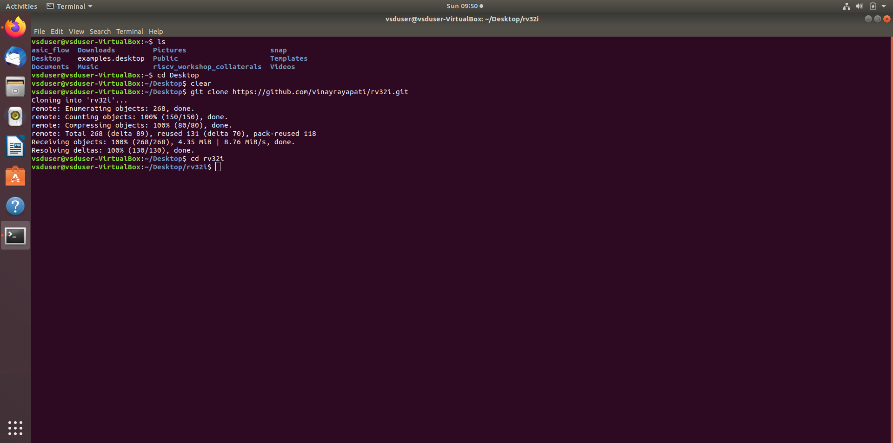
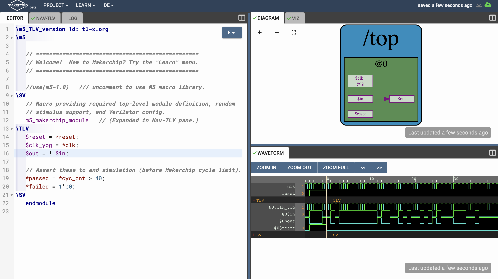
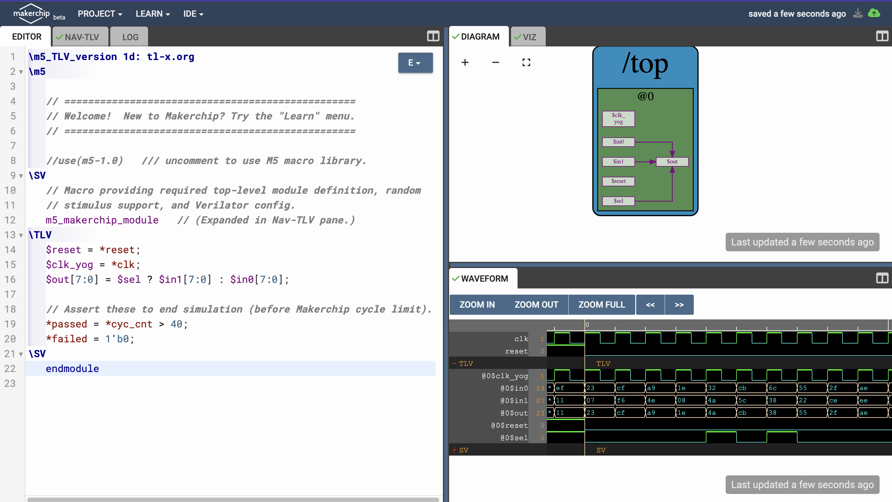
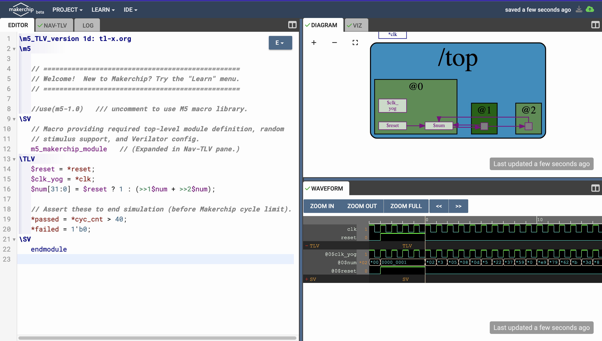
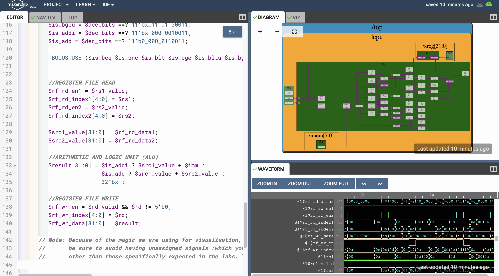
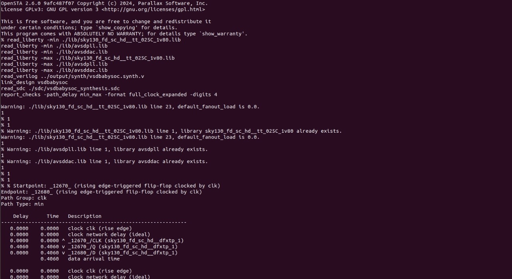

# ASIC Design Class Repository

## GitHub Repository: Yogesh Goyal, IMT2021542

This repository contains all the documentation and snapshots related to the experiments conducted during the lab sessions for the ASIC Design Class

---

## Contents of the Repository

- **Documentation:** Detailed explanations and observations for each experiment.
- **Snapshots:** Visual aids showing the procedures and steps involved in the experiments.

---

## Labs
<details>
<summary><strong>Laboratory 1:</strong> Create a C program to find the sum of `n` natural numbers, compile it using the GCC compiler, and verify the output after execution.</summary>

### Step-by-Step Procedure:

**Step 1:** Create a new `sum1ton.c` file in the specified directory (asic_flow) in a Linux environment using gedit editor.


- Save your C program


**Step 2:** Compile the source code `sum1ton.c` using gcc compiler (`gcc sum1ton.c`) which will generate an executable a.out file. Run the executable file(`./a.out`) in terminal window to view the output.


**Observation** 
- Sum of first 100 natural numbers come out to be 5050

</details>

<details>
<summary><strong>Laboratory 2:</strong> Compile the C program written in Laboratory 1 using the RISCV compiler.</summary>

### Step-by-Step Procedure:

# **Compilation using O1 flag**

**Step 1:** Compile `sum1ton.c` using RISCV Compiler using the command given below
```bash
riscv64-unknown-elf-gcc -O1 -mabi=lp64-march=rv64i -o sum1ton.o  sum1ton.c
```

- `riscv64-unknown-elf-gcc`: The compiler for RISC-V 64-bit target.
- `O1`: Applies moderate optimizations for a good balance between performance and compilation time.
- `mabi=lp64`: Specifies the ABI (Application Binary Interface) as LP64, meaning "Long and Pointer are 64-bit."
- `march=rv64i`: Sets the architecture to RISC-V 64-bit with the RV64I instruction set.
- `o sum1ton.o`: Outputs the compiled code to a file named sum1ton.o.
- `sum1ton.c`: The source file to be compiled.


- Also to check whether sum1ton.o has been created or not type the following command
```bash
ls -ltr sum1ton.o
```


**Step 2:** To generate the assembly code of the c program written type the following command in a new terminal window
```bash
riscv64-unknown-elf-objdump -d sum1ton.o
```


- It will give a bunch of assembly language code

**Step 3:** Use pipe less command with the command used in step 2 as shown below which allows us to scroll through the output interactively.

```bash
riscv64-unknown-elf-objdump -d sum1ton.o | less
```
- The assembly version of the C program is displayed. Type /main to navigate to the section of the code related to the main function (int main()).


- To determine the number of instructions in the "main" section, you can either count each instruction individually or use an alternative method: subtract the address of the first instruction in the subsequent section from the address of the first instruction in the "main" section. Then, divide the result by 4, as each instruction occupies 4 bytes in a byte-addressable memory system.


- No of instructions in the main function comes out to be (0x101C0 - 0x10184)/4 = 0x3C/4 = 0xF = 15 instructions

# **Compilation using Ofast flag**

**Step 4:** Repeat Step1 and instead of O1 flag use Ofast Flag and follow all the steps after that in the similar manner
```bash
riscv64-unknown-elf-gcc -Ofast -mabi=lp64-march=rv64i -o sum1ton.o  sum1ton.c
```


- Generate the assembly code for the file and observe that the number of bytes utilized decreases from 15 to 12.

**Observation** 
- **O1**: Provides moderate optimizations, balancing performance and compilation time, and adheres strictly to standards.
- **Ofast**: Applies aggressive optimizations for maximum performance, but might break some programs as it may not follow all standards.
</details>

<details>
<summary><strong>Laboratory 3:</strong> Determine the output of the C program using the RISC-V Compiler using Spike simulator, and then debug the code</summary>

### Step-by-Step Procedure:

# **Compilation**

**Step 1:** Compile `sum1ton.c` using RISCV Compiler using the command given below
```bash
riscv64-unknown-elf-gcc -O1 -mabi=lp64-march=rv64i -o sum1ton.o  sum1ton.c
```
**Step 2:** Now we have compiled our program using RISCV compiler and we need to run in order to get the output 
similar to the ./a.out we do using gcc compiler. To do that use Spike Simulator and type the following command 
given below

```bash
spike pk sum1ton.o
```


**Observation** 
- We have verified that output is same using the gcc and the riscv compiler

# **Debugging**

## Debugging the Assembly Code


To debug the assembly code of your compiled C program using the Spike simulator, follow these steps:

**Step 1:** Run the following command given below
```bash
spike -d pk sum1ton.o
```

- `spike`: The Spike RISC-V simulator.
- `d`: Starts the simulator in debug mode.
- `pk`: Proxy kernel, a small environment that provides minimal OS services.
- `sum1ton.o`: The compiled object file of your C program.

We will let the Spike debugger run until it reaches the 100b0 instruction within the main function by running the command given below. From there, we will proceed with manual debugging, checking the a2 register before and after execution.To move on to next instruction press Enter

```bash
until pc 0 100b0
```
To check a registers Value type the following command 
```bash
reg 0 a2
```


**Observation**
- Notably, the lui a2, 0x1 instruction changes the a2 register's value from `0x0000000000000000` to `0x0000000000001000`.

Next, we will manually debug the instruction addi sp, sp, -16, which reduces the stack pointer (sp) by 16. To do this run all the instructions till 100b8 by using the following command
```bash
until pc 0 100b8
```
To check stack pointer's Value type the following command 
```bash
reg 0 sp
```


 


**Observation**
- In the assembly code, it's evident that the stack pointer's value is being decreased by `0x10` in hexadecimal notation. This hexadecimal value translates to a reduction of 16 in decimal notation. Thus, the stack pointer is effectively being reduced by `16` units in decimal form.

</details>

<details>
<summary><strong>Laboratory 4:</strong> Identifying Different RISC-V Instructions.</summary>


# RISC-V Instruction Formats


**RISC-V architecture employs a variety of instruction formats to accommodate different types of operations. The six main formats are R-Type, I-Type, S-Type, B-Type, U-Type, and J-Type, each tailored for specific purposes like arithmetic, logical operations, immediate values, branching, memory access, and jumps. Below is a brief description of each format and its usage**

## R Type
- 'R' stands for register which means that operations are carried on the Registers and not on memory location
- This format encompasses arithmetic and logical operations.
- Suitable for operations involving three registers.
- The R-type format includes fields for two source registers, one destination register, a function code, and an opcode.
  - **Examples:** ADD, SUB, OR, XOR, AND etc.
  - **Format:**
    ```
    funct7 (7 bits): Function code for more instruction details.
    rs2 (5 bits): Second source register.
    rs1 (5 bits): First source register.
    funct3 (3 bits): Function code for basic instruction details.
    rd (5 bits): Destination register.
    opcode (7 bits): Base operation code for R-type instructions.
    ```

## I Type
- I stand for immediate which means that operations use Registers and Immediate value for their execution and are not related with memory location
- Commonly used for arithmetic with immediate values, load operations, and certain branch instructions.
- The I-type format includes fields for a source register, destination register, an immediate value, a function code, and an opcode.
  - **Format:**
    ```
    immediate (12 bits): Immediate value for operations.
    rs1 (5 bits): Source register.
    funct3 (3 bits): Function code for instruction details.
    rd (5 bits): Destination register.
    opcode (7 bits): Base operation code for I-type instructions.
    ```

## S Type
- S stands for Store, meaning it stores register values into memory.
- The S-type format includes fields for two source registers, an immediate value for the memory offset, a function code, and an opcode.
  - **Format:**
    ```
    imm[11:5] (7 bits): Upper 7 bits of the immediate value.
    rs2 (5 bits): Second source register (data to be stored).
    rs1 (5 bits): First source register (base address register).
    funct3 (3 bits): Function code for instruction details.
    imm[4:0] (5 bits): Lower 5 bits of the immediate value.
    opcode (7 bits): Base operation code for S-type instructions.
    ```

## B Type
- B-type instructions manage conditional branch operations, altering the flow of execution based on comparisons between two registers.
- The B-type format includes fields for two source registers, an immediate value for the branch offset, a function code, and an opcode.
  - **Format:**
    ```
    imm[12] (1 bit): The 12th bit of the immediate value.
    imm[10:5] (6 bits): The 10th to 5th bits of the immediate value.
    rs2 (5 bits): Second source register.
    rs1 (5 bits): First source register.
    funct3 (3 bits): Function code for instruction details.
    imm[4:1] (4 bits): The 4th to 1st bits of the immediate value.
    imm[11] (1 bit): The 11th bit of the immediate value.
    opcode (7 bits): Base operation code for B-type instructions.
    ```

## U Type
- U-type instructions deal with large immediate values, typically for loading upper immediate values or computing addresses.
- The U-type format includes fields for a destination register, a large immediate value, and an opcode.
  - **Format:**
    ```
    immediate[31:12] (20 bits): The upper 20 bits of the immediate value.
    rd (5 bits): Destination register.
    opcode (7 bits): Base operation code for U-type instructions.
    ```

## J Type
- J-type instructions handle jump operations, allowing for altering the program control flow by jumping to a specific address.
- These are used for unconditional jumps, such as calling functions or implementing loops.
  - **Format:**
    ```
    imm[20] (1 bit): The 20th bit of the immediate value.
    imm[10:1] (10 bits): The 10th to 1st bits of the immediate value.
    imm[11] (1 bit): The 11th bit of the immediate value.
    imm[19:12] (8 bits): The 19th to 12th bits of the immediate value.
    rd (5 bits): Destination register where the return address is stored.
    opcode (7 bits): Operation code for J-type instructions.
    ```

## Analyzing and Decoding each Instruction given to us
```
ADD r0, r1, r2
SUB r2, r0, r1
AND r1, r0, r2
OR r8, r1, r5
XOR r8, r0, r4
SLT r0, r1, r4
ADDI r2, r2, 5
SW r2, r0, 4
SRL r6, r1, r1
BNE r0, r0, 20
BEQ 10, r0, 15
LW r3, r1, 2
SLL r5, r1, r1
```
```
1. ADD r0, r1, r2
```
- Opcode for ADD = 0110011
- rd = r0 = 00000
- rs1 = r1 = 00001
- rs2 = r2 = 00010
- func3 = 000
- func7 = 0000000
- Instruction Type- R Type
- **32-bit Instruction:** `0000000_00010_00001_000_00000_0110011`
```
2. SUB r2, r0, r1
```
- Opcode for SUB = 0110011
- rd = r2 = 00010
- rs1 = r0 = 00000
- rs2 = r1 = 00001
- func3 = 000
- func7 = 0100000
- Instruction Type- R Type
- **32-bit Instruction:** `0100000_00001_00000_000_00010_0110011`
```
3. AND r1, r0, r2
```
- Opcode for AND = 0110011
- rd = r1 = 00001
- rs1 = r0 = 00000
- rs2 = r2 = 00010
- func3 = 111
- func7 = 0000000
- Instruction Type- R Type
- **32-bit Instruction:** `0000000_00010_00000_111_00001_0110011`
```
4. OR r8, r1, r5
```
- Opcode for OR = 0110011
- rd = r8 = 01000
- rs1 = r1 = 00001
- rs2 = r5 = 00101
- func3 = 110
- func7 = 0000000
- Instruction Type- R Type
- **R Type 32-bit Instruction:** `0000000_00101_00001_110_01000_0110011`
```
5. XOR r8, r0, r4
```
- Opcode for XOR = 0110011
- rd = r8 = 01000
- rs1 = r0 = 00000
- rs2 = r4 = 00100
- func3 = 100
- func7 = 0000000
- Instruction Type- R Type
- **32-bit Instruction:** `0000000_00100_00000_100_01000_0110011`
```
6. SLT r0, r1, r4
```
- Opcode for SLT = 0110011
- rd = r0 = 00000
- rs1 = r1 = 00001
- rs2 = r4 = 00100
- func3 = 010
- func7 = 0000000
- Instruction Type- R Type
- **32-bit Instruction:** `0000000_00100_00001_010_00000_0110011`
```
7. ADDI r2, r2, 5
```
- Opcode for ADDI = 0010011
- rd = r2 = 00010
- rs1 = r2 = 00010
- imm = 000000000101
- func3 = 000
- Instruction Type- I Type
- **I Type 32-bit Instruction:** `000000000101_00010_000_00010_0010011`
```
8. SW r2, r0, 4
```
- Opcode for SW = 0100011
- rs1 = r0 = 00000
- rs2 = r2 = 00010
- imm = 0000000 0100
- func3 = 010
- Instruction Type- S Type
- **32-bit Instruction:** `0000000_00010_00000_010_00100_0100011`
```
9. SRL r6, r1, r1
```
- Opcode for SRL = 0110011
- rd = r6 = 00110
- rs1 = r1 = 00001
- rs2 = r1 = 00001
- func3 = 101
- func7 = 0000000
- Instruction Type- R Type
- **32-bit Instruction:** `0000000_00001_00001_101_00110_0110011`
```
10. BNE r0, r0, 20
```
- Opcode for BNE = 1100011
- rs1 = r0 = 00000
- rs2 = r0 = 00000
- imm[12:1] = 20 = 000000010100
- func3 = 001
- Instruction Type- B Type
- **32-bit Instruction:** `0_000001_00000_00000_001_0100_0_1100011`
```
11. BEQ r0, r0, 15
```
- Opcode for BEQ = 1100011
- rs1 = r0 = 00000
- rs2 = r0 = 00000
- Imm[12:1] = 15 = 000000001111
- func3 = 000
- Instruction Type- B Type
- **32-bit Instruction:** `0_000000_00000_00000_000_1111_0_1100011`
```
12. LW r3, r1, 2
```
- Opcode for LW = 0000011
- rd = r3 = 00011
- rs1 = r1 = 00001
- imm = 000000000010
- func3 = 010
- Instruction Type- I Type
- **32-bit Instruction:** `000000000010_00001_010_00011_0000011`
```
13. SLL r5, r1, r1
```
- Opcode for SLL = 0110011
- rd = r5 = 00101
- rs1 = r1 = 00001
- rs2 = r1 = 00001
- func3 = 001
- func7 = 0000000
- Instruction Type- R Type
- **32-bit Instruction:** `0000000_00001_00001_001_00101_0110011`

| Instruction | Type | 32-bit Representation                      | Hexadecimal Notation  |
|-------------|------|-------------------------------------------|-----------------------|
| ADD r0, r1, r2 | R    | 0000000_00010_00001_000_00000_0110011     | 0x00208033            |
| SUB r2, r0, r1 | R    | 0100000_00001_00000_000_00010_0110011     | 0x40100133            |
| AND r1, r0, r2 | R    | 0000000_00010_00000_111_00001_0110011     | 0x002070B3            |
| OR r8, r1, r5  | R    | 0000000_00101_00001_110_01000_0110011     | 0x0050E433            |
| XOR r8, r0, r4 | R    | 0000000_00100_00000_100_01000_0110011     | 0x00404433            |
| SLT r0, r1, r4 | R    | 0000000_00100_00001_010_00000_0110011     | 0x0040A033            |
| ADDI r2, r2, 5 | I    | 000000000101_00010_000_00010_0010011      | 0x00510113            |
| SW r2, r0, 4   | S    | 0000000_00010_00000_010_00100_0100011     | 0x00202223            |
| SRL r6, r1, r1 | R    | 0000000_00001_00001_101_00110_0110011     | 0x0010D333            |
| BNE r0, r0, 20 | B    | 0_000001_00000_00000_001_0100_0_1100011   | 0x02001463            |
| BEQ r0, r0, 15 | B    | 0_000000_00000_00000_000_1111_0_1100011   | 0x00000F63            |
| LW r3, r1, 2   | I    | 000000000010_00001_010_00011_0000011      | 0x0020A183            |
| SLL r5, r1, r1 | R    | 0000000_00001_00001_001_00101_0110011     | 0x001092B3            |

</details>

<details>
<summary><strong>Laboratory 5:</strong> Execute the RISC-V ISA in the Reference Verilog Code and Get the Output Waveform.</summary>

---
##### As illustrated in the figure below, all the instructions in the provided Verilog file are hardcoded. This means that, instead of adhering to the standard RISC-V bit patterns, the designer has implemented custom bit patterns for each instruction.


### Differences between Standard RISC-V ISA and Hardcoded ISA

| Operation           | Standard RISC-V ISA | Hardcoded ISA   |
|---------------------|---------------------|-----------------|
| ADD R6, R2, R1      | 32'h00110333         | 32'h02208300    |
| SUB R7, R1, R2      | 32'h402083b3         | 32'h02209380    |
| AND R8, R1, R3      | 32'h0030f433         | 32'h0230a400    |
| OR R9, R2, R5       | 32'h005164b3         | 32'h02513480    |
| XOR R10, R1, R4     | 32'h0040c533         | 32'h0240c500    |
| SLT R1, R2, R4      | 32'h0045a0b3         | 32'h02415580    |
| ADDI R12, R4, 5     | 32'h004120b3         | 32'h00520600    |
| BEQ R0, R0, 15      | 32'h00000f63         | 32'h00f00002    |
| SW R3, R1, 2        | 32'h0030a123         | 32'h00209181    |
| LW R13, R1, 2       | 32'h0020a683         | 32'h00208681    |
| SRL R16, R14, R2    | 32'h0030a123         | 32'h00271803    |
| SLL R15, R1, R2     | 32'h002097b3         | 32'h00208783    |

### Custom Instructions provided in previous task

| Instruction    | Type | 32-bit Representation                | Hexadecimal Notation |
|----------------|------|--------------------------------------|----------------------|
| ADD r0, r1, r2 | R    | 0000000_00010_00001_000_00000_0110011 | 0x00208033           |
| SUB r2, r0, r1 | R    | 0100000_00001_00000_000_00010_0110011 | 0x40100133           |
| AND r1, r0, r2 | R    | 0000000_00010_00000_111_00001_0110011 | 0x002070B3           |
| OR r8, r1, r5  | R    | 0000000_00101_00001_110_01000_0110011 | 0x0050E433           |
| XOR r8, r0, r4 | R    | 0000000_00100_00000_100_01000_0110011 | 0x00404433           |
| SLT r0, r1, r4 | R    | 0000000_00100_00001_010_00000_0110011 | 0x0040A033           |
| ADDI r2, r2, 5 | I    | 000000000101_00010_000_00010_0010011  | 0x00510113           |
| SW r2, r0, 4   | S    | 0000000_00010_00000_010_00100_0100011 | 0x00202223           |
| SRL r6, r1, r1 | R    | 0000000_00001_00001_101_00110_0110011 | 0x0010D333           |
| BNE r0, r0, 20 | B    | 0_000001_00000_00000_001_0100_0_1100011 | 0x02001463           |
| BEQ r0, r0, 15 | B    | 0_000000_00000_00000_000_1111_0_1100011 | 0x00000F63           |
| LW r3, r1, 2   | I    | 000000000010_00001_010_00011_0000011  | 0x0020A183           |
| SLL r5, r1, r1 | R    | 0000000_00001_00001_001_00101_0110011 | 0x001092B3           |


## **Functional Simulation**

*NOTE:* Here we have used Verilog code and the testbench of RISC-V from the GitHub repository [iiitb_rv32i](https://github.com/vinayrayapati/rv32i/tree/main).

1. Clone the Repository and change the directory as follows
    ```bash
   git clone https://github.com/vinayrayapati/iiitb_rv32i
    cd rv32i  
   ```


2. To compile the Verilog code, use the following command:
   ```bash
   iverilog -o iiitb_rv32i iiitb_rv32i.v iiitb_rv32i_tb.v
   ```

3. Run this command to execute the test bench and generate a .vcd file:
     ```bash
    vvp iiitb_rv32i
   ```
4. View the Test Bench in GTKWave:

    ```bash
    gtkwave iiitb_rv32i.vcd
    ```



### Output Waveform
The output waveform illustrates the execution of instructions within a 5-stage pipelined architecture.


Outputs
```
1. ADD R6, R2, R1
```


```
2. SUB R7, R1, R2
```


```
3. AND R8, R1, R3
```


```
4. OR R9, R2, R5
```


```
5. XOR R10, R1, R4
```


```
6. SLT R1, R2, R4
```


```
7. ADDI R12, R4, 5
```


```
8. BEQ R0, R0, 15
```


```
9. SW R3, R1, 2
```

```

10. LW R13, R1, 2
```


**Observation**:- We observe a variation between bit pattern of RISCV code and hardcoded ISA.
</details>

<details>
<summary><strong>Laboratory 6:</strong> Finding Two's Complement of a 4 bit Number</summary>

# Twosify: Two's Compliment of a number
### Understanding Two's Complement

Two's complement is a mathematical operation on binary numbers, often used to represent signed integers in computing. To find the two's complement of a binary number:

1. **Invert all the bits** (change 0 to 1 and 1 to 0).
2. **Add 1** to the least significant bit (LSB) of the inverted number.

### Step-by-Step Procedure:

# **Calculation of Two's Complement**

## Compilation using gcc

**Step 1:** Create a new `twosify.c` file in the specified directory (asic_flow) in a Linux environment using gedit editor and save your c program. You can find the c program here `Lab6/twosify.c`


**Step 2:** Compile the c program using the gcc compiler using the command below
```bash
gcc twosify.c
```
**Step 3:** Now the run the executable file (a.out) using the following command
```bash
./a.out
```


## Compliation using RISCV Compiler

**Step 1:** Compile `twosify.c` using the RISCV Compiler with the command below:
```bash
riscv64-unknown-elf-gcc -Ofast -mabi=lp64 -march=rv64i -o twosify.o twosify.c
```

**Step 2:** After compiling the program using the RISCV compiler, run it to obtain the output. Similar to how you would use ./a.out with the GCC compiler, use the Spike Simulator with the following command:

```bash
spike pk twosify.o
```


**Observation**:- We can observe the output that is the two's compliment of number `3` is verified and coming the same using gcc and the riscv compiler.
</details>

<details>
<summary><strong>Laboratory 7:</strong> Digital Logic with TL-Verilog using Makerchip </summary>

## Combinational Circuits in TL-Verilog

**Introduction to TL-Verilog and Makerchip:**
Makerchip supports the Transaction-Level Verilog (TL-Verilog) standard, which represents a significant advancement by removing the need for the legacy features of traditional Verilog and introducing a more streamlined syntax. TL-Verilog enhances design efficiency by adding powerful constructs for pipelines and transactions, making it easier to develop complex digital circuits.


### 1. Inverter
Code is given below
```tl-verilog
$out = ! $in;
```
The generated block diagram and waveforms are as shown




### 2. 2-Input And Gate(&&)
Code is given below
```tl-verilog
$out = $in1 && $in2;
```
The generated block diagram and waveforms are as shown


### 3. 2-Input OR Gate
Code is given below
```tl-verilog
$out = $in1 || $in2;
```
The generated block diagram and waveforms are as shown


### 4. 2-Input XOR Gate
Code is given below
```tl-verilog
$out = $in1 ^ $in2;
```
The generated block diagram and waveforms are as shown


### 5. Arithmetic Operation on Vectors
Code is given below
```tl-verilog
$out[4:0] = $in1[3:0] + $in2[3:0];
```
The generated block diagram and waveforms are as shown


### 6. 2:1 MUX
Code is given below
```tl-verilog
$out = $sel ? $in1 : $in0;
```
The generated block diagram and waveforms are as shown


### 7. 2:1 MUX Using Vectors
Code is given below
```tl-verilog
$out[7:0] = $sel ? $in1[7:0] : $in0[7:0];
```
The generated block diagram and waveforms are as shown



### 8. Combinational Calculator Implementation in TL-Verilog

**Calculator Overview:**
In this section, we demonstrate a basic combinational calculator implemented using TL-Verilog on the Makerchip platform. The calculator performs four fundamental arithmetic operations: addition, subtraction, multiplication, and division.

```tl-verilog
$val1[31:0] = $rand1[3:0];
$val2[31:0] = $rand2[3:0];

$sum[31:0]  = $val1[31:0] + $val2[31:0];
$diff[31:0] = $val1[31:0] - $val2[31:0];
$prod[31:0] = $val1[31:0] * $val2[31:0];
$quot[31:0] = $val1[31:0] / $val2[31:0];

$out[31:0]  = $sel[1] ? ($sel[0] ? $quot[31:0] : $prod[31:0])
                      : ($sel[0] ? $diff[31:0] : $sum[31:0]);
```
Description: 
In this code snippet, two random 4-bit values, `$rand1[3:0]` and `$rand2[3:0]`, are assigned to the 32-bit variables `$val1[31:0]` and `$val2[31:0]`, respectively. The calculator then performs four arithmetic operations on these values:

The result of one of these operations is selected by a multiplexer (MUX), controlled by the selection bits `$sel[1:0]`. The MUX determines which operation's output is assigned to `$out[31:0]`.

The generated block diagram and waveforms are as shown


#### **Observation**:- The following screenshot shows the implementation of the combinational circuit using the code above on the Makerchip platform. It also displays the generated block diagram and the simulation waveform, providing insight into the circuit's operation.

## Sequential Circuits in TL-Verilog

A sequential circuit is a type of digital circuit that uses memory components to retain data, enabling it to generate outputs based on both the current inputs and the circuit's prior state. This distinguishes it from combinational circuits, where the output is solely determined by the present inputs without any regard to past activity. Sequential circuits rely on feedback loops and storage elements like flip-flops or registers to keep track of their internal state over time. This internal state, combined with the present input, influences the circuit's behavior, allowing it to perform tasks that require a history of previous inputs or operations, such as counting, storing data, or sequencing events.

### 1. Fibbonacci Series
- Next Value is the sum of previous two values


Code is given below
```tl-verilog
$reset = *reset;
$num[31:0] = $reset ? 1 : (>>1$num + >>2$num);
```
The generated block diagram and waveforms are as shown



### 2. Free Running Counter
- Next Value increments by 1 of the previous value


Code is given below
```tl-verilog
$reset = *reset;
$cnt[31:0] = $reset ? 0 : (>>1$cnt + 1);
```
The generated block diagram and waveforms are as shown


### 3. Sequential Calculator
- Works the same way as combinational calculator but mimics real scenario in which the result of the previous operation is considered as one of the operand for the next operation. Upon reset the result becomes zero.


Code is given below
```tl-verilog
$reset = *reset;
   
$val1[31:0] = >>1$out;
$val2[31:0] = $rand[3:0];
   
$sum[31:0] =  $val1[31:0] +  $val2[31:0];
$diff[31:0] =  $val1[31:0] -  $val2[31:0];
$prod[31:0] =  $val1[31:0] *  $val2[31:0];
$quot[31:0] =  $val1[31:0] /  $val2[31:0];
   
   
$out[31:0] = $reset ? 32'h0 : ($choose[1] ? ($choose[0] ? $quot : $prod):($choose[0] ? $diff : $sum));

```
The generated block diagram and waveforms are as shown


## Pipelined Logic

In Transaction-Level Verilog (TL-Verilog), pipelined logic is elegantly expressed through the use of pipeline constructs that inherently represent the flow of data across different stages of a digital design. Each pipeline stage in TL-Verilog corresponds to a clock cycle, where operations are performed on data as it progresses through the pipeline. This approach allows for clear and concise modeling of sequential logic, where each stage automatically handles the propagation of state and values to the next cycle. By leveraging TL-Verilog's pipeline notation, designers can easily describe complex, multi-stage operations with a focus on the transaction flow, simplifying the design and verification process while enhancing readability and maintainability.

### 1. To produce the Pipeline Design
- To produce the given block Diagram logic shown below. 4 error conditions in the pipeline and aggregrating them to result in a single error indication.


Code is given below
```tl-verilog
$reset = *reset;
$clk_yog = *clk;
|comp
  @1
    $err1 = $bad_input || $illegal_op;
  @3
    $err2 = $over_flow || $err1;
  @6
    $err3 = $div_by_zero || $err2;
```
The generated block diagram and waveforms are as shown and can be compared with the one which had to be produced and can verify it is the same


### 2. 2 Cycle Calculator 
- 


Code is given below
```tl-verilog
|calc
  @1
    $reset = *reset;
    $clk_yog = *clk;
   
    $val1[31:0] = >>2$out[31:0];
    $val2[31:0] = $rand2[3:0];
    $sel[1:0] = $rand3[1:0];
   
    $sum[31:0] = $val1[31:0] + $val2[31:0];
    $diff[31:0] = $val1[31:0] - $val2[31:0];
    $prod[31:0] = $val1[31:0] * $val2[31:0];
    $quot[31:0] = $val1[31:0] / $val2[31:0];
         
    $count = $reset ? 0 : >>1$count + 1;
         
  @2
    $valid = $count;
    $inv_valid = !$valid;
    $calc_reset = $reset | $inv_valid;
    $out[31:0] = $calc_reset ? 32'b0 : ($op[1] ? ($op[0] ? $quot[31:0] : $prod[31:0])
                                             : ($op[0] ? $diff[31:0] 
                                                        : $sum[31:0]));


```
The generated block diagram and waveforms are as shown


## Validity
When generating a waveform, results are obtained for each clock cycle, and while there may be no compilation errors, logical errors can still slip through, making them difficult to detect by merely analyzing the waveforms. Additionally, some "don't care" conditions might be irrelevant to the design and should be ignored. The concept of validity is introduced to address these issues. The global clock continuously drives operations, even when they are unnecessary, leading to excessive power consumption. In physical circuits, clocks are powered by voltage or current sources, consuming energy with every cycle. In complex systems, failing to bypass unnecessary operations can lead to substantial power waste. To optimize power efficiency, the clock signal is disabled during unneeded cycles through a technique called clock gating. Validity is crucial for implementing clock gating, ensuring that only the necessary operations are executed.

### 1. Total Distance Calculator
Code is given below
```tl-verilog
|calc
  @1
    $reset = *reset;
    $clk_yog = *clk;
            
    ?$vaild      
      @1
        $aa_seq[31:0] = $aa[3:0] * $aa;
        $bb_seq[31:0] = $bb[3:0] * $bb;;
      
      @2
        $cc_seq[31:0] = $aa_seq + $bb_seq;;
      
      @3
        $cc[31:0] = sqrt($cc_seq);
            
      @4
         $total_distance[63:0] = 
            $reset ? '0 :
            $valid ? >>1$total_distance + $cc :
                     >>1$total_distance;


```


The generated block diagram and waveforms are as shown


### 2. 2 Cycle Calulator with validity

Code is given below
```tl-verilog
|calc
@0
   $reset = *reset;
    $clk_yog = *clk;
         
@1
    $val1 [31:0] = >>2$out [31:0];
    $val2 [31:0] = $rand2[3:0];
         
    $valid = $reset ? 1'b0 : >>1$valid + 1'b1 ;
    $valid_or_reset = $valid || $reset;
         
vaild_or_reset
   @1   
      $sum [31:0] = $val1 + $val2;
      $diff[31:0] = $val1 - $val2;
      $prod[31:0] = $val1 * $val2;
      $quot[31:0] = $val1 / $val2;
            
   @2   
      $out [31:0] = $reset ? 32'b0 :
                          ($op[1:0] == 2'b00) ? $sum :
                          ($op[1:0] == 2'b01) ? $diff :
                          ($op[1:0] == 2'b10) ? $prod :
                                                $quot ;
```


The generated block diagram and waveforms are as shown


### 3. 2 Calculator with Single Value Memory

Code is given below
```tl-verilog
|calc
  @0
    $reset = *reset;
    $clk_yog = *clk;
         
   @1
    $val1 [31:0] = >>2$out;
    $val2 [31:0] = $rand2[3:0];
         
    $valid = $reset ? 1'b0 : >>1$valid + 1'b1 ;
    $valid_or_reset = $valid || $reset;
         
  ?$vaild_or_reset
    @1   
      $sum [31:0] = $val1 + $val2;
      $diff[31:0] = $val1 - $val2;
      $prod[31:0] = $val1 * $val2;
      $quot[31:0] = $val1 / $val2;
            
     @2   
        $mem[31:0] = $reset ? 32'b0 :
                     ($op[2:0] == 3'b101) ? $val1 : >>2$mem ;
            
        $out [31:0] = $reset ? 32'b0 :
                       ($op[2:0] == 3'b000) ? $sum :
                      ($op[2:0] == 3'b001) ? $diff :
                      ($op[2:0] == 3'b010) ? $prod :
                      ($op[2:0] == 3'b011) ? $quot :
                      ($op[2:0] == 3'b100) ? >>2$mem : >>2$out ;
```


The generated block diagram and waveforms are as shown


</details>

<details>
<summary><strong>Laboratory 8:</strong> Basic RISCV CPU Micro-architecture </summary>

# Implementation of the RISC-V CPU Core
This section will walk you through the different implementation steps followed to achieve the design of the complete RISC-V CPU core. You can find the codes [here](https://github.com/YogeshGoyyalA-1/Asic_Design/tree/main/Lab8/codes).


Given below is the riscv block diagram


The design of a basic RISC-V CPU core involves several key logical blocks, which include the following components:

### 1:- Program Counter(PC) and next PC Logic

The Program Counter (PC) is a register that stores the address of the next instruction to be executed, functioning as a pointer into the instruction memory. Since the memory is byte-addressable and each instruction is 32 bits long, the PC increments by 4 bytes after each instruction to point to the next one. Upon the initial execution, a reset signal sets the PC to 0, ensuring that the first instruction is fetched from the correct starting point. For branch instructions, an immediate value is added to the current PC, resulting in a new address given by the formula: `NextPC = Incremented PC + Offset value`. Generally, the PC advances by 4 to fetch the next sequential instruction, but it resets to zero if a reset signal is triggered. The accompanying diagram illustrates how the PC functions, showing its progression through instructions and its behavior during resets and branch operations.


Code is given below
```tl-verilog
$reset = *reset;
$clk_yog = *clk;
$reset = *reset;

|cpu
  @0
    $reset = *reset;
    $pc[31:0] = >>1$reset ? 32'b0 : >>1$pc + 32'd4;
```

Generated block diagram and waveform for the pc counter is shown below


### 2:- Instruction Fetch

The Instruction Fetch Unit (IFU) within a CPU is tasked with organizing program instructions to be fetched from memory and executed in the correct sequence, forming the core's control logic.The program counter identifies the address of the next instruction stored in the instruction memory. This instruction must be retrieved to proceed with processing and further calculations.In this context, the instruction memory is integrated into the program. Within the Instruction Fetch logic, instructions are retrieved from the instruction memory and then forwarded to the Decode logic for processing. The read address for the instruction memory is derived from the program counter, which outputs a 32-bit instruction (instr[31:0]).


Code is given below
```tl-verilog
|cpu
  @0
    $reset = *reset;
    $clk_yog = *clk;
    $pc[31:0] = $reset ? '0 : >>1$pc + 32'd4;
         
    $imem_rd_en = !$reset ? 1 : 0;
    $imem_rd_addr[M4_IMEM_INDEX_CNT-1:0] = $pc[M4_IMEM_INDEX_CNT+1:2];

  @1
    $instr[31:0] = $imem_rd_data[31:0];
```

Generated block diagram and waveform for the instruction fetch cycle is shown below


### 3:- Instruction Decode
In the decode stage, the goal is to extract detailed information from the instruction read during the fetch stage. This includes determining the instruction set, identifying any immediate values, and extracting register values.During Instruction Decode, every instruction is analyzed to identify its type, whether it includes immediate values, and the specific fields it contains. The opcode is mapped to the corresponding instruction, and the bit fields are interpreted according to the RISC-V ISA specifications.


Code is given below

```tl-verilog
 //INSTRUCTION TYPES DECODE         
@1
  $is_u_instr = $instr[6:2] ==? 5'b0x101;
         
  $is_s_instr = $instr[6:2] ==? 5'b0100x;
         
  $is_r_instr = $instr[6:2] ==? 5'b01011 ||
                       $instr[6:2] ==? 5'b011x0 ||
                       $instr[6:2] ==? 5'b10100;
         
  $is_j_instr = $instr[6:2] ==? 5'b11011;
         
  $is_i_instr = $instr[6:2] ==? 5'b0000x ||
                       $instr[6:2] ==? 5'b001x0 ||
                       $instr[6:2] ==? 5'b11001;
         
  $is_b_instr = $instr[6:2] ==? 5'b11000;
         
  //INSTRUCTION IMMEDIATE DECODE
  $imm[31:0] = $is_i_instr ? {{21{$instr[31]}}, $instr[30:20]} :
                      $is_s_instr ? {{21{$instr[31]}}, $instr[30:25], $instr[11:7]} :
                      $is_b_instr ? {{20{$instr[31]}}, $instr[7], $instr[30:25], $instr[11:8], 1'b0} :
                      $is_u_instr ? {$instr[31:12], 12'b0} :
                      $is_j_instr ? {{12{$instr[31]}}, $instr[19:12], $instr[20], $instr[30:21], 1'b0} :
                                    32'b0;
         
         
         
         
         
  //INSTRUCTION FIELD DECODE
  $rs2_valid = $is_r_instr || $is_s_instr || $is_b_instr;
  ?$rs2_valid
    $rs2[4:0] = $instr[24:20];
            
  $rs1_valid = $is_r_instr || $is_i_instr || $is_s_instr || $is_b_instr;
  ?$rs1_valid
    $rs1[4:0] = $instr[19:15];
         
  $funct3_valid = $is_r_instr || $is_i_instr || $is_s_instr || $is_b_instr;
  ?$funct3_valid
    $funct3[2:0] = $instr[14:12];
            
  $funct7_valid = $is_r_instr ;
  ?$funct7_valid
    $funct7[6:0] = $instr[31:25];
  $rd_valid = $is_r_instr || $is_i_instr || $is_u_instr || $is_j_instr;
  ?$rd_valid
    $rd[4:0] = $instr[11:7];
         
         
   //INSTRUCTION DECODE
  $opcode[6:0] = $instr[6:0];
         
  $dec_bits [10:0] = {$funct7[5], $funct3, $opcode};
  $is_beq = $dec_bits ==? 11'bx_000_1100011;
  $is_bne = $dec_bits ==? 11'bx_001_1100011;
  $is_blt = $dec_bits ==? 11'bx_100_1100011;
  $is_bge = $dec_bits ==? 11'bx_101_1100011;
  $is_bltu = $dec_bits ==? 11'bx_110_1100011;
  $is_bgeu = $dec_bits ==? 11'bx_111_1100011;
  $is_addi = $dec_bits ==? 11'bx_000_0010011;
  $is_add = $dec_bits ==? 11'b0_000_0110011;
         
  `BOGUS_USE ($is_beq $is_bne $is_blt $is_bge $is_bltu $is_bgeu $is_addi $is_add)
```
### Instructions to be Decoded are as follows:- 

 
Instruction Decoding happens in various stages
- 1. INSTRUCTION TYPES DECODE :- In the Instruction Decode logic, each instruction is decoded to determine its type, any immediate values, and the specific field types. The opcode is converted into the corresponding instruction, with all bit values interpreted according to the RISC-V ISA. The decoding process begins by identifying the instruction type using 5 bits from `instr[6:2]`. The lower two bits (`instr[1:0]`) are always set to `11` for Base integer instructions. 

- 2. INSTRUCTION IMMEDIATE DECODE :- The instruction sets have an immediate field. In order to decoder this field we use the following code:-

- 3. INSTRUCTION FIELD DECODE AND INSTRUCTION DECODE :- Other instruction fields like funct7, rs2, rs1, funct3, rd and opcode are extracted from the 32-bit instruction based on the instruction type. We collect all the bit values of funct7, funct3, opcode, rs2, rs1 and rd into a single vector and then decode the type of instruction. At this point valid condtions need to be defined for fields like rs1, rs2, funct3 and funct7 because they are unique to only certain instruction types.

Generated block diagram and waveform for the instruction Instruction Decode is shown below


### 4:- Register File Read

Most instructions, particularly arithmetic ones, operate on source registers, requiring a read from these registers. The CPU's register file supports two simultaneous reads for the source operands (rs1 and rs2) and one write per cycle to the destination register. Inputs `rs1` and `rs2` are fed into the register file, producing the corresponding register contents as outputs. Enable bits are set based on the validity of rs1 and rs2 conditions defined earlier. This setup, known as a 2-port register file, allows reading from two registers simultaneously. The read instructions are stored in registers and then sent to the ALU for processing.

Code is given below

```tl-verilog
//REGISTER FILE READ
$rf_wr_en = 1'b0;
$rf_wr_index[4:0] = 5'b0;
$rf_rd_en1 = $rs1_valid;
$rf_rd_index1[4:0] = $rs1;
$rf_rd_en2 = $rs2_valid;
$rf_rd_index2[4:0] = $rs2;
         
$src1_value[31:0] = $rf_rd_data1;
$src2_value[31:0] = $rf_rd_data2;
```
Generated block diagram and waveform for the instruction Instruction Decode is shown below


### 5:- Arithmetic and logic Unit(ALU)

The Arithmetic Logic Unit (ALU) is responsible for computing results based on the chosen operation. It processes the data from two registers provided by the register file, performs the corresponding arithmetic operation, and then writes the ALU's result back to memory via the register file's write port. Currently, the code supports only ADD and ADDI operations for executing the test code. All operations will be added at a later step.

Code is given below

```tl-verilog
//ARITHMETIC AND LOGIC UNIT (ALU)
$result[31:0] = $is_addi ? $src1_value + $imm :
              $is_add ? $src1_value + $src2_value :
                32'bx ;
```
Generated block diagram and waveform for the instruction Instruction Decode is shown below


### 6:- Register File Write

This step is crucial for handling instructions that require storing the output in a destination register (rd). The ALU's result is written back to memory through the register_file_write port, with the register_file_write_enable signal determined by the validity of the destination register (`rd`). The register_file_write_index then assigns the value from the destination register (rd) to the appropriate memory location. Since the RISC-V architecture has a hardwired x0 register, which is always zero, an additional condition is implemented to prevent any write operations to the x0 register. After the ALU completes its operations on the register values, these results may need to be written back into the registers. This process ensures that no write occurs to x0, maintaining its constant value of zero.

Block diagram of a 2-port Register File, with 2 Read and 1 Write per cycle:


General Block Diagram of Register File and ALU:


Code is given below

```tl-verilog
//REGISTER FILE WRITE
$rf_wr_en = $rd_valid && $rd != 5'b0;
$rf_wr_index[4:0] = $rd;
$rf_wr_data[31:0] = $result;
```
Generated block diagram and waveform for the instruction Instruction Decode is shown below



### 7:- Memory File
In addition to all of these, we also have a Memory file for which we have load and store instructions. The Store instruction is going to write a value fetched from the register file into the memory. The Load instruction is going to access the memory, take the value from it and them load it into the register file

### 8:- Branch Instruction

The final step involves adding support for branch instructions. In the RISC-V ISA, branches are conditional, meaning a specific branch is taken based on a certain condition. Additionally, the branch target PC must be calculated, and if the branch is taken, the PC will update to this new branch target when necessary.


Code is given below

```tl-verilog
//BRANCH INSTRUCTIONS 1
$taken_branch = $is_beq ? ($src1_value == $src2_value):
$is_bne ? ($src1_value != $src2_value):
$is_blt ? (($src1_value < $src2_value) ^ ($src1_value[31] != $src2_value[31])):
$is_bge ? (($src1_value >= $src2_value) ^ ($src1_value[31] != $src2_value[31])):
$is_bltu ? ($src1_value < $src2_value):
$is_bgeu ? ($src1_value >= $src2_value):
                                    1'b0;
`BOGUS_USE($taken_branch)
         
//BRANCH INSTRUCTIONS 2
 $br_target_pc[31:0] = $pc +$imm;
```
Generated block diagram and waveform for the instruction Instruction Decode is shown below

</details>


<details>
<summary><strong>Laboratory 9:</strong> Complete pipelined RISCV CPU Micro Architecture </summary>

### Pipelining the RISC-V CPU Core
The RISC-V core designed is divided into 5 pipeline stages. Pipelining in Makerchip is extremely simple. To define a pipeline use the following syntax:

```tl-verilog
|<pipeline_name>
  @<pipeline_stage>
    instruction1 in the current stage
    instruction2 in the current stage
    .
    .
  @<pipeline_stage>
    instruction1 in the current stage
    instruction2 in the current stage
    .
    .

```
 Staging in a pipeline is a physical attribute with no impact to behaviour. At this point support for register file bypass is provided. 

 ### Load/Store Instructions
 Load/store and jump support is added along with the following two extra lines of code to test load and store.
 
```tl-verilog
m4_asm(SW, r0, r10, 10000)
m4_asm(LW, r17, r0, 10000)
```


##  Testing the core with a Testbench
Now that the implementation is complete, a simple testbench statement can be added to ensure whether the core is working correctly or not. The "passed" and "failed" signals are used to communicate with the Makerchip platform to control the simulation. It tells the platform whther the simulation passed without any errors, failed with a list of errors that can be inferred from the log files, and hence to stop the simulation, if failed.

When the following line of code as mentioned below is added on Makerchip, the simulation will pass only if the value stored in r10 = sum of numbers from 1 to 9.
 
```tl-verilog
*passed = |cpu/xreg[17]>>5$value == (1+2+3+4+5+6+7+8+9);
```


Here, in the instruction memory, register r10 has been used to store the sum value. The simulation passed message can be seen under the "Log" tab. We have used ">>5" (ahead by 5) operator, because instead of stopping the simulator immediately, we wait for a couple of more cycles so as to see a little bit more on the waveform.


### CLK Waveform

### Reset Waveform


- We can observe that values are are being incremented and final value is `2d` which is 45 in hex

We can observe the simulation passed message
## The VIZ Graphic Visualizer
As we can see from the diagram, the final sum output of numbers from 1 to 9 , ie equal to 45 has been stored in the register r10, and simultaneously written into memory address 16 (4 because of byte addressing).


# Final RISC-V CPU Core Implementation
- The snapshot of the final output can be seen below.


**Final Block Diagarm is as shown**


#### **Observation**:- A 5-stage pipeline design, using `clk_yog`, computes the sum of numbers from 1 to 9 across various stages. The stages include Instruction Fetch, Instruction Decode, Execute, Memory Access, and Write-back. The entire process takes 58 cycles to complete.
</details>
<details>
<summary><strong>Laboratory 10:</strong> Converting TL-Verilog to Verilog and Simulating with a Testbench</summary>

### Objective:
The RISC-V processor was initially designed using TL-Verilog in the Makerchip IDE. To deploy this design on an FPGA, it must first be converted to standard Verilog. This conversion was achieved using the Sandpiper-SaaS compiler. Following the conversion, pre-synthesis simulations will be conducted using the GTKWave simulator to verify the design.
### Step-by-Step Procedure:

1. **Install Required Packages:**
Begin by installing the necessary packages using pip:
```bash
pip3 install pyyaml click sandpiper-saas
```
2. **Clone the github repo:** 
clone this repo containing VSDBabySoC design files and testbench. Move into the VSDBabySoc directory
```bash
git clone https://github.com/manili/VSDBabySoC.git
cd VSDBabySoc
```


3. **Replace the rvmyth.tlv file in the VSDBabySoC Directory:** 
replace in src/module with the rvmth.tlv given [here](https://github.com/YogeshGoyyalA-1/Asic_Design/tree/main/Lab10/codes). or replace the code with the code given below and also change the testbench according to our makerchip code.

4. **Convert .tlv to .v using converter:**
Now we have written the code in TL-Verilog .tlv which is a high level language and we want to convert into low level verilog that is to translate .tlv definition of rvmyth into .v definition. To do so Run the following command as follows

```bash
sandpiper-saas -i ./src/module/*.tlv -o rvmyth.v --bestsv --noline -p verilog --outdir ./src/module/
```


4. **Make the pre_synth_sim.vcd:**
We will create the pre_synth_sim.vcd by running the following command
```bash
make pre_synth_sim
```
The result of the simulation i.e the pre_synth_sim.vcd will be stored in the output/pre_synth_sim directory


5 .**Now to compile and simulate RISC-V design run the following code:**
To compile and simulate vsdbabysoc design.

```bash
iverilog -o output/pre_synth_sim.out -DPRE_SYNTH_SIM src/module/testbench.v -I src/include -I src/module
cd output
./pre_synth_sim.out
```
To generate pre_synth_sim.vcd file,which is our simulation waveform file.


6. **To open the Simulation file in gtkwave tool:**
To do so run the follwowing command 
```bash
gtkwave pre_synth_sim.vcd
```

### Pre-synthesis Simulation results:
Signals to plot are the following:

- clk_yog: This is the clock input to the RISC-V core.
- reset: This is the input reset signal to the RISC-V core.
- OUT[9:0]: This is the 10-bit output [9:0] OUT port of the RISC-V core. This port comes from the RISC-V register #14, originally.

Our aim is to verify whether the waveform which we obtained by running the .tlv in makerchip and the waveforms obtained by converting .tlv to .v then simulating it on gtkwave are same or not. We will verify this with the help of below waveforms which includes the one obtained in the previous labs and the one which we obtained from gtkwave

### Waveforms from Makerchip platform IDE by running .tlv file for comparison
**Clk Waveform**

**Reset Waveform**

**Final Output**


**Observation** :- We can see the gradual increment in sum from 0 to 9 in the end the sum of numbers from 0 to 9 is 45 which is `Ox2D` in hexadecimal which is stored in the register 14

### Waveforms from GTKwave platform by running .v file after conversion
**Clk Waveform**

**Reset Waveform**

**Final Output**


**Observation** :- We can see the gradual increment in sum from 0 to 9 in out[9:0] in the end the sum of numbers from 0 to 9 is 45 which is `Ox2D` in hexadecimal

### Observation:- We have verified our code for the processor works in the intended way as the output waveforms that we obtained from .tlv file and after conversion to low level .v file using gtkwave gives the same waveforms in both the cases as intended. 
</details>

<details>
<summary><strong>Laboratory 11:</strong>To generate waveform for DAC and PLL peripheral for Risc-V processor.</summary>

---

VSDBabySoC is a small yet powerful RISCV-based SoC. The main purpose of designing such a small SoC is to test three open-source IP cores together for the first time and calibrate the analog part of it. VSDBabySoC contains one RVMYTH microprocessor, an 8x-PLL to generate a stable clock, and a 10-bit DAC to communicate with other analog devices.


**What is RVMYTH?**

RVMYTH core is a simple RISCV-based CPU, introduced in Lab8 and Lab9. In lab 9,  a risc-v processor was created from scratch using the TLV for faster development. The main task of the processor is to add numbers from 1 to 9 and generate the sum output.


### BabySoC Simulation

Developing and simulating the complete micro-architecture of a RISC-V CPU is a complex task. For this simulation, we'll focus on incorporating two key IP blocks: **PLL** and **DAC**.

---

#### **Phase-Locked Loop (PLL)**

A Phase-Locked Loop (PLL) is an electronic system that aligns the phase and frequency of an output signal with a reference signal. It generally consists of three primary components:

1. **Phase Detector:** Compares the phase of the reference signal with the output signal, generating an error signal based on their difference.
2. **Loop Filter:** Smooths the error signal, reducing noise and improving the system's stability.
3. **Voltage-Controlled Oscillator (VCO):** Adjusts its output frequency in response to the filtered error signal to minimize the phase difference.

PLLs are widely used in applications such as clock generation, frequency synthesis, and data recovery in communication systems.

#### **Digital-to-Analog Converter (DAC)**

A Digital-to-Analog Converter (DAC) converts digital signals (typically binary) into analog signals (such as voltage or current). This conversion is essential in systems where digital data needs to be interpreted by analog devices or for outputs that need to be perceived by humans, such as in audio and video devices.

DACs are commonly found in applications including audio playback, video display, and signal processing.

---

#### Files Required for BabySoC Simulation

Please click [here](https://github.com/Subhasis-Sahu/BabySoC_Simulation/tree/main) to clone the reposoitory which has the necessary files we need to for simulation

* **src/module:** Contains all RTL files and `testbench.v` needed to simulate the BabySoC design.
* **src/include:** Houses RTL files referenced in the main RTL files within `src/module` via `include` directives.

### To perform Funtional Simulation
- After cloning the repository replace the rvymth.v file with your required rvymth.v. Also modify the vsdbabysoc.v file to point to our core clock. 
- Follow the steps below to perform functional simulation
```bash
cd BabySoC_Simulation
```
```bash
iverilog -o ./pre_synth_sim.out -DPRE_SYNTH_SIM src/module/testbench.v -I src/include -I src/module/
```
```bash
./pre_synth_sim.out
```
```
gtkwave pre_synth_sim.vcd
```


In the below screenshot, the output of the sum 1 to 9 can be observed after simulation that is the gradual increment from 0x00 to 0x2D in hexadecimal


* **VCO_IN** is the input clk reference signal to the PLL module.
* **CLK** is the output clk signal from the PLL module.
* **CLK_yog** is the clock used by the RISC-V CPU for the operations.
* **RV_TO_DAC** is the output wire connected to the `Xreg[14]` register of the register file,
* **OUT** is the analog signal coming out of the DAC unit.
* **reset** is the reset signal for the RISC-V CPU.

### Observation:-The simulation successfully demonstrates the integration of DAC and PLL peripherals with the RISC-V processor, converting digital outputs to analog signals.
</details>
<details>
<summary><strong>Laboratory 12:</strong>RTL design using Verilog with SKY130 Technology.</summary>

---
<details>
<summary><strong>Day 1:</strong>Introduction to Verilog RTL design and Synthesis.</summary>

### 1.1. Introduction to open source simulator iverilog

In digital circuit design, **register-transfer level** (RTL) is an abstraction that models a synchronous digital circuit by describing how data flows between hardware registers and how logic operations are applied to these signals. This RTL abstraction is used in HDL (Hardware Description Language) to create high-level models of a circuit, which can then be used to derive lower-level representations and, eventually, the actual hardware layout.

**Simulator**: A tool used to verify the design. In this workshop, we utilize the iverilog tool. Simulation involves generating models that replicate the behavior of the intended device (simulation models) and creating test models to validate the device (test benches). RTL Design: Consists of one or more Verilog files that implement the required design specifications and functionality for the circuit.

**Test Bench**: The configuration used to provide stimulus (test vectors) to the design in order to verify its functionality.

#### HOW SIMULATOR WORKS 
**Simulator** looks for changes on input signals and based on that output is evaluated.


**Design** may have 1 or more primary inputs and primary outputs but **TB** doesn't have.

#### SIMULATION FLOW

**Simulator** continuously checks for changes in the input. If there is an input change, the output is evaluated; else the simulator will never evaluate the output.
### 1.2. Introduction to LABS
#### ENVIRONMENT SETUP

```
//create a directory
mkdir VLSI 
cd VLSI
git clone https://github.com/kunalg123/vsdflow.git
git clone https://github.com/kunalg123/sky130RTLDesignAndSynthesisWorkshop.git
```


**sky130RTLDesignAndSynthesisWorkshop** Directory has: My_Lib - which contains all the necessary library files; where lib has the standard cell libraries to be used in synthesis and verilog_model with all standard cell verilog models for the standard cells present in the lib. Ther verilog_files folder contains all the experiments for lab sessions including both verilog code and test bench codes.


### 1.3. Labs using iverilog & gtkwave

### Simulation using iverilog simulator - 2:1 multiplexer rtl design

#### VERILOG FILE OF A SIMPLE 2:1 MUX


To compile the verilog and testbench file use the following commands which will generate an executable file and will dump the waveform to view it using the gtkwave

```
iverilog good_mux.v tb_good_mux.v
```


#### GTKWAVE Analysis

To view the waveform using the gtkwave run the following commands

```
./a.out
gtkwave tb_good_mux.vcd
```

We can view the waveform of a simple 2:1 mux which selects the input based on the select line


#### Access Module Files
To view the contents of the file run the following command
```
$ vim tb_good_mux.v -o good_mux.v 
```


Design file


Testbench File


### 1.4. Introduction to Yosys & Logic Synthesis

**Synthesizer** is a tool for converting the **RTL** to Netlist and here we are using the **Yosys** Synthesizer.
#### Yosys SETUP


#### Verifying the Synthesis


**Note**:- The set of Primary inputs / primary outputs will remain the same between the RTL design and Synthesized netlist  Same Test bench can be used

#### 1.5. Logic Synthesis

RTL Design - behavioral representation in HDL form for the required specification.

 **Synthesis** - RTL to Gate level translation.
 The design is converted int gates and connections are made. This given outas a file called **netlist**.

>_.lib file is a collection of logical modules which includes all basic logic gates. It may also contain different flavors of the same gate (2 input AND, 3 input AND  slow, medium and fast version)._

#### Faster cells and Slower Cells

A cell delay in the digital logic circuit depends on the load of the circuit which here is Capacitance.

Faster the charging / discharging of the capacitance --> Lesser is the Cell Delay

Inorder to charge/discharge the capacitance faster, we use wider transistors that can source more current. This will help us reduce the cell delay but at the same time, wider transistors consumer more power and area. Similarly, using narrower transistors help in reduced area and power but the circuit will have a higher cell delay. Hence, we have to compromise on area and power if we are to design a circuit with low cell delay.

#### Constraints

A Constraint is a guidance file given to a synthesizer inorder to enable an optimum implementation of the logic circuit by selecting the appropriate flavour of cells (fast or slow).

**Yosys flow**
1. start yosys.
          
```
yosys
```


2. load the sky130 standard library.
```
read_liberty -lib ../lib/sky130_fd_sc_hd__tt_025C_1v80.lib
```

3. Read the design files
```
read_verilog good_mux.v
```

4. Synthesize the top level module
```
synth -top good_mux
```

        
5. Map to the standard library
```
abc -liberty ../lib/sky130_fd_sc_hd__tt_025C_1v80.lib
```


6. Two view the result as a graphich use the show command.
```
show
```

7. To write the result netlist to a file use the write_veriog command. This will output the netlist to a file in the current directory.
```
write_verilog -noattr good_mux_netlist.v
```

</details>
<details>
<summary><strong>Day 2:</strong>Timing libs, hierarchical vs flat synthesis and efficient flop coding styles .</summary>

### 2.1. Introduction to timing labs
navigate to the verilog_files directory then type these below commands
```
Command to open the libary file
$ vim ../lib/sky130_fd_sc_hd__tt_025C_1v80.lib
To shut off the background colors/ syntax off:
: syn off
To enable the line numbers
: se nu
```

#### Library file


## The standard cell library
 A standard cell library is a collection of characterized logic gates that can be used to implement digital circuits.


#### Contents
For a design to work, there are three important parameters that determines how the Silicon works: Process (Variations due to Fabrications), Voltage (Changes in the behavior of the circuit) and Temperature (Sensitivity of semiconductors). Libraries are characterized to model these variations. 


### The .lib(liberty) File contents
The timing data of standard cells is provided in the liberty format. Every .lib file will provide timing, power, noise, area information for a single corner ie process,voltage, temperature etc.
1. Library\
general information common to all cells in the library.
2. Cell\
specific information about each standard cell.
3. Pin\
Timing, power, capacitance, leakage functionality etc characteristics for each pin in each cell.


#### Various Flavours of AND Cell


### 2.2. Hierarchial synthesis vs Flat synthesis 

#### Hierarchial synthesis  
```
_Opening the file used for this experiment
vim multiple_modules.v
_Invoke Yosys
yosys
_Read library 
read_liberty -lib ../lib/sky130_fd_sc_hd__tt_025C_1v80.lib
_Read Design
read_verilog multiple_modules.v
_Synthesize Design
synth -top multiple_modules
_Generate Netlist
abc -liberty ../lib/sky130_fd_sc_hd__tt_025C_1v80.lib
_Realizing Graphical Version of Logic for multiple modules
show multiple_modules
_Writing the netlist in a crisp manner 
write_verilog -noattr multiple_modules_hier.v
!vim multiple_modules_hier.v
```
When you do synth -top 'topmodulename' in yosys, it does an hierarchical synthesis. ie the different hierarchies between modules are preserved.


**Multiple Modules:** - 2 SubModules
**Staistics of Multiple Modules**


**Realization of the Logic**

**Map to the standard library**

**Netlist file**


#### Flat synthesis  
Merges all hierarchical modules in the design into a single module to create a flat netlist
```
_To flatten the netlist
flatten
_Writing the netlist in a crisp manner and to view it
write_verilog -noattr multiple_modules_flat.v
!vim multiple_modules_flat.v
```

**Realization of the Logic**


  
 
**Netlist file**


#### Module Level Synthesis
This method is preferred when multiple instances of same module are used. The synthesis is carried out once and is replicate multiple times, and the multiple instances of the same module are stitched together in the top module. This method is helpful when making use of divide and conquer algorithm


 ```
1. yosys
2. read_liberty -lib ../lib/sky130_fd_sc_hd__tt_025C_1v80.lib
3. read_verilog multiple_modules.v
4. synth -top sub_module1
5. abc -liberty ../lib/sky130_fd_sc_hd__tt_025C_1v80.lib
6. show
```


**Realization of the Logic**


### 2.3. Various Flop coding styles and optimization
In a digital design, when an input signal changes state, the output changes after a propogation delay. All logic gates add some delay to singals. These delays cause expected and unwanted transitions in the output, called as _Glitches_ where the output value is momentarily different from the expected value. An increased delay in one path can cause glitch when those signals are combined at the output gate. In short, more combinational circuits lead to more glitchy outputs that will not settle down with the output value. 

#### Flip flop overview
A D flip-flop is a sequential element that follows the input pin d at the clock's given edge. D flip-flop is a fundamental component in digital logic circuits.
There are two types of D Flip-Flops being implemented: Rising-Edge D Flip Flop and Falling-Edge D Flip Flop.


Every flop element needs an initial state, else the combinational circuit will evaluate to a garbage value. In order to achieve this, there are control pins in the flop namely: Set and Reset which can either be Synchronous or Asynchronous. 

#### _Asynchronous Reset/Set:_


Here, always block gets evaluated when there is a change in the clock or change in the set/reset.The circuit is sensitive to positive edge of the clock. Upon the signal going low/high depending on reset or set control, singal q line goes changes respectively. Hence, it does not wait for the positive edge of the clock and happens irrespective of the clock_.

#### _Synchronous Reset:_


#### _Both Synchronous and Asynchronous Reset:_


#### FLIP FLOP SIMULATION

```
Steps Followed for analysing Asynchronous behavior:
//Load the design in iVerilog by giving the verilog and testbench file names
iverilog dff_asyncres.v tb_dff_asyncres.v 
//List so as to ensure that it has been added to the simulator
ls
//To dump the VCD file
./a.out
//To load the VCD file in GTKwaveform
gtkwave tb_dff_asyncres.vcd
```


**GTK WAVE OF ASYNCHRONOUS RESET**

**GTK WAVE OF ASYNCHRONOUS SET**

**GTK WAVE OF SYNCHRONOUS RESET**


#### FLIP FLOP SYNTHESIS

```
_Invoke Yosys
yosys
_Read library 
read_liberty -lib ../lib/sky130_fd_sc_hd__tt_025C_1v80.lib
_Read Design
read_verilog dff_asyncres.v
_Synthesize Design - this controls which module to synthesize
synth -top dff_asyncres
_There will be a separate flop library under a standard library, but here we point back to the same library and tool looks only for DFF instead of all cells
dfflibmap -liberty ../lib/sky130_fd_sc_hd__tt_025C_1v80.lib
_Generate Netlist
abc -liberty ../lib/sky130_fd_sc_hd__tt_025C_1v80.lib
_Realizing Graphical Version of Logic for single modules
show 
```

**Statistics of D FLipflop with Asynchronous Reset**


**Realization of Logic**


**Note:**  We wrote a flop with active high reset but the flop is having acting low reset so the tool inserted the inverter so (!(!(reset))) is just reset so at the end we got a flop with active high reset

**Statistics of D FLipflop with Asynchronous set**\
Follow the same steps as given above just the file name changes to dff_async_set.v


**Realization of Logic**


**Note:**  We wrote a flop with active high set but the flop is having acting low set so the tool inserted the inverter so (!(!(set))) is just set so at the end we got a flop with active high set

**Statistics of D FLipflop with Synchronous Reset**


**Realization of Logic**


#### Interesting Optimizations
```
modules used are opened using the command
vim mult_*.v -o
_Invoke Yosys
yosys
_Read library 
read_liberty -lib ../my_lib/lib/sky130_fd_sc_hd__tt_025C_1v80.lib
_Read Design
read_verilog mult_2.v
_Synthesize Design - this controls which module to synthesize
synth -top mul2
_Generate Netlist
abc -liberty ../my_lib/lib/sky130_fd_sc_hd__tt_025C_1v80.lib
_Realizing Graphical Version of Logic for single modules
show 
_Writing the netlist in a crisp manner 
write_verilog -noattr mult_2.v
!vim mult_2.v
```
## (i) mult_2.v 

**_Expected Logic_**


**_Statistics & abc command return due to absence of standard cell library_**


 ##### No hardware requirements - No # of memories, memory bites, processes and cells. Number of cells inferred is 0.

**_NetList File of Sub-module_**
 


 **_Realization of Logic_**
 


## (ii) mult_8.v

follow the same steps but replace the file name with mult_8.v and the corresponding the top module name

**_Expected Logic_**


**Statistics **


 ##### No hardware requirements - No # of memories, memory bites, processes and cells. Number of cells inferred is 0.
 
 **_NetList File of Sub-module_**
 


 **_Realization of Logic_**
 


</details>
<details>
<summary><strong>Day 3:</strong>Combinational and Sequential Optimizations .</summary>

**Logic Circuits**

Combinational circuits are defined as the time independent circuits which do not depends upon previous inputs to generate any output are termed as combinational circuits. Sequential circuits are those which are dependent on clock cycles and depends on present as well as past inputs to generate any output.

### 3.1. Introduction to Logic Optimizations

### Combinational Logic Optimization
**Why do we need Combinational Logic Optimizations?**

* Primarily to squeeze the logic to get the most optimized design.
    * An optimized design results in comprehensive Area and Power saving.

#### Types of Combinational Optimizations

* Constant Propagation 
	* Direct Optimization technique
* Boolean Logic Optimization.
	* Karnaugh map
	* Quine Mckluskey

#### CONSTANT PROPAGATION

In Constant propagation techniques, inputs that are no way related or affecting the changes in the output are ignored/optimized to simplify the combination logic thereby saving area and power usage by those input pins.
```
Y =((AB)+ C)'
If A = 0
Y =((0)+ C)' = C'
```
#### BOOLEAN LOGIC OPTIMIZATION

Boolean logic optimization is nothing simplifying a complex boolean expression into a simplified expression by utilizing the laws of boolean logic algebra.
```
assign y = a?(b?c:(c?a:0)):(!c)
```
above is simplified as
```
y = a'c' + a(bc + b'ca) 
y = a'c' + abc + ab'c 
y = a'c' + ac(b+b') 
y = a'c' + ac
y = a xnor c
```
### Sequential Logic Optimization

#### Types of Sequential Optimizations

* Basic Technique
	* Sequential Constant Propagation
* Advanced Technique
	* State Optimization
	* Retiming
	* Sequential Logic cloning(Floorplan aware synthesis)
	
#### COMBINATIONAL LOGIC OPTIMIZATION  

### Design infers 2 input AND Gate:

```
1. yosys
2. read_liberty -lib ../lib/sky130_fd_sc_hd__tt_025C_1v80.lib
3. read_verilog opt_check.v
4. synth -top opt_check
5. abc -liberty ../lib/sky130_fd_sc_hd__tt_025C_1v80.lib
6. opt_clean -purge
7. show
```
###  opt_clean -purge
Removes unused or redundant logic in the design and purges any dangling wires or gates.


### Realization of logic


### Design infers 2 input OR Gate:

```
1. yosys
2. read_liberty -lib ../lib/sky130_fd_sc_hd__tt_025C_1v80.lib
3. read_verilog opt_check2.v
4. synth -top opt_check2
5. abc -liberty ../lib/sky130_fd_sc_hd__tt_025C_1v80.lib
6. opt_clean -purge
7. show
```


### Realization of logic


### Design infers 3 input AND Gate:

```
1. yosys
2. read_liberty -lib ../lib/sky130_fd_sc_hd__tt_025C_1v80.lib
3. read_verilog opt_check3.v
4. synth -top opt_check3
5. abc -liberty ../lib/sky130_fd_sc_hd__tt_025C_1v80.lib
6. opt_clean -purge
7. show
```


### Realization of logic


### Design infers 2 input XNOR Gate (3 input Boolean Logic)

```
1. yosys
2. read_liberty -lib ../lib/sky130_fd_sc_hd__tt_025C_1v80.lib
3. read_verilog opt_check4.v
4. synth -top opt_check4
5. abc -liberty ../lib/sky130_fd_sc_hd__tt_025C_1v80.lib
6. opt_clean -purge
7. show
```


### Realization of logic


Verilog code:

```
module sub_module1(input a , input b , output y);
 assign y = a & b;
endmodule

module sub_module2(input a , input b , output y);
 assign y = a^b;
endmodule

module multiple_module_opt(input a , input b , input c , input d , output y);
wire n1,n2,n3;

sub_module1 U1 (.a(a) , .b(1'b1) , .y(n1));
sub_module2 U2 (.a(n1), .b(1'b0) , .y(n2));
sub_module2 U3 (.a(b), .b(d) , .y(n3));

assign y = c | (b & n1); 

endmodule
```

On optimisation the above design becomes a AND OR gate

Run the below code for netlist:

```
yosys
read_liberty -lib ../lib/sky130_fd_sc_hd__tt_025C_1v80.lib
read_verilog multiple_module_opt.v
synth -top multiple_module_opt
dfflibmap -liberty ../lib/sky130_fd_sc_hd__tt_025C_1v80.lib
abc -liberty ../lib/sky130_fd_sc_hd__tt_025C_1v80.lib
flatten
show
write_verilog -noattr multiple_module_opt_net.v
```


Verilog code:

```
module sub_module(input a , input b , output y);
	assign y = a & b;
endmodule

module multiple_module_opt2(input a , input b , input c , input d , output y);
		wire n1,n2,n3;
	sub_module U1 (.a(a) , .b(1'b0) , .y(n1));
	sub_module U2 (.a(b), .b(c) , .y(n2));
	sub_module U3 (.a(n2), .b(d) , .y(n3));
	sub_module U4 (.a(n3), .b(n1) , .y(y));
endmodule
```

On optimisation the above design becomes Y=0 

Run the below code for netlist:

```
yosys
read_liberty -lib ../lib/sky130_fd_sc_hd__tt_025C_1v80.lib
read_verilog multiple_module_opt2.v
synth -top multiple_module_opt2
dfflibmap -liberty ../lib/sky130_fd_sc_hd__tt_025C_1v80.lib
abc -liberty ../lib/sky130_fd_sc_hd__tt_025C_1v80.lib
flatten
show
write_verilog -noattr multiple_module_opt2_net.v
```

**Sequential Logic Optimizations**

**Example 1:**

Verilog code:

```
module dff_const1(input clk, input reset, output reg q);
always @(posedge clk, posedge reset)
begin
	if(reset)
		q <= 1'b0;
	else
		q <= 1'b1;
end
endmodule
```

Run the below code for netlist:

```
yosys
read_liberty -lib ../lib/sky130_fd_sc_hd__tt_025C_1v80.lib
read_verilog dff_const1.v
synth -top dff_const1
dfflibmap -liberty ../lib/sky130_fd_sc_hd__tt_025C_1v80.lib
abc -liberty ../lib/sky130_fd_sc_hd__tt_025C_1v80.lib
show
write_verilog -noattr dff_const1_net.v
```


GTKWave Output:

```
iverilog dff_const1.v tb_dff_const1.v
./a.out
gtkwave tb_dff_const1.vcd
```


**Example 2:**

Verilog code:

```
module dff_const2(input clk, input reset, output reg q);
always @(posedge clk, posedge reset)
begin
	if(reset)
		q <= 1'b1;
	else
		q <= 1'b1;
end
endmodule
```

Run the below code for netlist:

```
yosys
read_liberty -lib ../lib/sky130_fd_sc_hd__tt_025C_1v80.lib
read_verilog dff_const2.v
synth -top dff_const2
dfflibmap -liberty ../lib/sky130_fd_sc_hd__tt_025C_1v80.lib
abc -liberty ../lib/sky130_fd_sc_hd__tt_025C_1v80.lib
show
write_verilog -noattr dff_const2_net.v
```


GTKWave Output:

```
iverilog dff_const2.v tb_dff_const2.v
./a.out
gtkwave tb_dff_const2.vcd
```


**Example 3:**

Verilog code:

```
module dff_const3(input clk, input reset, output reg q);
reg q1;

always @(posedge clk, posedge reset)
begin
	if(reset)
	begin
		q <= 1'b1;
		q1 <= 1'b0;
	end
	else
	begin
		q1 <= 1'b1;
		q <= q1;
	end
end
endmodule
```

Run the below code for netlist:

```
yosys
read_liberty -lib ../lib/sky130_fd_sc_hd__tt_025C_1v80.lib
read_verilog dff_const3.v
synth -top dff_const3
dfflibmap -liberty ../lib/sky130_fd_sc_hd__tt_025C_1v80.lib
abc -liberty ../lib/sky130_fd_sc_hd__tt_025C_1v80.lib
show
write_verilog -noattr dff_const3_net.v
```


GTKWave Output:

```
iverilog dff_const3.v tb_dff_const3.v
./a.out
gtkwave tb_dff_const3.vcd
```


**Example 4:**

Verilog code:

```
module dff_const4(input clk, input reset, output reg q);
reg q1;

always @(posedge clk, posedge reset)
begin
	if(reset)
	begin
		q <= 1'b1;
		q1 <= 1'b1;
	end
else
	begin
		q1 <= 1'b1;
		q <= q1;
	end
end
endmodule
```

Run the below code for netlist:

```
yosys
read_liberty -lib ../lib/sky130_fd_sc_hd__tt_025C_1v80.lib
read_verilog dff_const4.v
synth -top dff_const4
dfflibmap -liberty ../lib/sky130_fd_sc_hd__tt_025C_1v80.lib
abc -liberty ../lib/sky130_fd_sc_hd__tt_025C_1v80.lib
show
write_verilog -noattr dff_const4_net.v
```


 
GTKWave Output:

```
iverilog dff_const4.v tb_dff_const4.v
./a.out
gtkwave tb_dff_const4.vcd
```


**Example 5:**

Verilog code:

```
module dff_const5(input clk, input reset, output reg q);
reg q1;
always @(posedge clk, posedge reset)
	begin
		if(reset)
		begin
			q <= 1'b0;
			q1 <= 1'b0;
		end
	else
		begin
			q1 <= 1'b1;
			q <= q1;
		end
	end
endmodule
```

Run the below code for netlist:

```
yosys
read_liberty -lib ../lib/sky130_fd_sc_hd__tt_025C_1v80.lib
read_verilog dff_const5.v
synth -top dff_const5
dfflibmap -liberty ../lib/sky130_fd_sc_hd__tt_025C_1v80.lib
abc -liberty ../lib/sky130_fd_sc_hd__tt_025C_1v80.lib
show
write_verilog -noattr dff_const5_net.v
```


GTKWave Output:

```
iverilog dff_const5.v tb_dff_const5.v
./a.out
gtkwave tb_dff_const5.vcd
```


**Sequential Logic Optimizations for unused outputs**

**Example 1:**

Verilog code:

```
module counter_opt (input clk , input reset , output q);
reg [2:0] count;
assign q = count[0];
always @(posedge clk ,posedge reset)
begin
	if(reset)
		count <= 3'b000;
	else
		count <= count + 1;
end
endmodule
```

Run the below code for netlist:

```
yosys
read_liberty -lib ../lib/sky130_fd_sc_hd__tt_025C_1v80.lib
read_verilog counter_opt.v
synth -top counter_opt
dfflibmap -liberty ../lib/sky130_fd_sc_hd__tt_025C_1v80.lib
abc -liberty ../lib/sky130_fd_sc_hd__tt_025C_1v80.lib
show
write_verilog -noattr counter_opt_net.v
```


GTKWave Output:

```
iverilog counter_opt.v tb_counter_opt.v
./a.out
gtkwave tb_counter_opt.vcd
```


Modified counter logic:

Verilog code:

```
module counter_opt (input clk , input reset , output q);
reg [2:0] count;
assign q = {count[2:0]==3'b100};
always @(posedge clk ,posedge reset)
begin
if(reset)
	count <= 3'b000;
else
	count <= count + 1;
end
endmodule
```
Run the below code for netlist:

```
yosys
read_liberty -lib ../lib/sky130_fd_sc_hd__tt_025C_1v80.lib
read_verilog counter_opt.v
synth -top counter_opt
dfflibmap -liberty ../lib/sky130_fd_sc_hd__tt_025C_1v80.lib
abc -liberty ../lib/sky130_fd_sc_hd__tt_025C_1v80.lib
show
write_verilog -noattr counter_opt_net.v
```


GTKWave Output:

```
iverilog counter_opt.v tb_counter_opt.v
./a.out
gtkwave tb_counter_opt.vcd
```


</details>
<details>
<summary><strong>Day 4:</strong>GLS, blocking vs non-blocking and Synthesis-Simulation mismatch .</summary

Gate Level Simulation (GLS) is a crucial step in the verification process of digital circuits. It involves simulating the synthesized netlist, which is a lower-level representation of the design, using a testbench to verify its logical correctness and timing behavior. By comparing the simulated outputs to the expected outputs, GLS ensures that the synthesis process has not introduced any errors and that the design meets its performance requirements.


Sensitivity lists are vital for ensuring correct circuit behavior. An incomplete sensitivity list can result in unintended latches. The execution behavior of blocking and non-blocking assignments in always blocks differs. Misusing blocking assignments may inadvertently generate latches, leading to mismatches between synthesis and simulation. To prevent these problems, it's important to thoroughly assess circuit behavior and verify that both the sensitivity list and assignments correspond to the intended functionality.

**GLS Simulation**

**Example 1:**

Verilog code:

```
module ternary_operator_mux (input i0 , input i1 , input sel , output y);
assign y = sel?i1:i0;
endmodule
```

Simulation:

```
iverilog ternary_operator_mux.v tb_ternary_operator_mux.v
./a.out
gtkwave tb_ternary_operator_mux.vcd
```


Netlist:

```
yosys
read_liberty -lib ../lib/sky130_fd_sc_hd__tt_025C_1v80.lib  
read_verilog ternary_operator_mux.v
synth -top ternary_operator_mux
abc -liberty ../lib/sky130_fd_sc_hd__tt_025C_1v80.lib 
show
write_verilog -noattr ternary_operator_mux_net.v
```


GLS:

```
iverilog ../my_lib/verilog_model/primitives.v ../my_lib/verilog_model/sky130_fd_sc_hd.v ternary_operator_mux_net.v tb_ternary_operator_mux.v
./a.out
gtkwave tb_ternary_operator_mux.vcd
```


In this case there is no mismatch between the waveforms before and after synthesis

**Example 2:**

Verilog code:

```
module bad_mux (input i0 , input i1 , input sel , output reg y);
always @ (sel)
begin
	if(sel)
		y <= i1;
	else 
		y <= i0;
end
endmodule
```

Simulation:

```
iverilog bad_mux.v tb_bad_mux.v
./a.out
gtkwave tb_bad_mux.vcd
```


Netlist:

```
yosys
read_liberty -lib ../lib/sky130_fd_sc_hd__tt_025C_1v80.lib  
read_verilog bad_mux.v
synth -top bad_mux
abc -liberty ../lib/sky130_fd_sc_hd__tt_025C_1v80.lib 
show
write_verilog -noattr bad_mux_net.v
```


GLS:

```
iverilog ../my_lib/verilog_model/primitives.v ../my_lib/verilog_model/sky130_fd_sc_hd.v bad_mux_net.v tb_bad_mux.v
./a.out
gtkwave tb_bad_mux.vcd
```


In this case there is a synthesis and simulation mismatch. While performing synthesis yosys has corrected the sensitivity list error.

**Labs on Synthesis-Simulation mismatch for blocking statements**

Verilog code:

```
module blocking_caveat (input a , input b , input  c, output reg d); 
reg x;
always @ (*)
begin
d = x & c;
x = a | b;
end
endmodule
```

Simulation:

```
iverilog blocking_caveat.v tb_blocking_caveat.v
./a.out
gtkwave tb_blocking_caveat.vcd
```


Netlist:

```
yosys
read_liberty -lib ../lib/sky130_fd_sc_hd__tt_025C_1v80.lib  
read_verilog blocking_caveat.v
synth -top blocking_caveat
abc -liberty ../lib/sky130_fd_sc_hd__tt_025C_1v80.lib 
show
write_verilog -noattr blocking_caveat_net.v
```


GLS:

```
iverilog ../my_lib/verilog_model/primitives.v ../my_lib/verilog_model/sky130_fd_sc_hd.v blocking_caveat_net.v tb_blocking_caveat.v
./a.out
gtkwave tb_blocking_caveat.vcd
```


In this case there is a synthesis and simulation mismatch. While performing synthesis yosys has corrected the latch error.
</details>
</details>
<details>
<summary><strong>Lab 13:</strong>Synthesize RISC-V and compare output with functional simulations .</summary
### To Synthesize RISC-V and compare output with functional simulations


### Steps:

Copy the src folder from your VSDBabySoC folder to your VLSI folder.


Synthesis:
```
yosys
read_liberty -lib ../lib/sky130_fd_sc_hd__tt_025C_1v80.lib
read_verilog clk_gate.v
read_verilog rvmyth.v
synth -top rvmyth
abc -liberty ../lib/sky130_fd_sc_hd__tt_025C_1v80.lib
write_verilog -noattr rvmyth.v
!gedit rvmyth.v

```


```
yosys
read_liberty -lib ../lib/sky130_fd_sc_hd__tt_025C_1v80.lib
read_liberty -lib ../lib/avsddac.lib
read_liberty -lib ../lib/avsdpll.lib  
read_verilog vsdbabysoc.v
read_verilog rvmyth.v
read_verilog clk_gate.v 
synth -top vsdbabysoc
dfflibmap -liberty ../lib/sky130_fd_sc_hd__tt_025C_1v80.lib 
abc -liberty ../lib/sky130_fd_sc_hd__tt_025C_1v80.lib 
show
write_verilog -noattr vsdbabysoc.synth.v
```


### Generate GTKWave simulations:
```
iverilog ../../my_lib/verilog_model/primitives.v ../../my_lib/verilog_model/sky130_fd_sc_hd.v rvmyth.v testbench.v vsdbabysoc.v avsddac.v avsdpll.v clk_gate.v
./a.out
gtkwave dump.vcd
```


### Functional Simulations

```
cd VSDBabySoC
iverilog -o ./pre_synth_sim.out -DPRE_SYNTH_SIM src/module/testbench.v -I src/include -I src/module/
./pre_synth_sim.out
gtkwave pre_synth_sim.vcd
```


### As we can see comparing both the outputs are same hence verifying our results.


</details>
<details>
<summary><strong>Lab 14:</strong>Post Synthesis Static Timing Analysis using OpenSTA .</summary

### The contents of VSDBabySoc/src/sdc/vsdbabysoc_synthesis.sdc:

```
set PERIOD 10.60

set_units -time ns
create_clock [get_pins {pll/CLK}] -name clk -period $PERIOD
set_clock_uncertainty -setup  [expr $PERIOD * 0.05] [get_clocks clk]
set_input_delay -min 0 [get_ports ENb_CP] -clock [get_clocks "clk"]
set_input_delay -min 0 [get_ports ENb_VCO] -clock [get_clocks "clk"]
set_input_delay -min 0 [get_ports REF] -clock [get_clocks "clk"]
set_input_delay -min 0 [get_ports VCO_IN] -clock [get_clocks "clk"]
set_input_delay -min 0 [get_ports VREFH] -clock [get_clocks "clk"]
set_clock_transition [expr $PERIOD * 0.05] [get_clocks clk]
set_clock_uncertainty -hold [expr $PERIOD * 0.08] [get_clocks clk]
set_input_transition [expr $PERIOD * 0.08] [get_ports ENb_CP]
set_input_transition [expr $PERIOD * 0.08] [get_ports ENb_VCO]
set_input_transition [expr $PERIOD * 0.08] [get_ports REF]
set_input_transition [expr $PERIOD * 0.08] [get_ports VCO_IN]
set_input_transition [expr $PERIOD * 0.08] [get_ports VREFH]
```

Now, run the below commands:

```
cd VSDBabySoC/src
sta
read_liberty -min ./lib/sky130_fd_sc_hd__tt_025C_1v80.lib
read_liberty -min ./lib/avsdpll.lib
read_liberty -min ./lib/avsddac.lib
read_liberty -max ./lib/sky130_fd_sc_hd__tt_025C_1v80.lib
read_liberty -max ./lib/avsdpll.lib
read_liberty -max ./lib/avsddac.lib
read_verilog ../output/synth/vsdbabysoc.synth.v
link_design vsdbabysoc
read_sdc ./sdc/vsdbabysoc_synthesis.sdc
report_checks -path_delay min_max -format full_clock_expanded -digits 4
```

The below is the snapshot:



Setup Time:


Hold Time:


