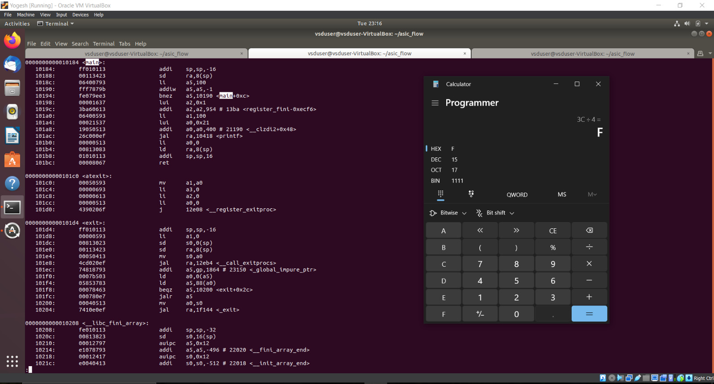

# ASIC Design Class Repository

## GitHub Repository: Yogesh Goyal, IMT2021542

This repository contains all the documentation and snapshots related to the experiments conducted during the lab sessions for the ASIC Design Class

---

## Contents of the Repository

- **Documentation:** Detailed explanations and observations for each experiment.
- **Snapshots:** Visual aids showing the procedures and steps involved in the experiments.

---

## Labs
<details>
<summary><strong>Laboratory 1:</strong> Create a C program to find the sum of `n` natural numbers, compile it using the GCC compiler, and verify the output after execution.</summary>

### Step-by-Step Procedure:

**Step 1:** Create a new `sum1ton.c` file in the specified directory (asic_flow) in a Linux environment using gedit editor.


- Save your C program


**Step 2:** Compile the source code `sum1ton.c` using gcc compiler (`gcc sum1ton.c`) which will generate an executable a.out file. Run the executable file(`./a.out`) in terminal window to view the output.


**Observation** 
- Sum of first 100 natural numbers come out to be 5050

</details>

<details>
<summary><strong>Laboratory 2:</strong> Compile the C program written in Laboratory 1 using the RISCV compiler.</summary>

### Step-by-Step Procedure:

# **Compilation using O1 flag**

**Step 1:** Compile `sum1ton.c` using RISCV Compiler using the command given below
```bash
riscv64-unknown-elf-gcc -O1 -mabi=lp64-march=rv64i -o sum1ton.o  sum1ton.c
```

- `riscv64-unknown-elf-gcc`: The compiler for RISC-V 64-bit target.
- `O1`: Applies moderate optimizations for a good balance between performance and compilation time.
- `mabi=lp64`: Specifies the ABI (Application Binary Interface) as LP64, meaning "Long and Pointer are 64-bit."
- `march=rv64i`: Sets the architecture to RISC-V 64-bit with the RV64I instruction set.
- `o sum1ton.o`: Outputs the compiled code to a file named sum1ton.o.
- `sum1ton.c`: The source file to be compiled.


- Also to check whether sum1ton.o has been created or not type the following command
```bash
ls -ltr sum1ton.o
```


**Step 2:** To generate the assembly code of the c program written type the following command in a new terminal window
```bash
riscv64-unknown-elf-objdump -d sum1ton.o
```


- It will give a bunch of assembly language code

**Step 3:** Use pipe less command with the command used in step 2 as shown below which allows us to scroll through the output interactively.

```bash
riscv64-unknown-elf-objdump -d sum1ton.o | less
```
- The assembly version of the C program is displayed. Type /main to navigate to the section of the code related to the main function (int main()).


- To determine the number of instructions in the "main" section, you can either count each instruction individually or use an alternative method: subtract the address of the first instruction in the subsequent section from the address of the first instruction in the "main" section. Then, divide the result by 4, as each instruction occupies 4 bytes in a byte-addressable memory system.



- No of instructions in the main function comes out to be (0x101C0 - 0x10184)/4 = 0x3C/4 = 0xF = 15 instructions

# **Compilation using Ofast flag**

**Step 4:** Repeat Step1 and instead of O1 flag use Ofast Flag and follow all the steps after that in the similar manner
```bash
riscv64-unknown-elf-gcc -Ofast -mabi=lp64-march=rv64i -o sum1ton.o  sum1ton.c
```


- Generate the assembly code for the file and observe that the number of bytes utilized decreases from 15 to 12.

**Observation** 
- **O1**: Provides moderate optimizations, balancing performance and compilation time, and adheres strictly to standards.
- **Ofast**: Applies aggressive optimizations for maximum performance, but might break some programs as it may not follow all standards.
</details>

<details>
<summary><strong>Laboratory 3:</strong> Determine the output of the C program using the RISC-V Compiler using Spike simulator, and then debug the code</summary>

### Step-by-Step Procedure:

# **Compilation**

**Step 1:** Compile `sum1ton.c` using RISCV Compiler using the command given below
```bash
riscv64-unknown-elf-gcc -O1 -mabi=lp64-march=rv64i -o sum1ton.o  sum1ton.c
```
**Step 2:** Now we have compiled our program using RISCV compiler and we need to run in order to get the output 
similar to the ./a.out we do using gcc compiler. To do that use Spike Simulator and type the following command 
given below

```bash
spike pk sum1ton.o
```


**Observation** 
- We have verified that output is same using the gcc and the riscv compiler

# **Debugging**

## Debugging the Assembly Code


To debug the assembly code of your compiled C program using the Spike simulator, follow these steps:

**Step 1:** Run the following command given below
```bash
spike -d pk sum1ton.o
```

- `spike`: The Spike RISC-V simulator.
- `d`: Starts the simulator in debug mode.
- `pk`: Proxy kernel, a small environment that provides minimal OS services.
- `sum1ton.o`: The compiled object file of your C program.

We will let the Spike debugger run until it reaches the 100b0 instruction within the main function by running the command given below. From there, we will proceed with manual debugging, checking the a2 register before and after execution.To move on to next instruction press Enter

```bash
until pc 0 100b0
```
To check a registers Value type the following command 
```bash
reg 0 a2
```


**Observation**
- Notably, the lui a2, 0x1 instruction changes the a2 register's value from `0x0000000000000000` to `0x0000000000001000`.

Next, we will manually debug the instruction addi sp, sp, -16, which reduces the stack pointer (sp) by 16. To do this run all the instructions till 100b8 by using the following command
```bash
until pc 0 100b8
```
To check stack pointer's Value type the following command 
```bash
reg 0 sp
```


 


**Observation**
- In the assembly code, it's evident that the stack pointer's value is being decreased by `0x10` in hexadecimal notation. This hexadecimal value translates to a reduction of 16 in decimal notation. Thus, the stack pointer is effectively being reduced by `16` units in decimal form.

</details>

<details>
<summary><strong>Laboratory 4:</strong> Identifying Different RISC-V Instructions.</summary>


# RISC-V Instruction Formats


**RISC-V architecture employs a variety of instruction formats to accommodate different types of operations. The six main formats are R-Type, I-Type, S-Type, B-Type, U-Type, and J-Type, each tailored for specific purposes like arithmetic, logical operations, immediate values, branching, memory access, and jumps. Below is a brief description of each format and its usage**

## R Type
- 'R' stands for register which means that operations are carried on the Registers and not on memory location
- This format encompasses arithmetic and logical operations.
- Suitable for operations involving three registers.
- The R-type format includes fields for two source registers, one destination register, a function code, and an opcode.
  - **Examples:** ADD, SUB, OR, XOR, AND etc.
  - **Format:**
    ```
    funct7 (7 bits): Function code for more instruction details.
    rs2 (5 bits): Second source register.
    rs1 (5 bits): First source register.
    funct3 (3 bits): Function code for basic instruction details.
    rd (5 bits): Destination register.
    opcode (7 bits): Base operation code for R-type instructions.
    ```

## I Type
- I stand for immediate which means that operations use Registers and Immediate value for their execution and are not related with memory location
- Commonly used for arithmetic with immediate values, load operations, and certain branch instructions.
- The I-type format includes fields for a source register, destination register, an immediate value, a function code, and an opcode.
  - **Format:**
    ```
    immediate (12 bits): Immediate value for operations.
    rs1 (5 bits): Source register.
    funct3 (3 bits): Function code for instruction details.
    rd (5 bits): Destination register.
    opcode (7 bits): Base operation code for I-type instructions.
    ```

## S Type
- S stands for Store, meaning it stores register values into memory.
- The S-type format includes fields for two source registers, an immediate value for the memory offset, a function code, and an opcode.
  - **Format:**
    ```
    imm[11:5] (7 bits): Upper 7 bits of the immediate value.
    rs2 (5 bits): Second source register (data to be stored).
    rs1 (5 bits): First source register (base address register).
    funct3 (3 bits): Function code for instruction details.
    imm[4:0] (5 bits): Lower 5 bits of the immediate value.
    opcode (7 bits): Base operation code for S-type instructions.
    ```

## B Type
- B-type instructions manage conditional branch operations, altering the flow of execution based on comparisons between two registers.
- The B-type format includes fields for two source registers, an immediate value for the branch offset, a function code, and an opcode.
  - **Format:**
    ```
    imm[12] (1 bit): The 12th bit of the immediate value.
    imm[10:5] (6 bits): The 10th to 5th bits of the immediate value.
    rs2 (5 bits): Second source register.
    rs1 (5 bits): First source register.
    funct3 (3 bits): Function code for instruction details.
    imm[4:1] (4 bits): The 4th to 1st bits of the immediate value.
    imm[11] (1 bit): The 11th bit of the immediate value.
    opcode (7 bits): Base operation code for B-type instructions.
    ```

## U Type
- U-type instructions deal with large immediate values, typically for loading upper immediate values or computing addresses.
- The U-type format includes fields for a destination register, a large immediate value, and an opcode.
  - **Format:**
    ```
    immediate[31:12] (20 bits): The upper 20 bits of the immediate value.
    rd (5 bits): Destination register.
    opcode (7 bits): Base operation code for U-type instructions.
    ```

## J Type
- J-type instructions handle jump operations, allowing for altering the program control flow by jumping to a specific address.
- These are used for unconditional jumps, such as calling functions or implementing loops.
  - **Format:**
    ```
    imm[20] (1 bit): The 20th bit of the immediate value.
    imm[10:1] (10 bits): The 10th to 1st bits of the immediate value.
    imm[11] (1 bit): The 11th bit of the immediate value.
    imm[19:12] (8 bits): The 19th to 12th bits of the immediate value.
    rd (5 bits): Destination register where the return address is stored.
    opcode (7 bits): Operation code for J-type instructions.
    ```

## Analyzing and Decoding each Instruction given to us
```
ADD r0, r1, r2
SUB r2, r0, r1
AND r1, r0, r2
OR r8, r1, r5
XOR r8, r0, r4
SLT r0, r1, r4
ADDI r2, r2, 5
SW r2, r0, 4
SRL r6, r1, r1
BNE r0, r0, 20
BEQ 10, r0, 15
LW r3, r1, 2
SLL r5, r1, r1
```
```
1. ADD r0, r1, r2
```
- Opcode for ADD = 0110011
- rd = r0 = 00000
- rs1 = r1 = 00001
- rs2 = r2 = 00010
- func3 = 000
- func7 = 0000000
- Instruction Type- R Type
- **32-bit Instruction:** `0000000_00010_00001_000_00000_0110011`
```
2. SUB r2, r0, r1
```
- Opcode for SUB = 0110011
- rd = r2 = 00010
- rs1 = r0 = 00000
- rs2 = r1 = 00001
- func3 = 000
- func7 = 0100000
- Instruction Type- R Type
- **32-bit Instruction:** `0100000_00001_00000_000_00010_0110011`
```
3. AND r1, r0, r2
```
- Opcode for AND = 0110011
- rd = r1 = 00001
- rs1 = r0 = 00000
- rs2 = r2 = 00010
- func3 = 111
- func7 = 0000000
- Instruction Type- R Type
- **32-bit Instruction:** `0000000_00010_00000_111_00001_0110011`
```
4. OR r8, r1, r5
```
- Opcode for OR = 0110011
- rd = r8 = 01000
- rs1 = r1 = 00001
- rs2 = r5 = 00101
- func3 = 110
- func7 = 0000000
- Instruction Type- R Type
- **R Type 32-bit Instruction:** `0000000_00101_00001_110_01000_0110011`
```
5. XOR r8, r0, r4
```
- Opcode for XOR = 0110011
- rd = r8 = 01000
- rs1 = r0 = 00000
- rs2 = r4 = 00100
- func3 = 100
- func7 = 0000000
- Instruction Type- R Type
- **32-bit Instruction:** `0000000_00100_00000_100_01000_0110011`
```
6. SLT r0, r1, r4
```
- Opcode for SLT = 0110011
- rd = r0 = 00000
- rs1 = r1 = 00001
- rs2 = r4 = 00100
- func3 = 010
- func7 = 0000000
- Instruction Type- R Type
- **32-bit Instruction:** `0000000_00100_00001_010_00000_0110011`
```
7. ADDI r2, r2, 5
```
- Opcode for ADDI = 0010011
- rd = r2 = 00010
- rs1 = r2 = 00010
- imm = 000000000101
- func3 = 000
- Instruction Type- I Type
- **I Type 32-bit Instruction:** `000000000101_00010_000_00010_0010011`
```
8. SW r2, r0, 4
```
- Opcode for SW = 0100011
- rs1 = r0 = 00000
- rs2 = r2 = 00010
- imm = 0000000 0100
- func3 = 010
- Instruction Type- S Type
- **32-bit Instruction:** `0000000_00010_00000_010_00100_0100011`
```
9. SRL r6, r1, r1
```
- Opcode for SRL = 0110011
- rd = r6 = 00110
- rs1 = r1 = 00001
- rs2 = r1 = 00001
- func3 = 101
- func7 = 0000000
- Instruction Type- R Type
- **32-bit Instruction:** `0000000_00001_00001_101_00110_0110011`
```
10. BNE r0, r0, 20
```
- Opcode for BNE = 1100011
- rs1 = r0 = 00000
- rs2 = r0 = 00000
- imm[12:1] = 20 = 000000010100
- func3 = 001
- Instruction Type- B Type
- **32-bit Instruction:** `0_000001_00000_00000_001_0100_0_1100011`
```
11. BEQ r0, r0, 15
```
- Opcode for BEQ = 1100011
- rs1 = r0 = 00000
- rs2 = r0 = 00000
- Imm[12:1] = 15 = 000000001111
- func3 = 000
- Instruction Type- B Type
- **32-bit Instruction:** `0_000000_00000_00000_000_1111_0_1100011`
```
12. LW r3, r1, 2
```
- Opcode for LW = 0000011
- rd = r3 = 00011
- rs1 = r1 = 00001
- imm = 000000000010
- func3 = 010
- Instruction Type- I Type
- **32-bit Instruction:** `000000000010_00001_010_00011_0000011`
```
13. SLL r5, r1, r1
```
- Opcode for SLL = 0110011
- rd = r5 = 00101
- rs1 = r1 = 00001
- rs2 = r1 = 00001
- func3 = 001
- func7 = 0000000
- Instruction Type- R Type
- **32-bit Instruction:** `0000000_00001_00001_001_00101_0110011`

| Instruction | Type | 32-bit Representation                      | Hexadecimal Notation  |
|-------------|------|-------------------------------------------|-----------------------|
| ADD r0, r1, r2 | R    | 0000000_00010_00001_000_00000_0110011     | 0x00208033            |
| SUB r2, r0, r1 | R    | 0100000_00001_00000_000_00010_0110011     | 0x40100133            |
| AND r1, r0, r2 | R    | 0000000_00010_00000_111_00001_0110011     | 0x002070B3            |
| OR r8, r1, r5  | R    | 0000000_00101_00001_110_01000_0110011     | 0x0050E433            |
| XOR r8, r0, r4 | R    | 0000000_00100_00000_100_01000_0110011     | 0x00404433            |
| SLT r0, r1, r4 | R    | 0000000_00100_00001_010_00000_0110011     | 0x0040A033            |
| ADDI r2, r2, 5 | I    | 000000000101_00010_000_00010_0010011      | 0x00510113            |
| SW r2, r0, 4   | S    | 0000000_00010_00000_010_00100_0100011     | 0x00202223            |
| SRL r6, r1, r1 | R    | 0000000_00001_00001_101_00110_0110011     | 0x0010D333            |
| BNE r0, r0, 20 | B    | 0_000001_00000_00000_001_0100_0_1100011   | 0x02001463            |
| BEQ r0, r0, 15 | B    | 0_000000_00000_00000_000_1111_0_1100011   | 0x00000F63            |
| LW r3, r1, 2   | I    | 000000000010_00001_010_00011_0000011      | 0x0020A183            |
| SLL r5, r1, r1 | R    | 0000000_00001_00001_001_00101_0110011     | 0x001092B3            |

